<h2 style="text-align: center;"> Universidad Peruana de Ciencias Aplicadas </h2>

<h4 style="text-align: center"> Ingeniería de Software </h4>

<h4 style="text-align: center"> Periodo: 202610 </h4>
<br>
 <p align="center">
    
</p>

<h4 style="text-align: center"> Fundamentos de Arquitectura de Software </h4>

<h4 style="text-align: center"> Sección: 7944 </h4>

<h4 style="text-align: center"> Docente: Abel Nehemias Rosales Caururu </h4>

<h3 style="text-align: center;"> Informe de Trabajo Final </h3>


<h4 style="text-align: center"> Startup: Pafi Solutions </h4>

<h4 style="text-align: center"> Producto: MediTrack </h4>


<h4 style="text-align: center">Integrantes:</h4>

<div style="text-align:center; margin-top: 10px; font-size: 90%; line-height: 1.6;">
   <table style="margin-left: auto; margin-right: auto;">
      <tr>
         <th>Código</th>
         <th>Apellidos y Nombres</th>
      </tr>
      <tr>
         <td>U202312966</td>
         <td>Gonzales Alvarado, Javier Sebastian</td>
      </tr>
      <tr>
         <td>U202219657</td>
         <td>Quijada Magro, Jeremy Alexander</td>
      </tr>
      <tr>
         <td>U20231D974</td>
         <td>Rivera Ratachi, Renzo Sebastian</td>
      </tr>
      <tr>
         <td>U202123655</td>
         <td>Rojas Reategui, Victor Manuel</td>
      </tr>
      <tr>
         <td>U202423711</td>
         <td>Sulca Sanchez, Piero Angel</td>
      </tr>
   </table>
</div>

<br>

<h5 style="text-align: center; font-style: italic;"> Abril 2026 </h5>

<hr class="page-break">

# Registro de Versiones del Informe


| Versión | Fecha      | Autor                                      | Descripción de modificación                                                                                                                      |
| :------ | :--------- | :----------------------------------------- | :----------------------------------------------------------------------------------------------------------------------------------------------- |
| 1.0     | 11/04/2026 | Rojas Reategui, Victor Manuel              | Creación de la estructura inicial del informe                                                                                                    |
| 1.1     | 13/04/2026 | Gonzales Alvarado, Javier Sebastian        | Capítulo I: descripción de la startup, Solution Profile, Lean UX Process y segmentos objetivo (1.1–1.3)                                          |
| 1.2     | 17/04/2026 | Sulca Sanchez, Piero Angel                 | Capítulo II: diseño de entrevistas (2.2.1)                                                                                                       |
| 1.3     | 17/04/2026 | Quijada Magro, Jeremy Alexander            | Capítulo II: análisis de competidores (2.1), registro y análisis de entrevistas (2.2.2, 2.2.3) y needfinding (2.3.1 - 2.3.4)                  |
| 1.4     | 18/04/2026 | Rivera Ratachi, Renzo Sebastian            | Capítulo III: To-Be Scenario Mapping (3.1), Impact Mapping (3.2) y especificación de User Stories (3.3)                                         |
| 1.5     | 18/04/2026 | Sulca Sanchez, Piero Angel                 | Capítulo III: Product Backlog (3.4)                                                                                                              |
| 1.6     | 18/04/2026 | Rojas Reategui, Victor Manuel              | Capítulo III: ampliación y reorganización de User Stories y Product Backlog (3.3 y 3.4)                                                         |
| 1.7     | 18/04/2026 | Sulca Sanchez, Piero Angel                 | Capítulo III: reordenamiento del Product Backlog por valor de negocio (3.4)                                                                      |
| 2.0     | 27/04/2026 | Quijada Magro, Jeremy Alexander            | Capítulo IV: Design Concepts, ViewPoints & ER Diagrams, Principles Statements, Architectural Styles & Patterns y Context Diagram (4.1.1 - 4.1.3) |
| 2.1     | 28/04/2026 | Rivera Ratachi, Renzo Sebastian            | Capítulo IV: Approach driven ViewPoints Diagrams, Relational/Non Relational Database Diagram y Design Patterns (4.1.4 - 4.1.6)                |
| 2.2     | 29/04/2026 | Gonzales Alvarado, Javier Sebastian        | Capítulo IV: Tactics, Architectural Drivers y Design Purpose (4.1.7, 4.2, 4.1.8)                                                                |
| 2.3     | 30/04/2026 | Rojas Reategui, Victor Manuel              | Capítulo IV: Primary Functionality (Primary User Stories) y Quality Attribute Scenarios (4.1.9, 4.1.10)                                         |
| 2.4     | 01/05/2026 | Sulca Sanchez, Piero Angel                 | Capítulo IV: Constraints y Architectural Concerns (4.1.11, 4.1.12)                                                                               |
| 2.5     | 02/05/2026 | Jeremy Quijada Magro y Piero Sulca Sanchez | Capítulo IV: ADD Iterations 1 & 2                                                                                                                 |
| 3.0     | 10/05/2026 | Rojas Reategui, Victor Manuel              | Capítulo V: Backend Application Core Testing Suite y Pattern Based Backend Application(s) (5.1.1, 5.1.2)                                        |
| 3.1     | 10/05/2026 | Sulca Sanchez, Piero Angel                 | Capítulo V: Pattern Based Custom Software Library y Framework Pattern Driven Refactoring Report (5.1.3, 5.1.4)                                  |
| 3.2     | 11/05/2026 | Sulca Sanchez, Piero Angel                 | Capítulo V: Software Development Environment Configuration, Source Code Management y Source Code Style Guide & Conventions (5.2.1 - 5.2.3)     |
| 3.3     | 11/05/2026 | Quijada Magro, Jeremy Alexander            | Capítulo V: Software Deployment Configuration y Development Evidence for Sprint Review (5.2.4, 5.3.1.2)                                         |
| 3.4     | 12/05/2026 | Rivera Ratachi, Renzo Sebastian            | Capítulo V: Sprint Backlog 1, Team Collaboration Insights during Sprint y Kanban Board (5.3.1.1, 5.3.1.7, 5.3.1.8)                             |
| 3.5     | 12/05/2026 | Rojas Reategui, Victor Manuel              | Capítulo V: Testing Suite Evidence for Sprint Review y Execution Evidence for Sprint Review (5.3.1.3, 5.3.1.4)                                  |
| 3.6     | 13/05/2026 | Gonzales Alvarado, Javier Sebastian        | Capítulo V: Microservices Documentation Evidence for Sprint Review y documentación de arquitectura de microservicios (5.3.1.5)                  |
| 3.7     | 13/05/2026 | Quijada Magro, Jeremy Alexander            | Capítulo V: Software Deployment Evidence for Sprint Review y consolidación de evidencias del sprint (5.3.1.6)                                   |
| 3.8     | 14/05/2026 | Todo el equipo                             | Revisión general, integración de capítulos, corrección de formato APA y validación final del informe TP1                                         |

<hr class="page-break">

# Contenido

- [Capítulo I: Introducción](#capítulo-i-introducción)

  - [1.1. Startup Profile](#11-startup-profile)
    - [1.1.1. Descripción de la Startup](#111-descripción-de-la-startup)
    - [1.1.2. Perfiles de integrantes del equipo](#112-perfiles-de-integrantes-del-equipo)
  - [1.2. Solution Profile](#12-solution-profile)
    - [1.2.1. Nombre del producto](#121-nombre-del-producto)
    - [1.2.2. Antecedentes y problemática](#122-antecedentes-y-problemática)
    - [1.2.3. Lean UX Process](#123-lean-ux-process)
      - [1.2.3.1. Lean UX Problem Statement](#1231-lean-ux-problem-statement)
      - [1.2.3.2. Lean UX Assumptions](#1232-lean-ux-assumptions)
      - [1.2.3.3. Lean UX Hypothesis](#1233-lean-ux-hypothesis)
      - [1.2.3.4. Lean UX Canvas](#1234-lean-ux-canvas)
  - [1.3. Segmentos objetivo](#13-segmentos-objetivo)

- [Capítulo II: Requirements & Analysis](#capítulo-ii-requirements--analysis)
  - [2.1. Competidores](#21-competidores)
  - [2.2. Entrevistas](#22-entrevistas)
  - [2.3. Needfinding](#23-needfinding)
    - [2.3.1. User Personas](#231-user-personas)
    - [2.3.2. User Task Matrix](#232-user-task-matrix)
    - [2.3.3. Empathy Maps](#233-empathy-maps)
    - [2.3.4. As-is Scenario Mapping](#234-as-is-scenario-mapping)

- [Capítulo III: Requirements Specification](#capítulo-iii-requirements-specification)
  - [3.1. To-Be Scenario Mapping](#31-to-be-scenario-mapping)
  - [3.2. User Stories](#32-user-stories)
  - [3.3. Impact Map](#33-impact-map)
  - [3.4. Product Backlog](#34-product-backlog)

- [Capítulo IV: Product Architecture Design](#capítulo-iv-product-architecture-design)
  - [4.1. Design Concepts, ViewPoints & ER Diagrams](#41-design-concepts-viewpoints--er-diagrams)
    - [4.1.1. Principles Statements](#411-principles-statements)
    - [4.1.2. Approaches Statements Architectural Styles & Patterns](#412-approaches-statements-architectural-styles--patterns)
    - [4.1.3. Context Diagram](#413-context-diagram)
    - [4.1.4. Approach driven ViewPoints Diagrams](#414-approach-driven-viewpoints-diagrams)
    - [4.1.5. Relational/Non Relational Database Diagram](#415-relationalnon-relational-database-diagram)
    - [4.1.6. Design Patterns](#416-design-patterns)
    - [4.1.7. Tactics](#417-tactics)
  - [4.2. Architectural Drivers](#42-architectural-drivers)
    - [4.2.1. Design Purpose](#421-design-purpose)
    - [4.2.2. Primary Functionality (Primary User Stories)](#422-primary-functionality-primary-user-stories)
    - [4.2.3. Quality Attribute Scenarios](#423-quality-attribute-scenarios)
    - [4.2.4. Constraints](#424-constraints)
    - [4.2.5. Architectural Concerns](#425-architectural-concerns)
  - [4.3. ADD Iterations](#43-add-iterations)
    - [4.3.1. Iteration 1: Flujo Core del Tratamiento](#42x-iteration-1-flujo-core-del-tratamiento)
      - [4.3.1.1. Architectural Design Backlog N](#4311-architectural-design-backlog-n)
      - [4.3.1.2. Establish Iteration Goal by Selecting Drivers](#4312-establish-iteration-goal-by-selecting-drivers)
      - [4.3.1.3. Choose One or More Elements of the System to Refine](#4313-choose-one-or-more-elements-of-the-system-to-refine)
      - [4.3.1.4. Choose One or More Design Concepts That Satisfy the Selected Drivers](#4314-choose-one-or-more-design-concepts-that-satisfy-the-selected-drivers)
      - [4.3.1.5. Instantiate Architectural Elements, Allocate Responsibilities, and Define Interfaces](#4315-instantiate-architectural-elements-allocate-responsibilities-and-define-interfaces)
      - [4.3.1.6. Sketch Views (C4 & UML) and Record Design Decisions](#4316-sketch-views-c4--uml-and-record-design-decisions)
      - [4.3.1.7. Analysis of Current Design and Review Iteration Goal (Kanban Board)](#4317-analysis-of-current-design-and-review-iteration-goal-kanban-board)
    - [4.3.2. Iteration 2: Continuidad del Tratamiento — Modo Offline](#432-iteration-2-continuidad-del-tratamiento--modo-offline)
      - [4.3.2.1. Architectural Design Backlog N](#4321-architectural-design-backlog-n)
      - [4.3.2.2. Establish Iteration Goal by Selecting Drivers](#4322-establish-iteration-goal-by-selecting-drivers)
      - [4.3.2.3. Choose One or More Elements of the System to Refine](#4323-choose-one-or-more-elements-of-the-system-to-refine)
      - [4.3.2.4. Choose One or More Design Concepts That Satisfy the Selected Drivers](#4324-choose-one-or-more-design-concepts-that-satisfy-the-selected-drivers)
      - [4.3.2.5. Instantiate Architectural Elements, Allocate Responsibilities, and Define Interfaces](#4325-instantiate-architectural-elements-allocate-responsibilities-and-define-interfaces)
      - [4.3.2.6. Sketch Views (C4 & UML) and Record Design Decisions](#4326-sketch-views-c4--uml-and-record-design-decisions)
      - [4.3.2.7. Analysis of Current Design and Review Iteration Goal (Kanban Board)](#4327-analysis-of-current-design-and-review-iteration-goal-kanban-board)

- [Capítulo V: Product Implementation, Validation & Deployment](#capítulo-v-product-implementation-validation--deployment)
  - [5.1. Testing Suites & General Patterns](#51-testing-suites--general-patterns)
    - [5.1.1. Backend Application Core Testing Suite](#511-backend-application-core-testing-suite)
    - [5.1.2. Pattern Based Backend Application(s)](#512-pattern-based-backend-applications)
    - [5.1.3. Pattern Based Custom Software Library](#513-pattern-based-custom-software-library)
    - [5.1.4. Framework Pattern Driven Refactoring Report](#514-framework-pattern-driven-refactoring-report)
  - [5.2. Software Configuration Management](#52-software-configuration-management)
    - [5.2.1. Software Development Environment Configuration](#521-software-development-environment-configuration)
    - [5.2.2. Source Code Management](#522-source-code-management)
    - [5.2.3. Source Code Style Guide & Conventions](#523-source-code-style-guide--conventions)
    - [5.2.4. Software Deployment Configuration](#524-software-deployment-configuration)
  - [5.3. Microservices Implementation](#53-microservices-implementation)
    - [5.3.1. Sprint 1](#531-sprint-1)
      - [5.3.1.1. Sprint Backlog 1](#5311-sprint-backlog-1)
      - [5.3.1.2. Development Evidence for Sprint Review](#5312-development-evidence-for-sprint-review)
      - [5.3.1.3. Testing Suite Evidence for Sprint Review](#5313-testing-suite-evidence-for-sprint-review)
      - [5.3.1.4. Execution Evidence for Sprint Review](#5314-execution-evidence-for-sprint-review)
      - [5.3.1.5. Microservices Documentation Evidence for Sprint Review](#5315-microservices-documentation-evidence-for-sprint-review)
      - [5.3.1.6. Software Deployment Evidence for Sprint Review](#5316-software-deployment-evidence-for-sprint-review)
      - [5.3.1.7. Team Collaboration Insights during Sprint](#5317-team-collaboration-insights-during-sprint)
      - [5.3.1.8. Kanban Board](#5318-kanban-board)
    - [5.3.2. Sprint 2](#532-sprint-2)
      - [5.3.2.1. Sprint Backlog 2](#5321-sprint-backlog-2)
      - [5.3.2.2. Development Evidence for Sprint Review](#5322-development-evidence-for-sprint-review)
      - [5.3.2.3. Testing Suite Evidence for Sprint Review](#5323-testing-suite-evidence-for-sprint-review)
      - [5.3.2.4. Execution Evidence for Sprint Review](#5324-execution-evidence-for-sprint-review)
      - [5.3.2.5. Microservices Documentation Evidence for Sprint Review](#5325-microservices-documentation-evidence-for-sprint-review)
      - [5.3.2.6. Software Deployment Evidence for Sprint Review](#5326-software-deployment-evidence-for-sprint-review)
      - [5.3.2.7. Team Collaboration Insights during Sprint](#5327-team-collaboration-insights-during-sprint)
      - [5.3.2.8. Kanban Board](#5328-kanban-board)

- [Conclusiones](#conclusiones)
- [Referencias Bibliográficas](#referencias-bibliográficas)
- [Anexos](#anexos)

<hr class="page-break">

# Student Outcome


En el siguiente cuadro se describe las acciones realizadas y enunciados de conclusiones por parte del grupo, que permiten sustentar el haber alcanzado el logro del ABET – EAC - Student Outcome 7.


<table>
  <thead>
    <tr>
      <th>Criterio específico</th>
      <th>Acciones realizadas</th>
      <th>Conclusiones</th>
    </tr>
  </thead>
  <tbody>
    <tr>
      <td rowspan="5"><strong>A: Actualiza conceptos y conocimientos necesarios para su desarrollo profesional y en especial para su proyecto en soluciones de software.</strong></td>
      <td><strong>Quijada Magro, Jeremy Alexander</strong><br><b>TB1:</b> Análisis de competidores, entrevistas y needfinding.<br><b>TB2:</b> Desarrollo de Problem Statements, definición de enfoques arquitectónicos (Architectural Styles & Patterns), elaboración del Context Diagram y participación en ADD iteration 2.<br><b>TP1:</b> Investigó y aplicó conceptos de Static Testing & Verification, además de participar en el desarrollo del prototipo visual y evidencias del Sprint Review.</td>
      <td rowspan="5"><b>TB1:</b> El equipo aplicó conceptos clave de ingeniería de software y diseño centrado en el usuario, estructurando una base sólida del proyecto.<br><br><b>TB2:</b> El equipo profundizó en el diseño arquitectónico del sistema, aplicando patrones, tácticas y metodologías como ADD. Esto permitió consolidar una estructura más robusta, alineada a atributos de calidad y necesidades del sistema.<br><br><b>TP1:</b> El equipo fortaleció conocimientos técnicos relacionados al desarrollo de soluciones modernas de software, aplicando conceptos de testing, arquitectura de microservicios, gestión ágil y configuración de entornos de desarrollo, permitiendo mejorar la calidad y organización del proyecto Meditrack.</td>
    </tr>
    <tr>
      <td><strong>Rivera Ratachi, Renzo</strong><br><b>TB1:</b> To-Be Scenario Mapping, User Stories e Impact Map.<br><b>TB2:</b> Desarrollo de ViewPoint Diagrams basados en enfoques arquitectónicos y diseño de diagramas de base de datos relacionales y no relacionales.<br><b>TP1:</b> Desarrollo del Sprint Backlog 1 y Kanban Board, aplicando metodologías ágiles y herramientas de gestión colaborativa.</td>
    </tr>
    <tr>
      <td><strong>Javier Sebastian Gonzales Alvarado</strong><br><b>TB1:</b> Definición de startup, problemática, Lean UX Process y segmentos objetivo.<br><b>TB2:</b> Aplicación de Design Patterns, definición de tácticas arquitectónicas y establecimiento del propósito del diseño.<br><b>TP1:</b> Elaboración de documentación de microservicios y organización de evidencias técnicas para el Sprint Review.</td>
    </tr>
    <tr>
      <td><strong>Victor Manuel Rojas Reategui</strong><br><b>TB1:</b> Elaboración del Product Backlog.<br><b>TB2:</b> Definición de funcionalidades principales del sistema y desarrollo de Quality Attribute Scenarios.<br><b>TP1:</b> Implementación de Testing Suites y General Patterns para reforzar buenas prácticas de desarrollo y pruebas de software.</td>
    </tr>
    <tr>
      <td><strong>Piero Angel Sulca Sanchez</strong><br><b>TB1:</b> Participación en entrevistas.<br><b>TB2:</b> Identificación de restricciones (Constraints), preocupaciones arquitectónicas (Architectural Concerns) y desarrollo de ADD iteration 1.<br><b>TP1:</b> Trabajo en Software Configuration Management aplicando herramientas de control de versiones y configuración del entorno de desarrollo.</td>
    </tr>
    <tr>
      <td rowspan="5"><strong>B: Reconoce la necesidad del aprendizaje permanente para el desempeño profesional y el desarrollo de proyectos en soluciones de software.</strong></td>
      <td><strong>Quijada Magro, Jeremy Alexander</strong><br><b>TB1:</b> Aplicación de entrevistas y needfinding.<br><b>TB2:</b> Aprendizaje en definición de arquitecturas, estilos y uso del método ADD para diseño iterativo.<br><b>TP1:</b> Investigación de herramientas de validación y verificación para mejorar la calidad del software y el prototipo desarrollado.</td>
      <td rowspan="5"><b>TB1:</b> El equipo demostró una actitud orientada al aprendizaje continuo, incorporando nuevas metodologías.<br><br><b>TB2:</b> Los integrantes fortalecieron su aprendizaje en arquitectura de software, adoptando nuevas herramientas y enfoques como ADD, patrones y modelado de datos, lo que evidencia una evolución técnica y compromiso con su desarrollo profesional.<br><br><b>TP1:</b> El equipo reforzó su aprendizaje continuo mediante el uso de nuevas herramientas, metodologías ágiles, testing y gestión de configuración, fortaleciendo competencias técnicas necesarias para el desarrollo profesional y la construcción de soluciones de software modernas.</td>
    </tr>
    <tr>
      <td><strong>Rivera Ratachi, Renzo</strong><br><b>TB1:</b> Uso de herramientas de modelado como Impact Map.<br><b>TB2:</b> Profundización en modelado arquitectónico y diseño de bases de datos híbridas.<br><b>TP1:</b> Aprendizaje y aplicación de metodologías ágiles mediante el uso de Sprint Backlog y Kanban Board.</td>
    </tr>
    <tr>
      <td><strong>Javier Sebastian Gonzales Alvarado</strong><br><b>TB1:</b> Desarrollo de Lean UX y definición de producto.<br><b>TB2:</b> Aprendizaje en patrones de diseño y tácticas arquitectónicas aplicadas al sistema.<br><b>TP1:</b> Reforzamiento de conocimientos en documentación de microservicios y buenas prácticas de arquitectura backend.</td>
    </tr>
    <tr>
      <td><strong>Victor Manuel Rojas Reategui</strong><br><b>TB1:</b> Gestión de backlog.<br><b>TB2:</b> Desarrollo de escenarios de atributos de calidad y definición funcional del sistema.<br><b>TP1:</b> Investigación y aplicación de patrones generales de desarrollo y testing para mejorar la confiabilidad del sistema.</td>
    </tr>
    <tr>
      <td><strong>Piero Angel Sulca Sanchez</strong><br><b>TB1:</b> Participación en levantamiento de información.<br><b>TB2:</b> Comprensión de restricciones y preocupaciones arquitectónicas, además del uso de ADD en etapas iniciales.<br><b>TP1:</b> Actualización de conocimientos relacionados a Software Configuration Management y herramientas colaborativas de desarrollo.</td>
    </tr>
  </tbody>
</table>

<hr class="page-break">

# Capítulo I: Introducción

## 1.1. Startup Profile

### 1.1.1. Descripción de la Startup

Pafi Solutions es una startup tecnológica enfocada en el desarrollo de soluciones digitales en el sector salud. Está conformada por estudiantes de Ingeniería de Software de séptimo ciclo comprometidos con la innovación y el uso de tecnologías modernas para resolver problemas en la realidad peruana. La startup busca aplicar principios de arquitectura de software, desarrollo ágil y buenas prácticas de ingeniería para crear productos digitales escalables y de alto impacto.

Misión: Desarrollar soluciones de software que permitan mejorar procesos relacionados a la salud.

Visión: Convertirse en la startup referente en el desarrollo de soluciones tecnológicas que contribuyan a mejorar la salud de las personas.

Alcance del proyecto: Pafi Solutions tiene como alcance el diseño y desarrollo de soluciones digitales enfocadas en el sector salud, inicialmente centradas en la gestión y seguimiento de tratamientos médicos. La startup busca validar su propuesta mediante el desarrollo de un producto mínimo viable, con el objetivo de escalar hacia soluciones más completas dentro del ámbito de la salud digital.

### 1.1.2. Perfiles de integrantes del equipo

<table>
  <thead>
    <tr>
      <th>Perfil</th>
      <th>Foto</th>
    </tr>
  </thead>
  <tbody>
    <tr>
      <td><strong>Rojas Reategui, Victor Manuel — U202123655</strong><br>Soy Victor Rojas y voy en el 7mo ciclo de la carrera de Ingeniería de Software. Me gusta lo rápido que cambia la tecnología en la actualidad, por lo que este curso me ayudará a expandir mis conocimientos y a explorar nuevas aplicaciones de mi carrera que no había experimentado antes.</td>
      <td></td>
    </tr>
    <tr>
      <td><strong>Gonzales Alvarado, Javier Sebastian — U202312966</strong><br>Mi nombre es Javier Gonzales, soy estudiante de Ingeniería de Software de séptimo ciclo. Tengo conocimientos en diversos lenguajes de programación como C++, Python y JavaScript, entre otros. Además, he desarrollado proyectos de software utilizando distintos frameworks como Angular y Vue. Me considero una persona responsable, empática y analítica. Mi objetivo personal es desarrollar soluciones tecnológicas que contribuyan a mejorar la calidad de vida de las personas y aportar a la construcción de un mundo más innovador y conectado</td>
      <td></td>
    </tr>
    <tr>
      <td><strong>Rivera Ratachi, Renzo Sebastian — U20231D974</strong><br>Soy Renzo Sebastian Rivera Ratachi y soy estudiante de la carrera de Ingeniería de Software. Actualmente estoy cursando el 7mo ciclo de mi carrera y tengo conocimientos intermedios de JavaScript y C++. Me considero una persona responsable y puntual. </td>
      <td></td>
    </tr>
    <tr>
      <td><strong>Sulca Sanchez, Piero Angel — U202423711</strong><br>Curso la carrera de Ingeniería de Software y tengo experiencia en desarrollo web trabajando con equipos pequeños. Me apasiona el Front End, sobre todo cuando hay espacio para el diseño creativo: interfaces 3D, animaciones, productos que se ven y se sienten distintos. En el equipo puedo aportar en levantamiento de requerimientos, diseño de interfaces, desarrollo web con React y TypeScript, diseño de bases de datos. En el equipo aporto organización y colaboración.</td>
      <td></td>
    </tr>
    <tr>
      <td><strong>Quijada Magro, Jeremy Alexander — U202219657</strong><br>Soy Jeremy Alexander Quijada Magro y soy estudiante de la carrera de Ingeniería de Software. Me considero una persona responsable y analítica. Además, tengo conocimientos intermedios en programación y análisis de datos.</td>
      <td></td>
    </tr>
  </tbody>
</table>

<hr class="page-break">

## 1.2. Solution Profile

### 1.2.1. Nombre del producto

MediTrack es una aplicación móvil que busca ayudar a pacientes a cumplir con sus tratamientos médicos. La solución busca reducir los olvidos y errores en la toma de medicamentos mediante la generación de recordatorios inteligentes, así como facilitar el seguimiento de citas médicas y exámenes. De este modo prevenimos los olvidos de pacientes, errores de dosis, falta de seguimiento, abandono del tratamiento, etc.

### 1.2.2. Antecedentes y problemática

#### WHAT (Qué)

¿Cuál es el problema?

En el Perú, muchas personas no siguen correctamente sus tratamientos médicos, especialmente quienes tienen enfermedades crónicas. Esto ocurre porque olvidan tomar sus medicamentos, se confunden con las dosis o no cumplen con los horarios indicados. Según un estudio sobre adherencia terapéutica en pacientes con enfermedades crónicas en Lima, existe un nivel importante de incumplimiento en los tratamientos, lo cual afecta directamente la calidad de vida de los pacientes (Vargas Rodríguez, 2022). Esta situación representa un problema relevante en el sistema de salud, ya que puede empeorar las enfermedades si no se controla adecuadamente.

#### WHEN (Cuándo)

¿Cuándo sucede el problema?

Este problema ocurre principalmente durante el día a día del tratamiento, especialmente cuando los pacientes deben seguir rutinas constantes por largos periodos. Es común que el incumplimiento se presente con el paso del tiempo, cuando los pacientes olvidan sus dosis o dejan de seguir las indicaciones médicas de manera continua. Según un estudio de la Universidad Cayetano Heredia, el incumplimiento del tratamiento es un fenómeno frecuente a lo largo del proceso de atención médica, sobre todo en tratamientos prolongados (Luzeve Gutiérrez, 2019).

#### WHERE (Dónde)

¿Dónde surge el problema?

El problema se presenta en el sistema de salud peruano, tanto en hospitales como, principalmente, en el entorno cotidiano del paciente, debido a la falta de supervisión constante. Como evidencia, en el año 2022 se registraron más de 5.5 millones de personas con hipertensión arterial en el Perú. Según el Dr. Chuquiruna, el 56.7% de estos pacientes no se adhiere al tratamiento por diversos motivos, entre los cuales destaca el olvido de tomar uno o más medicamentos (Consultor Salud, 2023).

#### WHO (Quién)

¿Quiénes son los afectados?

Los principales afectados son los pacientes con enfermedades crónicas, como diabetes, hipertensión o problemas cardíacos, quienes deben seguir tratamientos de forma constante. En muchos casos, estos pacientes presentan dificultades para cumplir correctamente con sus medicamentos y controles, lo que afecta directamente su estado de salud y calidad de vida (Patel, 2025).

Adicionalmente, esta solución también beneficia al sistema de salud, ya que puede funcionar como un canal de comunicación entre médicos y pacientes. Los médicos podrán registrar o subir las recetas desde un portal, mientras que los pacientes recibirán automáticamente los recordatorios en sus dispositivos móviles, facilitando el seguimiento del tratamiento.

#### WHY (Por qué)

¿Cuál es la causa del problema?

Este problema se debe principalmente a factores como el olvido, la falta de información y la complejidad de los tratamientos médicos. Muchos pacientes no siguen correctamente sus indicaciones porque deben tomar varios medicamentos en distintos horarios, lo que genera confusión y errores en la administración (Schnorrerova, 2025). En el Perú, esta situación se agrava por factores como la desorganización en los tratamientos y la ausencia de herramientas tecnológicas que ayuden a los pacientes a cumplir sus horarios.

#### HOW (Cómo)

¿Cómo se utilizará el producto?

El producto se utilizará a través de una aplicación móvil donde el paciente podrá visualizar y gestionar su tratamiento de manera sencilla. Los médicos podrán registrar o subir la receta desde un portal web, la cual será procesada para generar automáticamente los horarios y recordatorios de medicación. A partir de ello, el paciente recibirá notificaciones en su celular que le indicarán cuándo tomar sus medicamentos, asistir a citas o realizar exámenes, facilitando así el seguimiento continuo del tratamiento en su vida diaria.

#### HOW MUCH (Cuánto)

¿Cuánto costará implementar la solución?

Para esta primera versión de la aplicación, el costo será relativamente bajo, ya que se desarrollará utilizando tecnologías accesibles. Se emplearán frameworks modernos y servicios cloud gratuitos, como Azure for Students. Por el momento, nos concentraremos en el contexto académico, pero con la visión de expandirnos en el futuro hacia un ámbito más profesional.

### 1.2.3. Lean UX Process

#### 1.2.3.1. Lean UX Problem Statement

El propósito de MediTrack es brindar a los pacientes peruanos una herramienta digital accesible que les permita llevar un seguimiento adecuado de sus tratamientos médicos, recordándoles la toma de medicamentos y ayudándolos a mantener una mejor adherencia, con el fin de mejorar su calidad de vida.

El problema se presenta en el sistema de salud peruano, principalmente fuera de los entornos hospitalarios, donde los pacientes no cuentan con una supervisión constante. Esto provoca que muchos de ellos olviden tomar sus medicamentos o no sigan correctamente las indicaciones médicas.

Hemos observado que esta situación genera complicaciones en la salud de los pacientes, incrementa el riesgo de enfermedades graves y reduce la efectividad de los tratamientos. Además, evidencia una falta de herramientas tecnológicas simples y accesibles que acompañen al paciente en su vida diaria, fuera del entorno clínico. Esta desconexión entre la indicación médica y el seguimiento real del tratamiento representa una brecha importante en el cuidado de la salud.

Y ante esta problemática nos surge la siguiente pregunta: ¿Cómo podríamos ayudar a los pacientes a cumplir correctamente sus tratamientos médicos en su día a día, mediante una solución accesible, simple y efectiva?

- **Domain:** Salud digital y monitoreo de tratamientos médicos.

- **Customer Segments:** Pacientes.

- **Pain Points:**
  - Olvido de medicamentos
  - Falta de seguimiento continuo
  - Ausencia de supervisión médica diaria
  - Falta de comunicación o entendimiento entre el doctor y paciente

- **Gap:** No existe una solución accesible y enfocada en el contexto peruano que ayude a los pacientes a gestionar y cumplir sus tratamientos de manera constante.

- **Vision/Strategy:** Desarrollar una aplicación que permita a los pacientes llevar un control de sus tratamientos mediante recordatorios, alertas y seguimiento, mejorando su adherencia y reduciendo riesgos de salud.

- **Initial Segment:** Pacientes con hipertensión en Lima Metropolitana que cuentan con acceso a smartphones.

El propósito de MediTrack hacia el personal técnico de clínicas y hospitales es ofrecer una plataforma web que les permita cargar digitalmente recetas e historiales clínicos, reduciendo la transcripción manual y asegurando que la información llegue directamente al paciente.

El problema se presenta en clínicas y hospitales peruanos, donde la gestión de recetas y expedientes sigue dependiendo de papel, caligrafía ilegible y archivos físicos propensos al deterioro o pérdida. Esto provoca retrabajo constante, errores de dosis por interpretación incorrecta y dificultad para recuperar información previa del paciente.

Hemos observado que esta situación genera retrasos en la atención, interrumpe la continuidad del tratamiento y limita la capacidad del personal para hacer seguimiento real de la adherencia de sus pacientes más allá de la consulta. Esta desconexión entre el centro médico y el paciente representa una brecha crítica en la operación hospitalaria.

Y ante esta problemática nos surge la siguiente pregunta: ¿Cómo podríamos facilitar al personal técnico la gestión digital de recetas e historiales clínicos para extender el seguimiento del paciente más allá de la consulta?

- **Domain:** Digitalización de información clínica y seguimiento de pacientes en centros médicos.

- **Customer Segments:** Personal técnico.

- **Pain Points:**
  - Gestión manual de recetas en papel
  - Pérdida y deterioro de expedientes físicos
  - Caligrafía ilegible entre colegas
  - Retrabajo por transcripción manual
  - Dificultad para acceder a historiales previos

- **Gap:** No existe una plataforma local integrada que conecte la carga de recetas del centro médico con el seguimiento diario del paciente.

- **Vision/Strategy:** Ofrecer un portal web donde el personal técnico cargue recetas, suba historiales clínicos y visualice dashboards de adherencia, centralizando la información del paciente.

- **Initial Segment:** Personal técnico de clínicas privadas en Lima Metropolitana.

#### 1.2.3.2. Lean UX Assumptions

##### Business Assumptions

1. **Creo nuestros usuarios tienen la necesidad** de recordar y cumplir correctamente sus tratamientos médicos en su vida diaria.

2. **Estas necesidades se pueden satisfacer** mediante una aplicación móvil con recordatorios, alertas y seguimiento personalizado.

3. **Nuestros clientes iniciales serán** pacientes con enfermedades crónicas en Lima Metropolitana, especialmente con hipertensión.

4. **El valor más importante que un cliente quiere de nuestros servicios es** la facilidad para no olvidar tomar sus medicamentos.

5. **El cliente también va a obtener** mayor control de su salud y reducción de riesgos asociados a su enfermedad.

6. **Vamos a obtener la mayoría de los clientes mediante** recomendaciones médicas, integrándonos en clínicas y hospitales, donde se recomendará la aplicación a los pacientes como apoyo para el seguimiento de sus tratamientos.

7. **Vamos a obtener ingresos mediante** suscripciones premium (para los centros de salud) y alianzas con clínicas o hospitales.

8. **Nuestra competencia en el mercado serán** aplicaciones de salud genéricas y recordatorios de medicamentos existentes.

9. **Vamos a tener ventaja frente a nuestra competencia debido a** nuestra simplicidad, enfoque en el contexto peruano y facilidad de uso.

10. **El mayor riesgo del servicio es** que los usuarios no adopten o abandonen la aplicación con el tiempo.

11. **Lo resolveremos realizando** mejoras continuas en la experiencia de usuario y funcionalidades de valor.

12. **Otro riesgo que debemos considerar es que** los usuarios no confíen en la aplicación para gestionar información de salud.

##### User Assumptions

1. ¿Quién es el usuario?

Pacientes con enfermedades crónicas que necesitan seguir un tratamiento médico constante, y también clínicas y hospitales que gestionan el historial clínico y recetas del paciente para generar recordatorios y dar seguimiento al tratamiento.

2. ¿Dónde encaja nuestro producto en su vida?

Encaja en la rutina diaria del paciente como una herramienta de apoyo para el cuidado de su salud. Para las clínicas y hospitales, encaja como un complemento digital que extiende el seguimiento del tratamiento más allá de la consulta médica.

3. ¿Qué problemas resuelve nuestro producto?

Resuelve el olvido en la toma de medicamentos, la falta de organización en los tratamientos y la ausencia de seguimiento continuo. Además, ayuda a reducir errores en la medicación y mejora la comunicación indirecta entre paciente y centro de salud.

4. ¿Cuándo y cómo se usa nuestro producto?

Se utiliza diariamente en momentos clave, como horarios de medicación o revisiones del tratamiento. Funciona mediante notificaciones automáticas, alertas y una interfaz donde el usuario puede registrar el cumplimiento de su tratamiento de forma sencilla.

5. ¿Qué características son importantes?

Son importantes la facilidad de uso, recordatorios automáticos y configurables, registro del cumplimiento del tratamiento, integración con información médica (recetas e historial médico) y notificaciones claras.

6. ¿Cómo debería lucir y comportarse el producto?

Debe tener un diseño simple, intuitivo y accesible para todo tipo de usuarios, incluyendo personas mayores. Su comportamiento debe ser confiable, rápido y amigable, brindando información clara y precisa, así evitando generar confusión o sobrecarga de notificaciones.

##### Feature Assumptions

- Creemos que los usuarios necesitan recordatorios automáticos de medicamentos que se ajusten a los horarios indicados en su tratamiento.

- Creemos que los usuarios necesitan un sistema de registro digital de recetas médicas accesible desde su dispositivo móvil, para poder consultar en cualquier momento las indicaciones de su tratamiento sin depender de documentos físicos.

- Creemos que las clínicas y hospitales necesitan una funcionalidad que les permita subir recetas e historiales clínicos directamente a la plataforma, de modo que el paciente reciba información confiable y centralizada desde su médico.

- Creemos que los usuarios necesitan notificaciones personalizadas basadas en su tipo de tratamiento, frecuencia y rutina diaria, para mejorar la adherencia y evitar interrupciones en su medicación.

- Creemos que los usuarios necesitan visualizar el progreso de su tratamiento mediante indicadores claros de cumplimiento, lo que les permitirá mantenerse motivados y conscientes de su avance.

#### 1.2.3.3. Lean UX Hypothesis

1. Hypothesis Statement 01:

**Creemos que** implementar recordatorios automáticos de medicamentos para pacientes resultará en un mayor cumplimiento de sus tratamientos médicos.

**Sabremos que** hemos tenido éxito

**Cuando** al menos el 80% de las dosis programadas sean marcadas como completadas por los usuarios.

2. Hypothesis Statement 02:

**Creemos que** permitir a clínicas y hospitales subir recetas e historiales clínicos directamente en la plataforma para pacientes resultará en un incremento en la cantidad de usuarios activos en la aplicación.

**Sabremos que** esto es cierto

**Cuando** al menos el 60% de los nuevos usuarios registrados provengan de instituciones de salud afiliadas.

3. Hypothesis Statement 03:

**Creemos que** enviar notificaciones personalizadas según el tratamiento de cada paciente resultará en un mayor nivel de interacción de los usuarios con la aplicación.

**Sabremos que** esto es cierto

**Cuando** más del 70% de los usuarios interactúen con las notificaciones recibidas.

#### 1.2.3.4. Lean UX Canvas

<p align="center">
    
</p>

<div align = center>

_Figura 1. Lean UX Canvas del producto MediTrack. Elaboración propia._

</div>

<hr class="page-break">

## 1.3. Segmentos objetivo

#### Segmento 1: Pacientes

Este segmento está conformado por personas que siguen tratamientos médicos de corta, mediana o larga duración y requieren apoyo para cumplir correctamente con la toma de sus medicamentos y el seguimiento de indicaciones médicas. Incluye pacientes con enfermedades crónicas, tratamientos postoperatorios o cualquier condición que implique una medicación constante. Estos usuarios buscan herramientas que les faciliten organizar su tratamiento, reducir olvidos y mejorar su salud.

- Características Demográficas:
  - Edad: 18 a más de 65 años
  - Género: Masculino y femenino
  - Nivel socioeconómico: Medio
  - Nivel educativo: Secundaria completa y superior.
  - Ocupación: Estudiantes, trabajadores dependientes e independientes.
  - Condición: Personas con tratamientos médicos activos (crónicos o temporales).

- Características Geográficas:
  - Ubicación: Principalmente zonas urbanas.
  - Región: Lima Metropolitana (fase inicial), expansión a nivel nacional (a futuro)
  - Entorno: Ciudades con acceso a servicios de salud.

- Sustento estadístico:

En el Perú, la adherencia a tratamientos médicos representa un problema relevante, ya que diversos estudios indican que entre el 44% y 76% de los pacientes con enfermedades crónicas no siguen correctamente sus tratamientos farmacológicos. Asimismo, investigaciones evidencian que el olvido es una de las principales causas de incumplimiento terapéutico (Kardas, 2024). Estos datos demuestran la necesidad de soluciones tecnológicas que ayuden a mejorar la adherencia, reducir olvidos y optimizar el seguimiento de tratamientos en la población.

#### Segmento 2: Personal de Apoyo

Este segmento agrupa al personal que sostiene la operatividad diaria de la atención médica. Son los encargados de la transcripción de la receta hasta la coordinación de la siguiente cita. Su labor es vital para que el tratamiento no se quede en un papel, sino que se convierta en una realidad para el paciente. Ellos son quienes sufren directamente el caos de los archivos físicos y quienes más necesitan que la información esté disponible para evitar errores que afecten la salud de las personas.

- Características Organizacionales:
  - Entidades: Clínicas privadas, hospitales públicos y centros médicos.
  - Tamaño: Pequeñas, medianas y grandes instituciones.
  - Sector: Salud
  - Personal: Internos de medicina, técnicos de enfermería, coordinadores de piso.

- Características Geográficas:
  - Ubicación: Zonas urbanas.
  - Región: Lima Metropolitana (fase inicial)
  - Infraestructura: Instituciones que aún dependen fuertemente del papel y que presentan cuellos de botella en la entrega de información.

- Sustento estadístico:

En el contexto del sistema de salud, se ha identificado que problemas en la gestión y seguimiento de tratamientos afectan directamente a los pacientes, evidenciándose que la falta de coordinación y digitalización de la información médica incrementa los errores y retrasos en la atención. Además, la digitalización del sector salud permite mejorar la comunicación entre pacientes y profesionales, optimizando el seguimiento de tratamientos (Kruse et al., 2017).

<hr class="page-break">

# Capítulo II: Requirements & Analysis

## 2.1. Competidores

<table>
  <tr>
    <th colspan="6">Competitive Analysis Landscape</th>
  </tr>
  <tr>
    <td colspan="2" align="center"><b>¿Por qué llevar a cabo este análisis?</b></td>
    <td colspan="4">Es importante analizar a la competencia para entender las necesidades y expectativas de los clientes, así como las fortalezas y debilidades de las competencias. Esto ayudará a identificar oportunidades de mejora y desafíos para la empresa.</td>
  </tr>
  <tr>
    <th colspan="2">Nombre</th>
    <th>MediTrack</th>
    <th>MyTherapy</th>
    <th>CareClinic</th>
    <th>Medisafe</th>
  </tr>
  <tr>
    <td colspan="2" align="center"><b>Logo</b></td>
    <td align="center">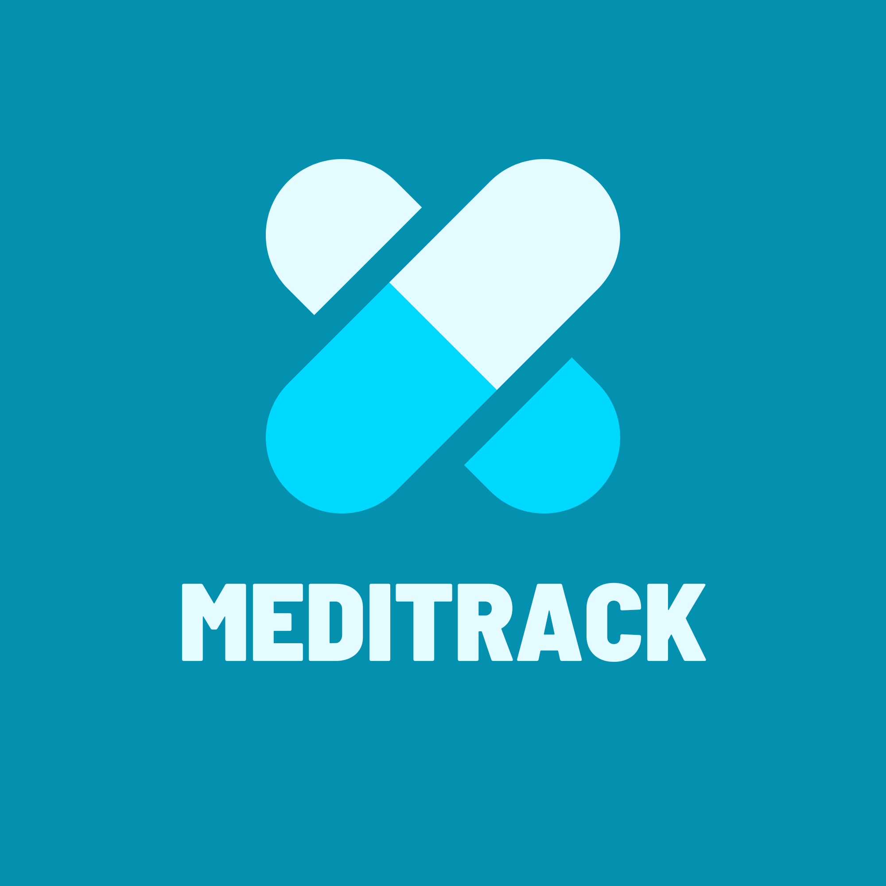</td>
    <td align="center"></td>
    <td align="center">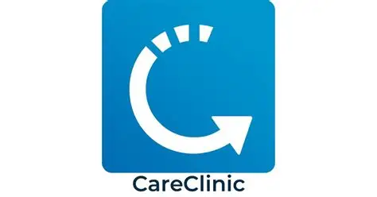</td>
    <td align="center">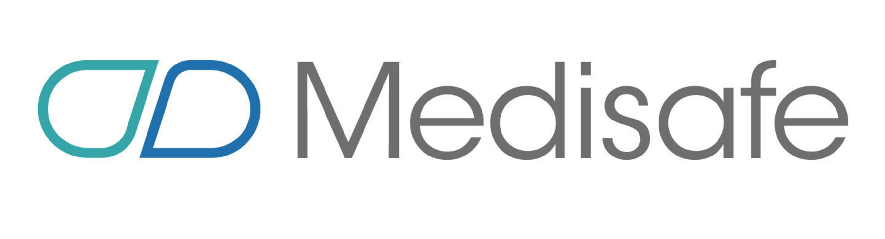</td>
  </tr>
  <tr>
    <td rowspan="2"><b>Perfil</b></td>
    <td><b>Overview</b></td>
    <td>Es una aplicación diseñada para cerrar la brecha entre la indicación médica y el cumplimiento real del paciente.</td>
    <td>Es como un "compañero diario" para la gestión de medicación y diario de salud, enfocado en simplicidad.</td>
    <td>Es una plataforma de gestión de salud basada en marcos clínicos para el autocuidado proactivo.</td>
    <td>Es el líder en gestión de medicación con alertas inteligentes y soporte para cuidadores.</td>
  </tr>
  <tr>
    <td><b>Ventaja competitiva ¿Qué valor ofrece a los clientes?</b></td>
    <td>Automatización del flujo de información médico-paciente. Elimina la carga manual de datos, reduciendo el riesgo de errores de dosis y olvidos.</td>
    <td>Simplicidad de la aplicación y en los reportes de salud gratuitos listos para entregar al médico tratante.</td>
    <td>Análisis avanzado de patrones; correlaciona hábitos, síntomas y clima con la salud.</td>
    <td>Red de seguridad mediante "Medfriends" y alertas de interacciones medicamentosas</td>
  </tr>
  <tr>
    <td rowspan="2"><b>Perfil de Marketing</b></td>
    <td><b>Mercado objetivo</b></td>
    <td>Pacientes en Lima Metropolitana y personal técnico de clínicas y hospitales privados/públicos.</td>
    <td>Pacientes crónicos (Diabetes, Esclerosis Múltiple, TDAH) que requieren diarios de salud.</td>
    <td>Usuarios que buscan "biohacking" o gestión compleja de enfermedades crónicas.</td>
    <td>Adultos mayores y familias que requieren supervisar la toma de medicamentos a distancia.</td>
  </tr>
  <tr>
    <td><b>Estrategias de Marketing</b></td>
    <td>Convenios de digitalización con clínicas para reducir sus retrasos operativos.</td>
    <td>Alianzas con sociedades médicas (ej. Sociedad de Diabetes) y blogs de salud científica.</td>
    <td>Marketing de contenidos sobre protocolos médicos (Stanford/Mayo Clinic) y SEO técnico.</td>
    <td>Recomendaciones en farmacias (Walgreens/CVS) y pauta en buscadores médicos.</td>
  </tr>
  <tr>
    <td rowspan="3"><b>Perfil de Producto</b></td>
    <td><b>Productos &amp; Servicios</b></td>
    <td>Aplicación móvil centrada para el Paciente y portal web para clínicas donde pueden gestionar recetas y monitoreo.</td>
    <td>Alarmas de pastillas, registro de síntomas y contador de pasos integrado.</td>
    <td>Rastreador de dolor, diario de humor, planes de nutrición y sincronización con Apple Health.</td>
    <td>Recordatorios de dosis, aviso de reabastecimiento y base de datos de fármacos.</td>
  </tr>
  <tr>
    <td><b>Precios y Costos</b></td>
    <td>Modelo de suscripción para instituciones y versión gratuita para pacientes con opciones de reportes avanzados (Freemium).</td>
    <td>100% Gratuito (sin publicidad ni compras dentro de la aplicación).</td>
    <td>Freemium (Versión Pro para análisis de datos avanzados).</td>
    <td>Gratis con opción Premium (aprox. $4.99/mes) para más voces y temas.</td>
  </tr>
  <tr>
    <td><b>Canales de distribución</b></td>
    <td>Implementación directa en sistemas de clínicas, Google Play, App Store.</td>
    <td>App Store, Google Play y página web oficial.</td>
    <td>App Store, Google Play y página web oficial.</td>
    <td>App Store, Google Play y página web oficial.</td>
  </tr>
  <tr>
    <td rowspan="4"><b>Análisis SWOT</b></td>
    <td><b>Fortalezas</b></td>
    <td>Conocimiento del sistema de salud local y capacidad de integración técnica con centros médicos peruanos.</td>
    <td>Alta privacidad de datos y avalada por estudios de investigación en Europa.</td>
    <td>Basada en protocolos clínicos reales; alta capacidad de personalización.</td>
    <td>Posee la mayor base de datos de medicamentos y gran reconocimiento de marca.</td>
  </tr>
  <tr>
    <td><b>Oportunidades</b></td>
    <td>Alta tasa de incumplimiento en Perú (59%-69%) y la necesidad de digitalización post-pandemia en el sector salud.</td>
    <td>Convertirse en la aplicación estándar para investigaciones clínicas a nivel global.</td>
    <td>Integración con sistemas de farmacia (PMS) para pedidos de recetas en tiempo real.</td>
    <td>Alianzas con compañías de seguros de salud para monitorear pacientes en riesgo.</td>
  </tr>
  <tr>
    <td><b>Debilidades</b></td>
    <td>Dependencia inicial de la adopción por parte del personal técnico de las clínicas.</td>
    <td>El diseño es muy austero y puede resultar poco motivador para usuarios jóvenes.</td>
    <td>Curva de aprendizaje elevada; puede ser difícil de usar para personas mayores.</td>
    <td>La mayoría de funciones de valor (como el Medfriend ilimitado) son de pago.</td>
  </tr>
  <tr>
    <td><b>Amenazas</b></td>
    <td>Resistencia al cambio en procesos burocráticos de hospitales públicos y competencia de aplicaciones gratuitas globales.</td>
    <td>Riesgo de sostenibilidad financiera al no cobrar al usuario final.</td>
    <td>Competencia de aplicaciones de nicho que se enfocan en una sola enfermedad.</td>
    <td>Regulaciones estrictas de privacidad de datos (HIPAA/GDPR) que limiten el uso de datos.</td>
  </tr>
</table>

#### Estrategias y tácticas frente a competidores

Para MediTrack, nos enfocaremos en la mayor ventaja: la unificación. Mientras los competidores obligan al usuario a saltar entre la aplicación de la farmacia, el calendario de Google y un diario de salud, ofreceremos un ecosistema cerrado.

Además, aplicaremos las siguientes estrategias y tácticas frente a los competidores:

- **Estrategia de Doble Valor:** Se busca diferenciarse de Medisafe y MyTherapy atacando simultáneamente los problemas del paciente y del centro médico.
  - **Táctica de Integración para TI:** A diferencia de la competencia que es aislada, MediTrack ofrecerá una API de Carga Masiva para el personal técnico de clínicas. Esto reduce el retraso en tratamientos por fallas de coordinación.
  - **Táctica de Receta Digital Automática:** El paciente no configura su tratamiento; el centro médico lo hace por él. Esto ataca directamente el 71% de olvidos por falta de organización.

En resumen, nuestra real ventaja es la desorganización sistémica. Nosotros al incluir al Personal Técnico, convertimos a las clínicas en nuestro principal promotor, asegurando que el paciente use la aplicación por recomendación de su propia institución de salud, lo que garantiza la confianza y la retención a largo plazo.

<hr class="page-break">

## 2.2. Entrevistas

### 2.2.1. Diseño de entrevistas

#### A. Segmento: Pacientes

**Datos demográficos y de contexto**

1. ¿Cuál es su nombre completo, edad y en qué distrito vive?
2. ¿Cuál es su ocupación y con quién vive actualmente?
3. ¿Actualmente sigue algún tratamiento médico y desde hace cuánto tiempo aproximadamente?
4. ¿Qué tipo de tratamiento realiza y cuántos medicamentos distintos toma durante el día?
5. ¿Qué dispositivos tecnológicos usa en el día a día y cuáles son sus aplicaciones más utilizadas?

**Preguntas principales**

1. Cuénteme cómo organiza actualmente la toma de sus medicamentos en el día a día.
2. ¿Qué dificultades suele tener para recordar horarios, dosis o indicaciones médicas?
3. ¿Con qué frecuencia olvida una dosis, cita o examen?
4. ¿Qué consecuencias le genera cuando eso ocurre?
5. ¿Qué herramientas usa hoy para acordarse de sus medicamentos o citas?
6. ¿Ha usado alguna vez una aplicación, alarma o recordatorio digital para su tratamiento? ¿Cómo fue esa experiencia?
7. ¿Cómo hace seguimiento de sus próximas citas médicas o exámenes?
8. ¿Qué tan fácil o difícil le resulta entender una receta médica o las indicaciones que le dan?
9. ¿Qué problemas aparecen cuando se queda sin medicamento o le falta stock?
10. ¿Qué tipo de ayuda le haría más fácil cumplir su tratamiento en el día a día?
11. ¿Qué información le gustaría ver en una aplicación para sentir que realmente le ayuda en el seguimiento de su tratamiento?
12. ¿Qué aspectos le generarían confianza o desconfianza al usar una aplicación de salud digital?

**Preguntas complementarias**

1. ¿Cómo cree que su tratamiento afecta su calidad de vida o sus actividades diarias?
2. ¿Qué papel juegan su familia o cuidadores en el seguimiento de su tratamiento?
3. ¿Cómo se comunica con su médico cuando tiene una duda fuera de la consulta?
4. ¿De qué manera influyen los factores económicos en el cumplimiento de su tratamiento?
5. ¿Ha dejado de tomar algún medicamento por efectos secundarios o por otra razón? ¿Qué sucedió después?
6. ¿Qué personas, recursos o herramientas cree que realmente ayudan a cumplir un tratamiento?

#### B. Segmento: Personal de Apoyo

**Datos demográficos y de contexto**

1. ¿Cuál es su nombre, edad y en qué distrito vive?
2. ¿Cuál es su cargo o función dentro del centro médico y hace cuántos años trabaja en ese rol?
3. ¿En qué tipo de institución trabaja actualmente y cuál es el volumen aproximado de pacientes que gestionan por semana?
4. ¿Qué sistemas informáticos usa actualmente en su trabajo diario?
5. ¿Qué dispositivos tecnológicos utiliza durante su jornada laboral?

**Preguntas principales**

1. Cuénteme cómo se registra actualmente la información clínica y las recetas en su centro médico.
2. ¿Qué problemas aparecen al trabajar con recetas, historiales o seguimiento de pacientes?
3. ¿Qué tareas manuales consumen más tiempo en ese proceso?
4. ¿Qué errores son más frecuentes cuando la información se maneja de forma manual o dispersa?
5. ¿Cómo buscan actualmente la información de un paciente cuando necesitan revisar su seguimiento?
6. ¿Ha utilizado o conocido herramientas digitales para cargar recetas o historiales clínicos? ¿Cómo fue esa experiencia?
7. ¿Qué indicadores o reportes consulta con más frecuencia o le gustaría consultar para hacer seguimiento de pacientes?
8. ¿Qué parte del proceso actual le genera más frustración o retrabajo?
9. ¿Qué resultados o metas busca cumplir en el seguimiento o la gestión de pacientes?
10. ¿Qué barreras existirían para implementar una herramienta digital de seguimiento de pacientes en su institución?
11. ¿Qué condiciones deberían cumplirse para que el personal adopte una plataforma de este tipo?
12. ¿Qué cambios concretos se generarían en su trabajo diario si contara con una herramienta digital para seguimiento de pacientes?

**Preguntas complementarias**

1. ¿Qué diferencias nota entre pacientes que cumplen el tratamiento y los que no?
2. ¿Cómo se coordina actualmente con otros profesionales de salud que atienden al mismo paciente?
3. ¿Qué información recibe del paciente sobre su evolución entre consultas?
4. ¿Qué costos o ineficiencias operativas percibe en el proceso actual de gestión de pacientes?
5. ¿Qué consideraciones éticas o de confidencialidad serían clave al digitalizar el historial clínico?
6. ¿Qué capacitación o acompañamiento necesitaría el personal para adoptar una herramienta digital de gestión clínica?

### 2.2.2. Registro de entrevistas

#### A. Segmento: Pacientes

##### Entrevista 1:

<td align="center"></td>

**Link de la entrevista:** https://youtu.be/QLU1UJcwt7Q

##### Datos de la entrevista:

**Nombre:** Vicenta Ramos Coronado
**Edad:** 76 años
**Fecha:** 17/04/2026
**Duración:** 11 minutos

**Resumen:** Vicenta Ramos es una adulta mayor de 76 años que padece artritis, una enfermedad crónica que le causa dolor en las manos y la obliga a seguir un tratamiento con pastillas, inyecciones y citas médicas cada tres meses. Aunque actualmente ya se ha acostumbrado a sus medicamentos y puede recordarlos con facilidad, al inicio le resultaba complicado. Sus hijas se encargan de coordinar sus citas médicas, y aunque ella está agradecida por su apoyo, le gustaría ser más independiente. Por eso, considera que una aplicación que le ayude a recordar sus medicamentos y citas sería de gran utilidad.

#### B. Segmento: Personal de Apoyo

##### Entrevista 1:

<td align="center"></td>

**Link de la entrevista:** https://youtu.be/Yh0xtK4cxbM

##### Datos de la entrevista:

**Nombre:** Gabrielle Coronel
**Edad:** 22 años
**Fecha:** 17/04/2026
**Duración:** 7 minutos

**Resumen:** Gabrielle describe un entorno hospitalario donde el desorden administrativo es la norma, resaltando que la mayoría de los procesos de seguimiento y gestión de recetas se realizan de forma manual mediante papeles, cuadernos y fólderes que frecuentemente se pierden o se deterioran por factores ambientales. Menciona que, aunque existen algunos sistemas, ella debe recurrir a herramientas personales como Excel para llevar un control propio de sus pacientes, enfrentando dificultades constantes para acceder a historiales clínicos completos o previos que facilitarían una atención de mayor calidad y eficiencia.

##### Entrevista 2:

<td align="center"></td>

**Link de la entrevista:** https://youtu.be/l2zcC1aD70Q

##### Datos de la entrevista:

**Nombre:** Yanet Magro
**Edad:** 49 años
**Fecha:** 17/04/2026
**Duración:** 9 minutos

**Resumen:** Yanet enfatiza la problemática de la falta de interoperabilidad y actualización en los sistemas de salud, explicando cómo el deterioro de las historias clínicas físicas y la caligrafía ilegible de los colegas entorpecen la continuidad del tratamiento. Señala que, si bien la digitalización ayuda, la falta de capacitación del personal y la lentitud en la carga de resultados (como exámenes de laboratorio) generan costos adicionales y pérdida de tiempo tanto para el Estado como para el paciente. Asimismo, resalta que un diagnóstico correcto, apoyado en un sistema digital eficiente, es vital para asegurar que el paciente cumpla su tratamiento y asista a sus citas de control.

### 2.2.3. Análisis de entrevistas

#### A. Segmento: Pacientes

Al analizar las entrevistas del segmento de pacientes, se identifican varios puntos de dolor que refuerzan la necesidad de una solución:

- Existe una dependencia significativa del entorno familiar para gestionar el tratamiento. Muchos pacientes, especialmente adultos mayores, delegan la organización de sus citas médicas y seguimiento a familiares, lo que limita su autonomía.

- Al inicio del tratamiento, los pacientes presentan dificultades para recordar horarios de medicación y citas, lo que puede afectar la adherencia al tratamiento y retrasar su recuperación.

- Se evidencia una necesidad de mayor independencia y apoyo personalizado, ya que, aunque con el tiempo algunos pacientes logran adaptarse, valoran herramientas que les permitan gestionar su salud de forma más autónoma y segura, reduciendo la carga sobre sus familiares.

#### B. Segmento: Personal de Apoyo

Al contrastar diferentes perspectivas, se identifican puntos de dolor críticos que validan la necesidad de una solución:

- Existe una **desconexión total** entre lo que sucede en el consultorio y la realidad del paciente en casa. Ambas profesionales coinciden en que el seguimiento depende de que el paciente recuerde la información o de que el sistema médico logre ubicar un documento físico, lo cual falla en un alto porcentaje de los casos.

- El uso de papel es peligroso. La pérdida de recetas y la dificultad para leer indicaciones médicas (mencionada por Yanet) son causas directas de los errores de dosis y el abandono del tratamiento que MediTrack busca resolver.

- Las entrevistas sugieren que el **éxito terapéutico** está ligado a la **organización**. Mientras que los pacientes organizados "se curan", aquellos que olvidan sus citas o dosis (debido al caos administrativo) recaen, generando mayores costos hospitalarios y complicaciones graves.

<hr class="page-break">

## 2.3. Needfinding

En esta sección, el equipo presenta el análisis detallado de las necesidades, dolores y comportamientos de nuestros segmentos objetivo.

### 2.3.1. User Personas

En esta sección, se presentan las fichas de User Persona diseñadas para representar a nuestros dos segmentos objetivo. Estos perfiles son el resultado de la síntesis de las entrevistas a profundidad realizadas y el análisis comparativo de la competencia.

#### Segmento 1: Pacientes

<td align="center"></td>

<div align = center>

_Figura 2. User Persona del segmento Pacientes (Ricardo Alberto Luján). Elaboración propia._

</div>

#### Segmento 2: Personal de Apoyo

<td align="center"></td>

<div align = center>

_Figura 3. User Persona del segmento Personal de Apoyo (Claudia Valdivia). Elaboración propia._

</div>

### 2.3.2. User Task Matrix

Para la sección del User Task Matrix, es fundamental separar las actividades cotidianas de los usuarios de las funciones específicas del software. Aquí analizamos cómo Ricardo y Claudia gestionan sus responsabilidades actuales, lo que nos permitirá identificar dónde MediTrack puede aportar el mayor valor.

<table>
  <thead>
    <tr>
      <th rowspan="2">Tareas</th>
      <th colspan="2">Pacientes </th>
      <th colspan="2">Personal técnico de centros médicos</th>
    </tr>
    <tr>
      <th>Frecuencia</th>
      <th>Importancia</th>
      <th>Frecuencia</th>
      <th>Importancia</th>
    </tr>
  </thead>
  <tbody>
    <tr>
      <td>Tomar los medicamentos en el horario indicado</td>
      <td>Alta</td>
      <td>Critica</td>
      <td>N/A</td>
      <td>N/A</td>
    </tr>
    <tr>
      <td>Contar manualmente las pastillas que le quedan</td>
      <td>Media</td>
      <td>Alta</td>
      <td>N/A</td>
      <td>N/A</td>
    </tr>
    <tr>
      <td>Leer las instrucciones de la receta física</td>
      <td>Media</td>
      <td>Alta</td>
      <td>N/A</td>
      <td>N/A</td>
    </tr>
    <tr>
      <td>Preparar requisitos para exámenes</td>
      <td>Baja</td>
      <td>Alta</td>
      <td>N/A</td>
      <td>N/A</td>
    </tr>
    <tr>
      <td>Trasladarse al hospital para agendar citas</td>
      <td>Baja</td>
      <td>Media</td>
      <td>Alta</td>
      <td>Alta</td>
    </tr>
    <tr>
      <td>Transcribir datos del paciente al archivo físico</td>
      <td>N/A</td>
      <td>N/A</td>
      <td>Alta</td>
      <td>Crítica</td>
    </tr>
    <tr>
      <td>Informar al paciente sobre su próximo control</td>
      <td>N/A</td>
      <td>N/A</td>
      <td>Media</td>
      <td>Alta</td>
    </tr>
    <tr>
      <td>Revisar el inventario de citas del día</td>
      <td>N/A</td>
      <td>N/A</td>
      <td>Alta</td>
      <td>Media</td>
    </tr>
  </tbody>
</table>

#### Análisis de la Matriz

Al observar las tareas que realizan Ricardo y Claudia en su entorno natural, sin asistencia digital especializada, se identifican los siguientes puntos clave:

**Tareas con mayor carga (Frecuencia e Importancia):**

- Para Ricardo, la tarea diaria y crítica es la ingesta de medicamentos. Al depender de su memoria o de alarmas genéricas de reloj, el riesgo de error es máximo.
- Para Claudia, la transcripción de datos y la búsqueda de expedientes consumen la mayor parte de su tiempo, siendo tareas críticas para evitar errores administrativos en el hospital.

**Principales Contradicciones:**

- Las tareas de Ricardo son logísticas y de autocuidado (contar pastillas, recordar horarios, leer papeles).
- Las tareas de Claudia son organizacionales y de archivo (gestionar expedientes físicos, transcribir información).
- Ricardo sufre por la memoria individual, mientras que Claudia sufre por el caos del volumen de información.

**Principales Coincidencias:**

- Ambos segmentos coinciden en la alta importancia de la coordinación de citas y controles.
- Ambos consideran que la pérdida de una cita rompe la continuidad del tratamiento.

**Puntos de Dolor Identificados:**
La matriz revela que el proceso actual es altamente manual. Tareas como "contar pastillas" o "buscar expedientes físicos" son ineficientes y propensas al error humano. Esta es precisamente la brecha que MediTrack vendrá a digitalizar para transformar estas tareas pesadas en procesos automáticos.

### 2.3.3. Empathy Maps

Los Empathy Maps son herramientas de diseño efectivas, que responden a la realidad humana y psicológica de cada segmento. A continuación, se presentan los Empathy Maps para los dos segmentos objetivo.

#### Segmento 1: Pacientes

<td align="center"></td>

<div align = center>

_Figura 4. Empathy Map del segmento Pacientes. Elaboración propia._

</div>

#### Segmento 2: Personal de Apoyo

<td align="center"></td>

<div align = center>

_Figura 5. Empathy Map del segmento Personal de Apoyo. Elaboración propia._

</div>

### 2.3.4. As-is Scenario Mapping

En esta sección se presenta un análisis detallado de la situación actual (AS-IS) para los diferentes segmentos. A través de este mapeo, identificamos los procesos, las interacciones y las emociones clave, proporcionando una visión clara de los puntos críticos.

Para tener una visión más clara de los escenarios, puede revisar el siguiente link: https://lucid.app/lucidspark/a26b2a1e-0c17-4428-aba7-c0949b7349e3/edit?viewport_loc=-141%2C-63%2C2265%2C1035%2C0_0&invitationId=inv_5a727633-905e-446c-bbfc-4069c628a26c

#### Segmento 1: Pacientes

<td align="center">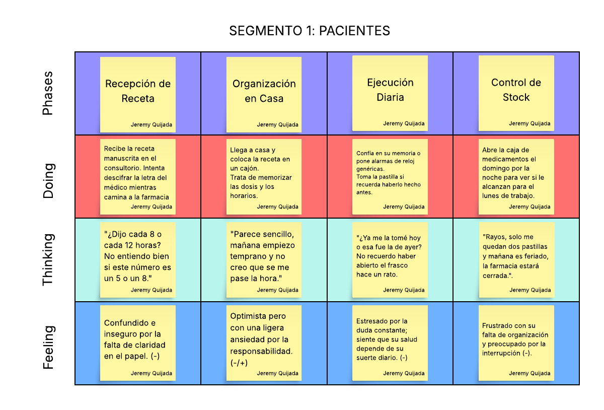</td>

<div align = center>

_Figura 6. As-Is Scenario Mapping del segmento Pacientes. Elaboración propia._

</div>

#### Segmento 2: Personal de Apoyo

<td align="center">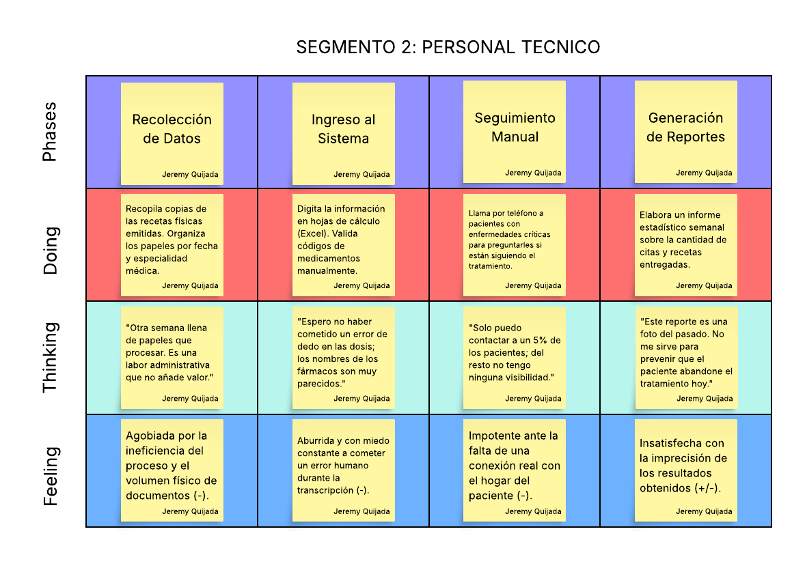</td>

<div align = center>

_Figura 7. As-Is Scenario Mapping del segmento Personal de Apoyo. Elaboración propia._

</div>

<hr class="page-break">

# Capítulo III: Requirements Specification

## 3.1. To-Be Scenario Mapping

En esta sección se presenta un análisis detallado de la situación futura (TO-BE) para los diferentes segmentos. A través de este mapeo, proyectamos los procesos automatizados, las interacciones digitales y los factores de éxito clave, ofreciendo una visión clara de los puntos de mejora resueltos.

Para tener una visión más clara de los escenarios, puede revisar el siguiente link: https://lucid.app/lucidspark/a26b2a1e-0c17-4428-aba7-c0949b7349e3/edit?viewport_loc=-141%2C-63%2C2265%2C1035%2C0_0&invitationId=inv_5a727633-905e-446c-bbfc-4069c628a26c

#### Segmento 1: Pacientes

<td align="center">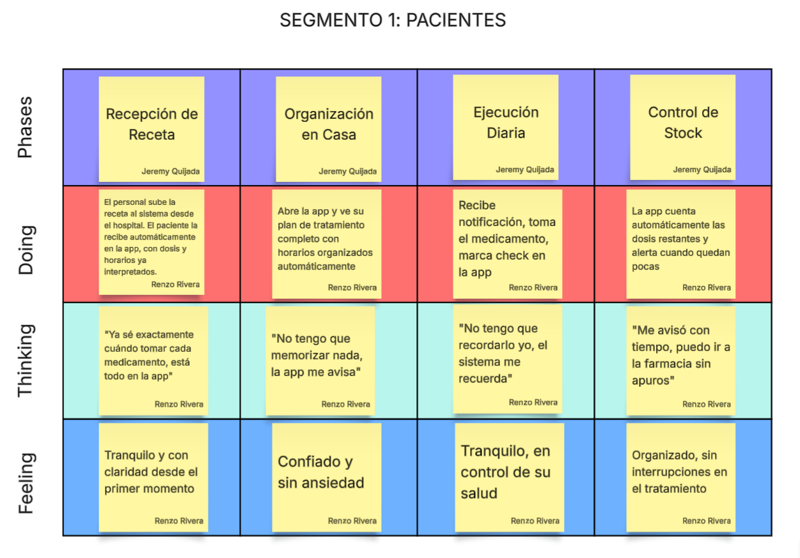</td>

<div align = center>

_Figura 8. To-Be Scenario Mapping del segmento Pacientes. Elaboración propia._

</div>

#### Segmento 2: Personal de Apoyo

<td align="center">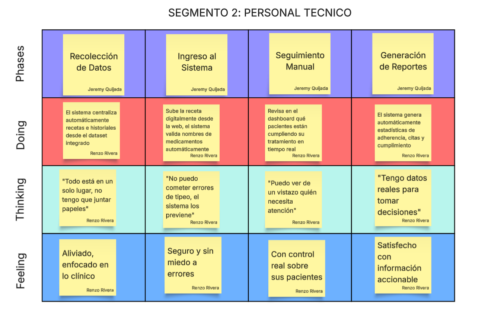</td>

<div align = center>

_Figura 9. To-Be Scenario Mapping del segmento Personal de Apoyo. Elaboración propia._

</div>

<hr class="page-break">

## 3.2. User Stories


#### Requisitos Funcionales

| Componente del sistema | Id | Requisito Funcional |
|---|---|---|
| Identity & Profile Service | IAM-RF1 | El sistema deberá permitir a los pacientes crear una cuenta con nombre, correo y contraseña. |
| | IAM-RF2 | El sistema deberá permitir al personal técnico registrarse seleccionando su institución y rol. |
| | IAM-RF3 | El sistema deberá validar que el correo electrónico no esté previamente registrado. |
| | IAM-RF4 | El sistema deberá permitir cerrar sesión de forma segura e invalidar la sesión activa. |
| | IAM-RF5 | El sistema deberá permitir recuperar la contraseña enviando un enlace al correo registrado. |
| | IAM-RF6 | El sistema deberá permitir cambiar la contraseña validando la contraseña actual antes de actualizarla. |
| | IAM-RF7 | El sistema deberá permitir editar el nombre, teléfono y foto de perfil del usuario. |
| Treatment Service | TRT-RF1 | El sistema deberá permitir al personal técnico subir una receta médica indicando medicamento, dosis y horarios de toma. |
| | TRT-RF2 | El sistema deberá validar automáticamente el nombre del medicamento contra un catálogo oficial antes de guardar la receta. |
| | TRT-RF3 | El sistema deberá mostrar sugerencias o un mensaje de error cuando el medicamento ingresado no exista en el catálogo. |
| | TRT-RF4 | El sistema deberá permitir al personal técnico editar los datos de un medicamento cuando esté autorizado. |
| | TRT-RF5 | El sistema deberá permitir cancelar un medicamento únicamente cuando el personal técnico lo autorice. |
| | TRT-RF6 | El sistema deberá mostrar al paciente la lista de sus medicamentos activos con nombre, dosis y horario. |
| | TRT-RF7 | El sistema deberá emitir una alerta cuando el stock de un medicamento llegue al umbral configurado. |
| Medical Appointment Service | APT-RF1 | El sistema deberá permitir al paciente agendar una cita médica indicando fecha, hora y tipo de cita. |
| | APT-RF2 | El sistema deberá validar que la fecha de la cita sea posterior a la fecha actual. |
| | APT-RF3 | El sistema deberá mostrar los requisitos previos asociados a cada cita médica. |
| | APT-RF4 | El sistema deberá permitir al paciente editar o cancelar una cita futura. |
| | APT-RF5 | El sistema deberá impedir la modificación de citas con fecha pasada. |
| | APT-RF6 | El sistema deberá permitir registrar y consultar exámenes clínicos pendientes de recojo. |
| Reminder Service | REM-RF1 | El sistema deberá enviar una notificación push al paciente en el horario programado de cada medicamento. |
| | REM-RF2 | El sistema deberá enviar una notificación push 24 horas antes de una cita médica y una segunda notificación 2 horas antes. |
| | REM-RF3 | El sistema deberá enviar un recordatorio cuando llegue la fecha de recojo de un examen clínico. |
| | REM-RF4 | El sistema deberá cancelar automáticamente un recordatorio cuando se registre el cumplimiento correspondiente. |
| | REM-RF5 | El sistema deberá permitir desactivar temporalmente todas las notificaciones y reactivarlas cuando el paciente lo indique. |
| Follow-up Service | FUP-RF1 | El sistema deberá permitir al paciente registrar el cumplimiento de un medicamento adjuntando un video de evidencia de máximo 30 segundos. |
| | FUP-RF2 | El sistema deberá registrar el cumplimiento automáticamente al recibir la URL del video, sin requerir validación humana. |
| | FUP-RF3 | El sistema deberá almacenar el video de evidencia en Azure Blob Storage y guardar únicamente la URL en la base de datos. |
| | FUP-RF4 | El sistema deberá permitir al paciente registrar el cumplimiento de una cita médica indicando si asistió o no. |
| | FUP-RF5 | El sistema deberá permitir visualizar los medicamentos y registrar cumplimiento en modo offline, sincronizando los datos al recuperar la conexión. |
| | FUP-RF6 | El sistema deberá mostrar al paciente su historial de adherencia con porcentaje de cumplimiento semanal. |
| Medical Analysis Service | ANA-RF1 | El sistema deberá generar un dashboard con tendencias de adherencia por paciente para el personal técnico. |
| | ANA-RF2 | El sistema deberá mostrar estadísticas de cumplimiento por receta, resaltando las de bajo cumplimiento. |
| | ANA-RF3 | El sistema deberá mostrar un diagrama circular con la distribución de citas por tipo. |
| | ANA-RF4 | El sistema deberá permitir configurar el umbral de adherencia a partir del cual se generan las alertas. |
| | ANA-RF5 | El sistema deberá permitir al personal técnico buscar un paciente por nombre o DNI y consultar su información de seguimiento. |

---

#### Requisitos No Funcionales

| Atributo de Calidad | Id | Requisito No Funcional |
|---|---|---|
| Rendimiento | NFR-PERF1 | El sistema deberá responder a consultas de medicamentos, citas y cumplimiento en ≤200ms para la mayoría de casos. |
| | NFR-PERF2 | El sistema deberá procesar operaciones de creación y actualización (recetas, cumplimiento, citas) en ≤500ms para la mayoría de casos. |
| | NFR-PERF3 | El dashboard de adherencia del personal técnico deberá cargar completamente en ≤3 segundos desde el inicio de sesión. |
| | NFR-PERF4 | La subida de videos de cumplimiento a Azure Blob Storage deberá completarse en ≤10 segundos para videos de hasta 30 segundos de duración. |
| Durabilidad | NFR-DUR1 | Los registros de cumplimiento generados en modo offline deberán encolarse localmente y sincronizarse íntegramente al recuperar la conexión, sin pérdida de datos. |
| | NFR-DUR2 | Los videos de evidencia de cumplimiento deberán almacenarse en Azure Blob Storage con redundancia, garantizando que no se pierdan ante fallos del servicio. |
| | NFR-DUR3 | Todas las fechas y timestamps deberán almacenarse en formato UTC para garantizar consistencia entre zonas horarias. |
| Disponibilidad | NFR-AVAIL1 | El sistema deberá mantener un 99% de uptime mensual, exceptuando ventanas de mantenimiento programado. |
| | NFR-AVAIL2 | El sistema deberá reintentar operaciones fallidas de publicación de eventos al Message Bus hasta 3 veces antes de registrar el error. |
| | NFR-AVAIL3 | El Reminder Service deberá mantener la cola de recordatorios pendientes disponible de forma independiente, de modo que un fallo en otro microservicio no interrumpa el envío de notificaciones. |


| Epic / Story ID | Título                                          | Descripción                                                                                                                                                            | Criterios de Aceptación                                                                                                                                                                                                                                                                                                                         | Relación con Epic |
| --------------- | ----------------------------------------------- | ---------------------------------------------------------------------------------------------------------------------------------------------------------------------- | ----------------------------------------------------------------------------------------------------------------------------------------------------------------------------------------------------------------------------------------------------------------------------------------------------------------------------------------------- | ----------------- |
| EP01            | Registro y roles                                | Como usuario de MediTrack, quiero registrarme y acceder al sistema con un rol específico, para usar las funciones correspondientes a paciente o personal técnico.      | No corresponde                                                                                                                                                                                                                                                                                                                                  | No corresponde    |
| EP02            | Gestión de medicamentos para pacientes          | Como paciente con tratamiento activo, quiero gestionar mis medicamentos con recordatorios y alertas de stock, para no olvidar ninguna dosis ni quedarme sin pastillas. | No corresponde                                                                                                                                                                                                                                                                                                                                  | No corresponde    |
| EP03            | Gestión de citas y exámenes                     | Como paciente, quiero gestionar mis citas médicas y exámenes clínicos, para estar preparado y no faltar a ninguna.                                                     | No corresponde                                                                                                                                                                                                                                                                                                                                  | No corresponde    |
| EP04            | Carga de datos clínicos para personal técnico   | Como personal técnico de hospital, quiero subir recetas e historiales clínicos, para que los pacientes reciban su información automáticamente.                         | No corresponde                                                                                                                                                                                                                                                                                                                                  | No corresponde    |
| EP05            | Estadísticas y tendencias para personal técnico | Como personal técnico, quiero ver estadísticas de adherencia y cumplimiento, para analizar la evolución de mis pacientes.                                              | No corresponde                                                                                                                                                                                                                                                                                                                                  | No corresponde    |
| EP06            | Edición de perfil                               | Como usuario de MediTrack, quiero editar mi información personal, para mantener mis datos actualizados.                                                                | No corresponde  | No corresponde    |
| EP07            | Landing Page          | Como visitante, quiero conocer sobre MediTrack y navegar hacia el registro, para decidir si deseo usar la plataforma.                                                   | No corresponde           | No corresponde    |
| US01            | Registro de paciente                            | Como paciente, quiero crear una cuenta en la aplicación móvil, para gestionar mis tratamientos y citas.                                                                | **Escenario 1:** Dado que el paciente ingresa nombre, correo y contraseña válidos, cuando presiona "Registrarse", entonces la cuenta se crea y accede al home. **Escenario 2:** Dado que el correo ya existe, cuando intenta registrarse, entonces ve el mensaje "Correo ya registrado".                                                        | EP01              |
| US02            | Registro de personal técnico                    | Como personal técnico, quiero registrarme en la plataforma web, para subir recetas y ver estadísticas de pacientes.                                                    | **Escenario 1:** Dado que el personal ingresa sus datos y selecciona su institución, cuando presiona "Registrarse", entonces la cuenta se crea con rol "Personal Técnico". **Escenario 2:** Dado que falta un campo obligatorio, cuando intenta registrarse, entonces ve "Completa todos los campos".                                           | EP01              |
| US03            | Inicio de sesión                                | Como usuario registrado, quiero iniciar sesión con mi correo y contraseña, para acceder a mi dashboard según mi rol.                                                   | **Escenario 1:** Dado que el usuario tiene cuenta activa, cuando ingresa credenciales correctas, entonces accede a su dashboard. **Escenario 2:** Dado que las credenciales son incorrectas, cuando presiona "Ingresar", entonces ve "Correo o contraseña incorrectos".                                                                         | EP01              |
| US04            | Ver lista de medicamentos                       | Como paciente, quiero ver todos mis medicamentos con sus horarios, para saber qué debo tomar y a qué hora.                                                             | **Escenario 1:** Dado que el personal técnico subió mi receta, cuando abro la sección "Mis medicamentos", entonces veo nombre, dosis y horario de cada uno. **Escenario 2:** Dado que no tengo receta cargada, cuando accedo a la sección, entonces veo "No tienes medicamentos registrados".                                                   | EP02              |
| US05            | Recibir recordatorio de medicamento             | Como paciente, quiero recibir una notificación en el horario de mi medicamento, para no olvidar tomarlo.                                                               | **Escenario 1:** Dado que tengo un medicamento programado a las 8am, cuando llega esa hora, entonces recibo una notificación push con el nombre y la dosis. **Escenario 2:** Dado que son múltiples medicamentos, cuando llega cada horario, entonces recibo una notificación por cada uno.                                                     | EP02              |
| US06            | Registrar cumplimiento de medicamento           | Como paciente, quiero marcar si tomé o no mi medicamento, para llevar un registro de mi adherencia al tratamiento.                                                     | **Escenario 1:** Dado que recibo una notificación de medicamento, cuando presiono "Tomado", entonces se registra el cumplimiento con fecha y hora. **Escenario 2:** Dado que olvidé marcar en el momento, cuando entro a la aplicación y presiono "Tomado" después, entonces se registra igualmente.                                            | EP02              |
| US07            | Alerta de stock bajo                            | Como paciente, quiero recibir una alerta cuando me quedan pocas pastillas, para ir a la farmacia antes de quedarme sin tratamiento.                                    | **Escenario 1:** Dado que me quedan 3 pastillas de un medicamento, cuando abro la aplicación, entonces veo la alerta "Te quedan 3 pastillas de [nombre]". **Escenario 2:** Dado que me quedan 3 pastillas, cuando llega el horario de la siguiente toma, entonces recibo una notificación adicional de stock bajo.                              | EP02              |
| US08            | Agendar cita médica                             | Como paciente, quiero registrar una nueva cita médica en la aplicación, para tenerla en mi calendario y recibir recordatorios.                                         | **Escenario 1:** Dado que ingreso fecha, hora y tipo de cita, cuando presiono "Agendar", entonces la cita se guarda y aparece en mi lista. **Escenario 2:** Dado que ingreso una fecha pasada, cuando intento agendar, entonces veo "La fecha debe ser posterior a hoy".                                                                        | EP03              |
| US09            | Recibir recordatorio de cita médica             | Como paciente, quiero recibir una notificación antes de mi cita, para no olvidarla.                                                                                    | **Escenario 1:** Dado que tengo una cita mañana a las 10am, cuando faltan 24 horas, entonces recibo una notificación con fecha, hora y lugar. **Escenario 2:** Dado que tengo una cita en 2 horas, cuando falta ese tiempo, entonces recibo una segunda notificación.                                                                           | EP03              |
| US10            | Registrar cumplimiento de cita                  | Como paciente, quiero marcar si asistí o no a mi cita, para mantener mi historial actualizado.                                                                         | **Escenario 1:** Dado que tengo una cita agendada para hoy, cuando presiono "Asistí", entonces se registra el cumplimiento. **Escenario 2:** Dado que no pude asistir, cuando presiono "No asistí", entonces queda registrada como inasistencia.                                                                                                | EP03              |
| US11            | Ver requisitos de cita                          | Como paciente, quiero ver los requisitos previos de mi cita, para llegar preparado.                                                                                    | **Escenario 1:** Dado que mi cita requiere muestra de orina, cuando abro el detalle de la cita, entonces veo "Requisito: traer muestra de orina". **Escenario 2:** Dado que la cita no tiene requisitos, cuando abro el detalle, entonces veo "No se requiere preparación especial".                                                            | EP03              |
| US12            | Recordatorio de examen clínico                  | Como paciente, quiero recibir un recordatorio cuando tengo un examen pendiente, para no olvidar recoger mis resultados.                                                | **Escenario 1:** Dado que tengo un examen programado, cuando llega la fecha de recojo, entonces recibo una notificación con el tipo de examen. **Escenario 2:** Dado que ya pasó la fecha de recojo, cuando abro la aplicación, entonces veo un aviso pendiente.                                                                                | EP03              |
| US13            | Subir receta médica con horarios                | Como personal técnico, quiero subir una receta indicando medicamento, dosis y horarios de toma, para que el paciente la reciba en su aplicación.                       | **Escenario 1:** Dado que ingreso nombre del medicamento, dosis y horarios, cuando presiono "Subir receta", entonces el paciente la recibe automáticamente. **Escenario 2:** Dado que falta el horario de una toma, cuando intento subir, entonces veo "Completa todos los horarios".                                                           | EP04              |
| US14            | Subir historial clínico                         | Como personal técnico, quiero cargar el historial clínico de un paciente para evitar ingreso manual de datos.                                                          | **Escenario 1:** Dado que selecciono un archivo de dataset válido, cuando presiono "Cargar", entonces el historial se vincula al paciente correspondiente. **Escenario 2:** Dado que el paciente no existe en el dataset, cuando intento cargarlo, entonces veo "Paciente no encontrado".                                                       | EP04              |
| US15            | Buscar paciente individual                      | Como personal técnico, quiero buscar un paciente por nombre o DNI, para ver su información y seguimiento.                                                              | **Escenario 1:** Dado que ingreso un DNI válido, cuando busco, entonces veo el perfil completo del paciente. **Escenario 2:** Dado que no hay coincidencias, cuando busco, entonces veo "No se encontraron pacientes".                                                                                                                          | EP04              |
| US16            | Ver dashboard de tendencias de adherencia       | Como personal técnico, quiero ver un dashboard con la tendencia de adherencia de mis pacientes, para identificar quiénes necesitan seguimiento.                        | **Escenario 1:** Dado que hay datos de cumplimiento registrados, cuando accedo al dashboard, entonces veo gráficos de tendencia por paciente. **Escenario 2:** Dado que no hay datos suficientes, cuando accedo, entonces veo "Sin datos disponibles para mostrar tendencias".                                                                  | EP05              |
| US17            | Ver estadísticas de cumplimiento de recetas     | Como personal técnico, quiero ver estadísticas de qué recetas se cumplen más, para evaluar la efectividad del tratamiento.                                             | **Escenario 1:** Dado que hay múltiples recetas activas, cuando accedo a estadísticas, entonces veo porcentaje de cumplimiento por cada receta. **Escenario 2:** Dado que una receta tiene bajo cumplimiento, cuando accedo al dashboard, entonces aparece resaltada en el gráfico.                                                                                         | EP05              |
| US18            | Ver estadísticas de citas                       | Como personal técnico, quiero ver un diagrama circular de citas por tipo, para entender la distribución de atenciones.                                                 | **Escenario 1:** Dado que hay citas registradas, cuando accedo a la sección, entonces veo un gráfico circular con tipos de cita. **Escenario 2:** Dado que no hay citas, cuando accedo, entonces veo "No hay datos de citas disponibles".                                                                                                       | EP05              |
| US19            | Editar perfil de usuario                        | Como usuario de MediTrack, quiero modificar mi nombre, teléfono o foto de perfil, para mantener mi información actualizada.                                            | **Escenario 1:** Dado que modifico mi teléfono o subo una nueva foto, cuando presiono "Guardar", entonces el cambio se refleja inmediatamente. **Escenario 2:** Dado que ingreso un formato inválido, cuando intento guardar, entonces veo "Formato incorrecto".                                                                                | EP06              |
| US20            | Recuperar contraseña                            | Como usuario, quiero recuperar mi contraseña olvidada, para poder acceder nuevamente a mi cuenta.                                                                      | **Escenario 1:** Dado que ingreso mi correo registrado, cuando presiono "Recuperar contraseña", entonces recibo un enlace por correo. **Escenario 2:** Dado que el correo no existe, entonces veo "Correo no registrado". **Escenario 3:** Dado que uso el enlace, cuando ingreso una nueva contraseña válida, entonces la cuenta se actualiza. | EP01              |
| US21            | Cerrar sesión                                   | Como usuario, quiero cerrar sesión de forma segura, para proteger mi información.                                                                                      | **Escenario 1:** Dado que estoy logueado, cuando presiono "Cerrar sesión", entonces se cierra la sesión y regresa a la pantalla de login. **Escenario 2:** Dado que cierro la aplicación, cuando la abro nuevamente, entonces debo iniciar sesión otra vez.                                                                                     | EP01              |
| US22            | Configurar preferencias de notificaciones       | Como paciente, quiero configurar las preferencias de notificaciones, para ajustar sonido, vibración y repeticiones según mi necesidad.                                 | **Escenario 1:** Dado que accedo a Configuración, cuando elijo sonido, vibración y número de repeticiones, entonces las notificaciones se aplican según mi elección. **Escenario 2:** Dado que desactivo temporalmente las notificaciones, entonces no recibo recordatorios hasta que las reactive.                                             | EP02              |
| US23            | Funcionar en modo offline                       | Como paciente, quiero poder ver mis medicamentos y marcar cumplimiento sin internet, para usar la aplicación en cualquier lugar.                                       | **Escenario 1:** Dado que no tengo internet, cuando abro la aplicación Y tengo una medicación por tomar, puedo marcar "Tomado". **Escenario 2:** Dado que registré tomas de medicamento offline, cuando recupere conexión a  internet entonces se sincronizan automáticamente los registros.                                                                                                      | EP02              |
| US24            | Editar o cancelar medicamento                   | Como paciente, quiero editar o cancelar un medicamento (cuando el médico lo autorice), para corregir errores en mi tratamiento.                                        | **Escenario 1:** Dado que el personal técnico autoriza el cambio, cuando edito un medicamento, entonces se actualiza y se notifica al paciente. **Escenario 2:** Dado que intento cancelar sin autorización, entonces veo "Solo el personal técnico puede cancelar".                                                                            | EP02              |
| US25            | Ver historial de adherencia y progreso          | Como paciente, quiero ver mi historial completo de adherencia y progreso del tratamiento, para motivarme y seguir mi evolución.                                        | **Escenario 1:** Dado que tengo registros de cumplimiento, cuando accedo a "Mi progreso", entonces veo gráfico de porcentaje de adherencia semanal. **Escenario 2:** Dado que no hay datos suficientes, cuando accedo al dashboard,  entonces veo "Aún no hay suficiente información para mostrar progreso".                                                                 | EP02 / EP03       |
| US26            | Ver próxima toma pendiente                      | Como paciente, quiero ver cuál es mi próxima toma programada y en cuánto tiempo es, para estar preparado.                                                             | **Escenario 1:** Dado que el paciente tiene un tratamiento activo con medicamentos programados, cuando ingresa a la pantalla principal  de la aplicación móvil, entonces el sistema debe mostrar una tarjeta con el nombre del medicamento, la dosis y la hora exacta de la próxima toma más cercana al tiempo actual, y debe mostrar un contador regresivo en tiempo real. | EP02              |
| US27            | Recibir alertas automáticas por baja adherencia | Como personal técnico, quiero recibir alertas automáticas cuando la adherencia de un paciente baja del 70 %, para intervenir a tiempo.                                 | **Escenario 1:** Dado que un paciente tiene adherencia <70 %, entonces recibo notificación en el portal web. **Escenario 2:** Dado que accedo al apartado de configuración, cuando configuro el umbral,  entonces las alertas se ajustan al nuevo valor.                                                                                                                                     | EP05              |
| US28            | Cambiar contraseña                              | Como usuario, quiero cambiar mi contraseña, para mantener mi cuenta segura.                                                                                            | **Escenario 1:** Dado que ingreso la contraseña actual y la nueva, cuando confirmo, entonces la contraseña se actualiza y se cierra la sesión actual. **Escenario 2:** Dado que la contraseña actual es incorrecta, cuando confirmo, entonces veo "Contraseña actual incorrecta".                                                               | EP01              |
| US29            | Editar o cancelar cita médica                   | Como paciente, quiero editar o cancelar una cita médica, para corregir errores en mi agenda.                                                                           | **Escenario 1:** Dado que tengo una cita agendada a futuro, cuando la edito o cancelo, entonces se actualiza en mi calendario y se eliminan sus recordatorios. **Escenario 2:** Dado que intento modificar una cita pasada, entonces veo "No se pueden modificar citas pasadas".                                                                | EP03              |
| US30            | Ver propuesta de valor                          | Como visitante, quiero entender qué hace MediTrack en la página principal, para decidir si me interesa.                                                                 | **Escenario 1:** Dado que soy visitante nuevo, cuando accedo a la Landing Page, entonces veo una descripción clara de qué es MediTrack y su propuesta de valor.                                         | EP07              |
| US31            | Ver funcionalidades por segmento                | Como visitante, quiero ver qué funciones ofrece MediTrack para pacientes y para personal médico, para saber si aplica a mi caso.                                       | **Escenario 1:** Dado que soy visitante, cuando accedo a la sección "Funcionalidades", entonces veo características específicas para pacientes y para personal técnico. **Escenario 2:** Dado que consulto un segmento específico, entonces veo ejemplos claros de cada funcionalidad con descripciones breves.                                | EP07              |
| US32            | Ver testimonios o casos de uso                  | Como visitante, quiero ver ejemplos de uso real, para generar confianza en la plataforma.                                                                               | **Escenario 1:** Dado que soy visitante nuevo, cuando accedo a la sección "Testimonios", entonces veo casos de uso reales o testimonios de pacientes.                                                           | EP07              |
| US33            | Navegar a registro desde landing                | Como visitante interesado, quiero acceder al registro desde la landing, para crear mi cuenta fácilmente.                                                                | **Escenario 1:** Dado que me interesa MediTrack, cuando presiono "Registrarse" desde cualquier parte del landing, entonces accedo al formulario de registro. **Escenario 2:** Dado que completo el registro, cuando presiono "Crear cuenta", entonces mi cuenta se crea y accedo a mi dashboard.                                          | EP07              |
| US34            | Ver información de contacto                     | Como visitante, quiero encontrar información de contacto o soporte, para resolver dudas antes de registrarme.                                                           | **Escenario 1:** Dado que tengo dudas, cuando accedo a la sección "Contacto", entonces veo correo, teléfono o formulario de contacto.                                                                               | EP07              |

<hr class="page-break">

## 3.3. Impact Map

<td align="center">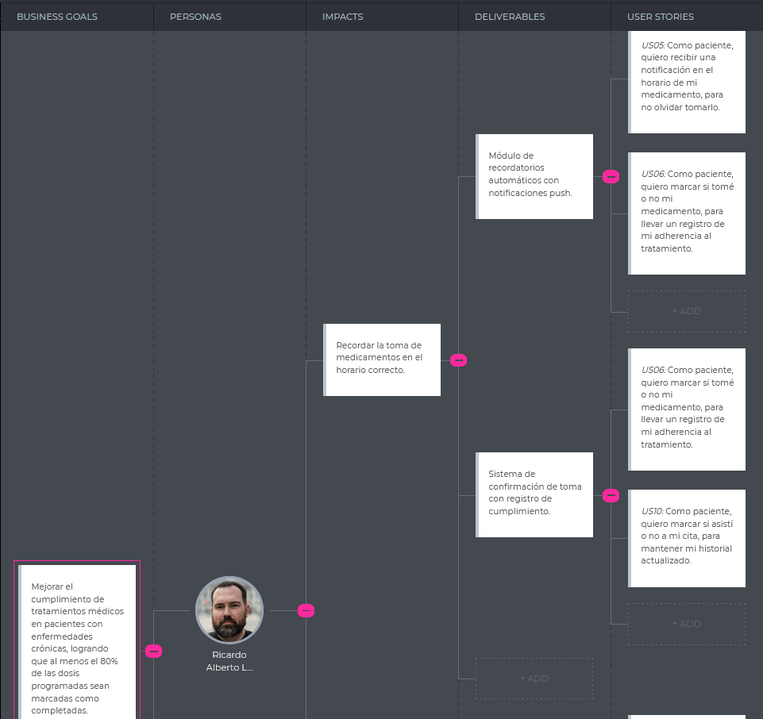</td>

<td align="center">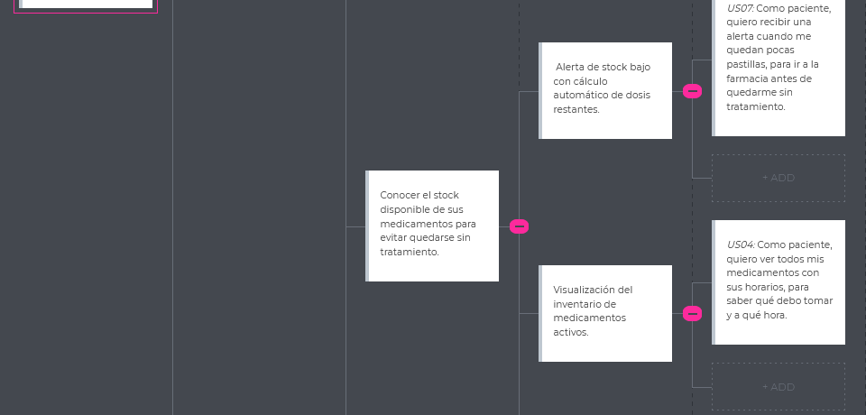</td>

<div align = center>

_Figura 10. Impact Mapping del segmento Pacientes. Elaboración propia._

</div>

<hr class="page-break">

<td align="center">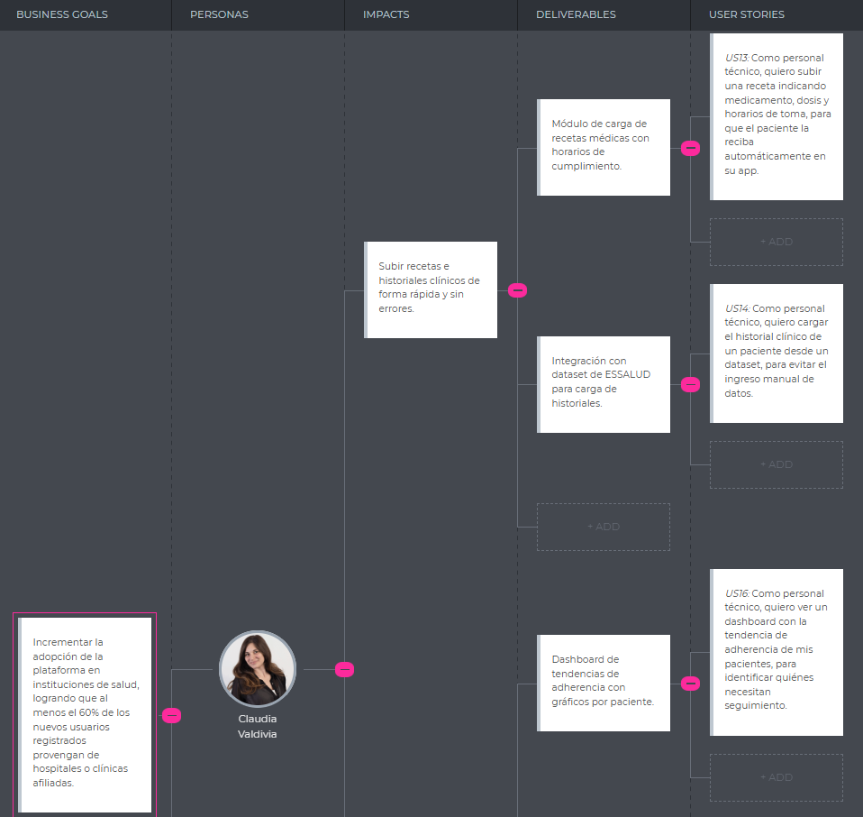</td>

<td align="center">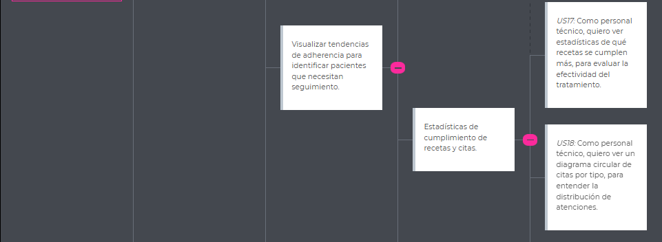</td>

<div align = center>

_Figura 11. Impact Mapping del segmento Personal de Apoyo. Elaboración propia._

</div>

<hr class="page-break">

## 3.4. Product Backlog

El orden del Product Backlog se determina por el valor de negocio que aporta cada User Story, priorizando aquellas que resuelven directamente los Pain Points identificados (adherencia al tratamiento, digitalización de recetas y seguimiento de pacientes). Las User Stories relacionadas con autenticación, recuperación de contraseña y operaciones de soporte se ubican al final, ya que son habilitadoras del flujo pero no representan el valor core que MediTrack ofrece a pacientes e instituciones de salud.

Para la estimación del esfuerzo de los elementos del Product Backlog, se ha optado por utilizar la sucesión de Fibonacci (1,2,3,5,8,…).

| # Orden | User Story ID | Título                                          | Descripción                                                                                                                                      | Story Points |
| ------- | ------------- | ----------------------------------------------- | ------------------------------------------------------------------------------------------------------------------------------------------------ | ------------ |
| 1       | US13          | Subir receta médica con horarios                | Como personal técnico, quiero subir una receta indicando medicamento, dosis y horarios de toma, para que el paciente la reciba en su aplicación. | 8            |
| 2       | US04          | Ver lista de medicamentos                       | Como paciente, quiero ver todos mis medicamentos con sus horarios, para saber qué debo tomar y a qué hora.                                       | 5            |
| 3       | US05          | Recibir recordatorio de medicamento             | Como paciente, quiero recibir una notificación en el horario de mi medicamento, para no olvidar tomarlo.                                         | 8            |
| 4       | US06          | Registrar cumplimiento de medicamento           | Como paciente, quiero marcar si tomé o no mi medicamento, para llevar un registro de mi adherencia al tratamiento.                               | 5            |
| 5       | US14          | Subir historial clínico                         | Como personal técnico, quiero cargar el historial clínico de un paciente para evitar ingreso manual de datos.                                    | 8            |
| 6       | US15          | Buscar paciente individual                      | Como personal técnico, quiero buscar un paciente por nombre o DNI, para ver su información y seguimiento.                                        | 5            |
| 7       | US26          | Ver próxima toma pendiente                      | Como paciente, quiero ver cuál es mi próxima toma programada y en cuánto tiempo es, para estar preparado.                                        | 5            |
| 8       | US07          | Alerta de stock bajo                            | Como paciente, quiero recibir una alerta cuando me quedan pocas pastillas, para ir a la farmacia antes de quedarme sin tratamiento.              | 5            |
| 9       | US24          | Editar o cancelar medicamento                   | Como paciente, quiero editar o cancelar un medicamento (cuando el médico lo autorice), para corregir errores en mi tratamiento.                  | 3            |
| 10      | US22          | Configurar preferencias de notificaciones       | Como paciente, quiero configurar las preferencias de notificaciones, para ajustar sonido, vibración y repeticiones según mi necesidad.           | 5            |
| 11      | US08          | Agendar cita médica                             | Como paciente, quiero registrar una nueva cita médica en la aplicación, para tenerla en mi calendario y recibir recordatorios.                   | 5            |
| 12      | US09          | Recibir recordatorio de cita médica             | Como paciente, quiero recibir una notificación antes de mi cita, para no olvidarla.                                                              | 5            |
| 13      | US10          | Registrar cumplimiento de cita                  | Como paciente, quiero marcar si asistí o no a mi cita, para mantener mi historial actualizado.                                                   | 3            |
| 14      | US11          | Ver requisitos de cita                          | Como paciente, quiero ver los requisitos previos de mi cita, para llegar preparado.                                                              | 3            |
| 15      | US29          | Editar o cancelar cita médica                   | Como paciente, quiero editar o cancelar una cita médica, para corregir errores en mi agenda.                                                     | 3            |
| 16      | US12          | Recordatorio de examen clínico                  | Como paciente, quiero recibir un recordatorio cuando tengo un examen pendiente, para no olvidar recoger mis resultados.                          | 5            |
| 17      | US25          | Ver historial de adherencia y progreso          | Como paciente, quiero ver mi historial completo de adherencia y progreso del tratamiento, para motivarme y seguir mi evolución.                  | 8            |
| 18      | US16          | Ver dashboard de tendencias de adherencia       | Como personal técnico, quiero ver un dashboard con la tendencia de adherencia de mis pacientes, para identificar quiénes necesitan seguimiento.  | 8            |
| 19      | US17          | Ver estadísticas de cumplimiento de recetas     | Como personal técnico, quiero ver estadísticas de qué recetas se cumplen más, para evaluar la efectividad del tratamiento.                       | 8            |
| 20      | US27          | Recibir alertas automáticas por baja adherencia | Como personal técnico, quiero recibir alertas automáticas cuando la adherencia de un paciente baja del 70 %, para intervenir a tiempo.           | 5            |
| 21      | US18          | Ver estadísticas de citas                       | Como personal técnico, quiero ver un diagrama circular de citas por tipo, para entender la distribución de atenciones.                           | 5            |
| 22      | US23          | Funcionar en modo offline                       | Como paciente, quiero poder ver mis medicamentos y marcar cumplimiento sin internet, para usar la aplicación en cualquier lugar.                 | 8            |
| 23      | US19          | Editar perfil de usuario                        | Como usuario de MediTrack, quiero modificar mi nombre, teléfono o foto de perfil, para mantener mi información actualizada.                      | 3            |
| 24      | US01          | Registro de paciente                            | Como paciente, quiero crear una cuenta en la aplicación móvil, para gestionar mis tratamientos y citas.                                          | 5            |
| 25      | US02          | Registro de personal técnico                    | Como personal técnico, quiero registrarme en la plataforma web, para subir recetas y ver estadísticas de pacientes.                              | 5            |
| 26      | US03          | Inicio de sesión                                | Como usuario registrado, quiero iniciar sesión con mi correo y contraseña, para acceder a mi dashboard según mi rol.                             | 3            |
| 27      | US20          | Recuperar contraseña                            | Como usuario, quiero recuperar mi contraseña olvidada, para poder acceder nuevamente a mi cuenta.                                                | 3            |
| 28      | US21          | Cerrar sesión                                   | Como usuario, quiero cerrar sesión de forma segura, para proteger mi información.                                                                | 3            |
| 29      | US28          | Cambiar contraseña                              | Como usuario, quiero cambiar mi contraseña, para mantener mi cuenta segura.                                                                      | 3            |

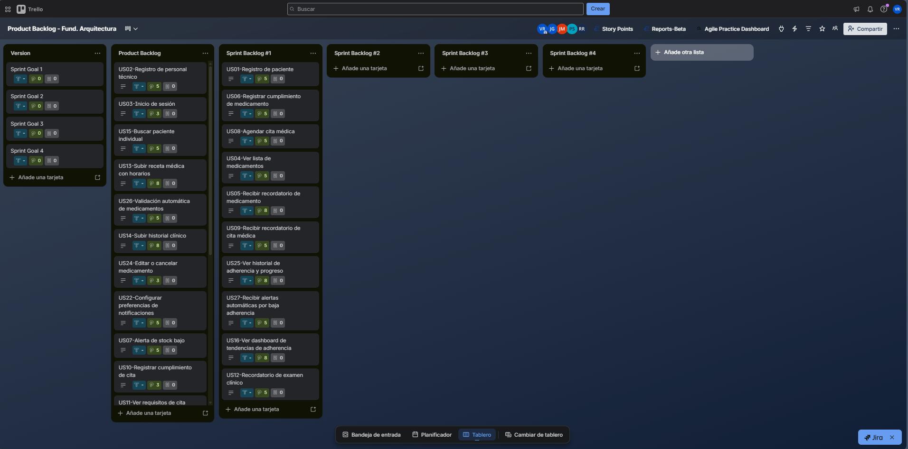

<div align = center>

_Figura 12. Product Backlog. Elaboración propia._

</div>

<br>
Enlace del tablero en Trello: https://trello.com/b/uqAJCw99

<hr class="page-break">

# Capítulo IV: Product Architecture Design

## 4.1. Design Concepts, ViewPoints & ER Diagrams

En esta sección se presentan los conceptos de diseño y las perspectivas arquitectónicas que guían el desarrollo de MediTrack. Se busca mostrar cómo los principios arquitectónicos, los enfoques adoptados, los estilos y patrones seleccionados, así como los diagramas de contexto y de entidades, permiten estructurar una solución tecnológica coherente, escalable y alineada con las necesidades de la gestión medicinal de pacientes. Cada subsección detalla los lineamientos y representaciones que sirven de base para asegurar la calidad y sostenibilidad del sistema en el tiempo.

### 4.1.1. Principles Statements

Los principios arquitectónicos de MediTrack actúan como reglas de gobierno para el diseño y evolución del sistema, asegurando que las decisiones técnicas apoyen los objetivos estratégicos de la startup.

- **Disponibilidad "Offline-First" para el Paciente:** Dado que el cumplimiento del tratamiento no puede depender de la conectividad (especialmente en contextos locales con redes inestables), la arquitectura debe priorizar el funcionamiento de recordatorios y registros de forma local, sincronizando datos de manera asíncrona cuando la conexión se restablezca.

- **Seguridad y Privacidad por Diseño:** Tratándose de información de salud sensible, el acceso a los datos debe regirse por el principio de "menor privilegio". La separación de roles (Paciente vs. Personal Técnico) debe ser estricta a nivel de servicios y base de datos, asegurando el cumplimiento de normativas de protección de datos personales.

- **Desacoplamiento mediante Microservicios:** Se adoptará un enfoque de servicios independientes para las funcionalidades de "Gestión de Tratamientos", "Notificaciones" y "Analítica de Datos". Esto permite que un fallo en el módulo de estadísticas no afecte la entrega crítica de recordatorios de medicación a los pacientes.

- **Escalabilidad Horizontal sobre Vertical:** La infraestructura debe estar preparada para crecer en número de usuarios (pacientes) sin comprometer el rendimiento, utilizando servicios en la nube que permitan replicar instancias de los microservicios según la demanda.

- **Simplicidad en la Interfaz de Usuario:** La arquitectura de información debe reducir la carga cognitiva del usuario. El backend debe entregar datos procesados y simplificados para que el frontend pueda renderizar interfaces limpias, aptas para adultos mayores o personas con dificultades tecnológicas.

### 4.1.2. Approaches Statements Architectural Styles & Patterns

En esta sección se describen los enfoques metodológicos que rigen el desarrollo de la solución, garantizando que el software sea mantenible y fiel a las reglas de negocio.

#### Enfoques adopatados:

- **Domain-Driven Design (DDD):** Dado que el dominio de la salud es complejo, se adopta DDD para centrar el desarrollo en el modelo de negocio. Se identificarán **Bounded Contexts** claros permitiendo que el lenguaje ubicuo sea compartido entre desarrolladores y expertos del dominio médico.

- **Attribute-Driven Design (ADD):** Las decisiones arquitectónicas se basan en atributos de calidad como seguridad, escalabilidad, disponibilidad y facilidad de uso, asegurando que el sistema cumpla con las expectativas técnicas y de los usuarios.

#### Estilos arquitectónicos:

- **Microservicios:** El sistema se descompone en servicios pequeños e independientes que se comunican a través de protocolos ligeros (HTTP/REST). Este estilo facilita el despliegue independiente y la escalabilidad selectiva de las funciones más demandadas, como el motor de notificaciones.

#### Patrones de diseño:

- **API Gateway:** Se implementará un punto de entrada único que actúe como intermediario entre los clientes (App Móvil y Portal Web) y los microservicios. El Gateway se encargará de la autenticación, el enrutamiento de peticiones y la agregación de respuestas, simplificando la lógica en el lado del cliente.
- **CQRS (Command Query Responsibility Segregation):** Para módulos con alta carga de lectura (como los dashboards de estadísticas para el personal técnico), se evaluará la separación de las operaciones de lectura y escritura. Esto optimiza el rendimiento al permitir modelos de datos específicos para consultas complejas sin penalizar las actualizaciones del tratamiento.

### 4.1.3. Context Diagram

El Diagrama de Contexto del Sistema nos permite visualizar el ecosistema en el que opera la solución. En el centro se ubica el sistema MediTrack, el cual actúa como el núcleo de interacción entre los dos actores principales: el Paciente, quien consume la información de su tratamiento, y el Personal Técnico, encargado de la gestión clínica. Asimismo, se detallan las dependencias con sistemas externos.

<td align="center">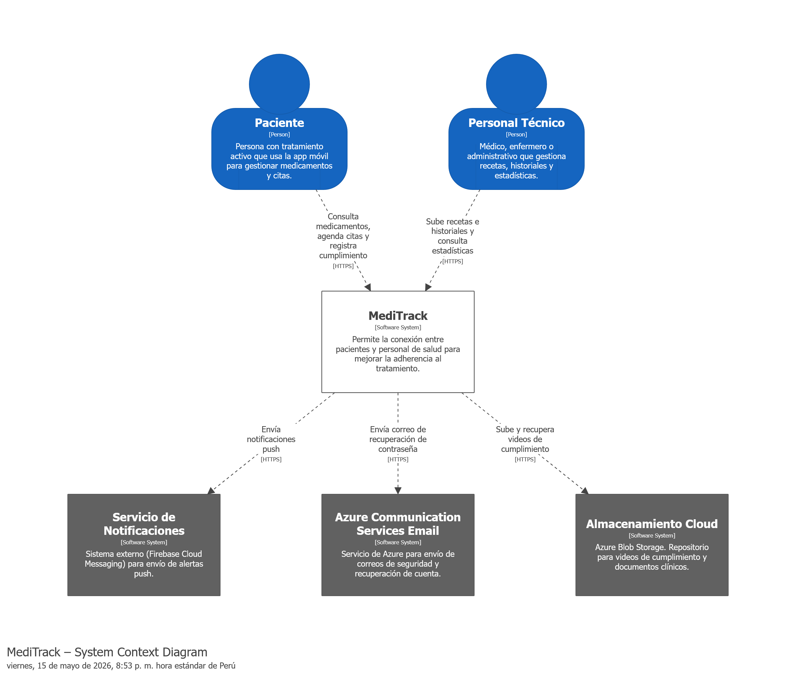</td>

<div align = center>

_Figura 13. Diagrama de contexto del sistema MediTrack. Elaboración propia._

</div>


### 4.1.4. Approach driven ViewPoints Diagrams

#### Container Diagram:

<td align="center">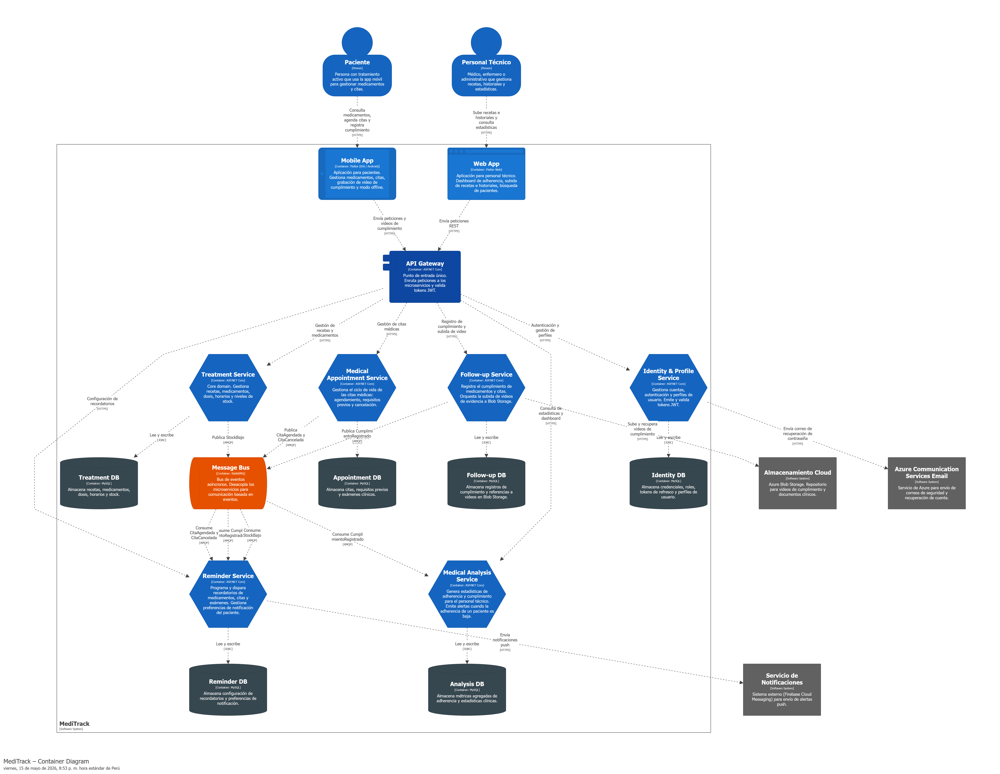</td>

<div align = center>

_Figura 14. Anexo del diagrama de contenedores del sistema MediTrack. Elaboración propia._

</div>

#### Component Diagrams:

#### Identity & Profiles Service:

<td align="center">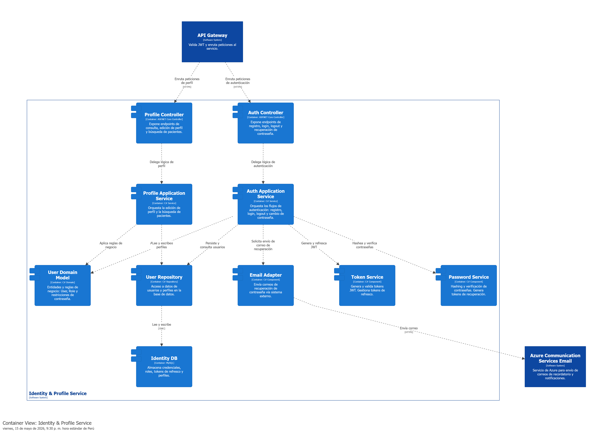</td>

<div align = center>

_Figura 15. Anexo del diagrama de componentes de Identity & Profiles Service . Elaboración propia._

</div>

#### Treatment Service:

<td align="center">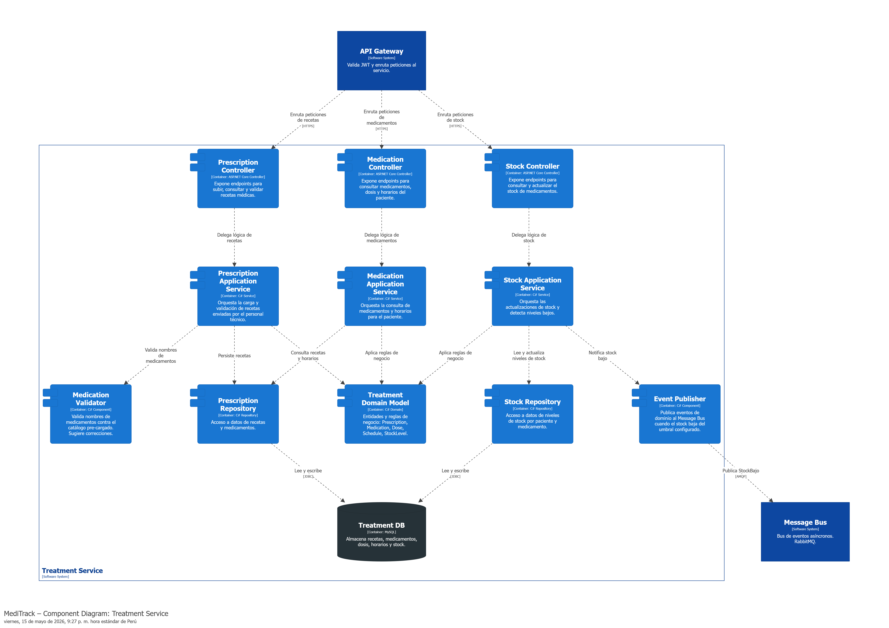</td>

<div align = center>

_Figura 16. Anexo del diagrama de componentes de Treatment Service . Elaboración propia._

</div>

#### Reminder Service:

<td align="center">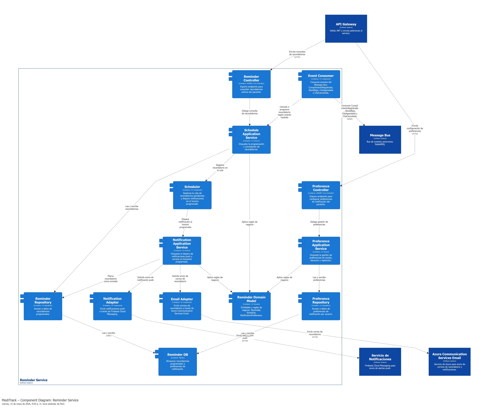</td>

<div align = center>

_Figura 17. Anexo del diagrama de componentes de Reminder Service. Elaboración propia._

</div>

#### Follow-up Service:

<td align="center">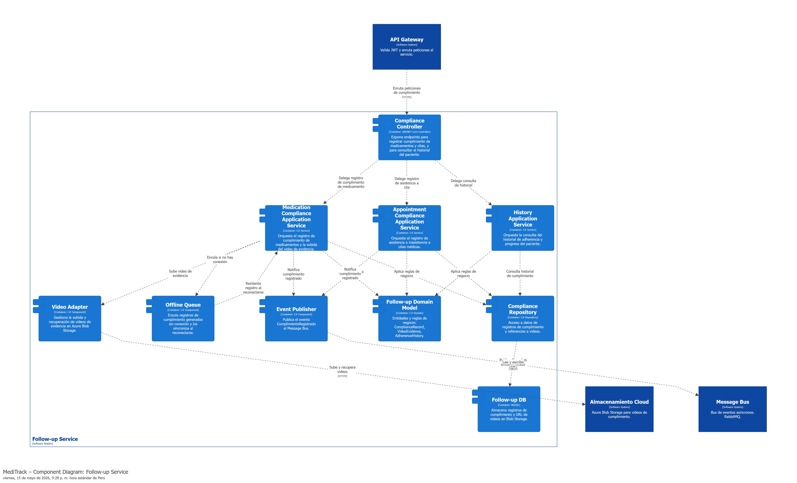</td>

<div align = center>

_Figura 18. Anexo del diagrama de componentes de Follow-up Service. Elaboración propia._

</div>

#### Medical Analysis Service:

<td align="center">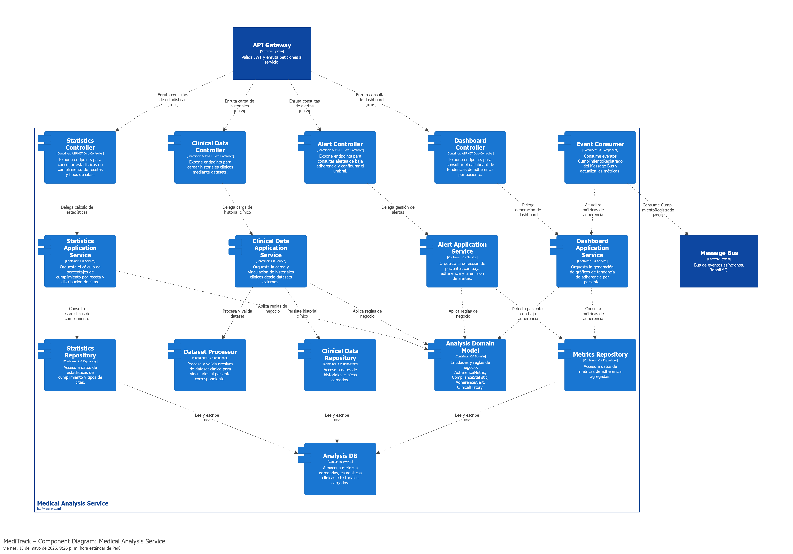</td>

<div align = center>

_Figura 19. Anexo del diagrama de componentes de Medical Analysis Service. Elaboración propia._

</div>

#### Appointment Service:

<td align="center">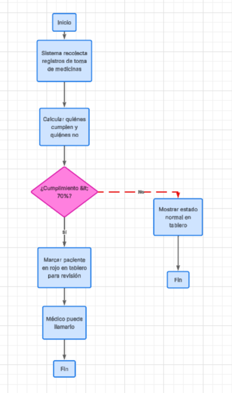</td>

<div align = center>

_Figura 20. Anexo del diagrama de componentes de Appointment Service. Elaboración propia._

</div>

#### Diagramas de Actividades

##### Medical Analysis Activity

<td align="center"></td>

<div align = center>

_Figura 21. Anexo del diagrama de actividades de Medical Analysis. Elaboración propia._

</div>

##### Appointment Activity

<td align="center">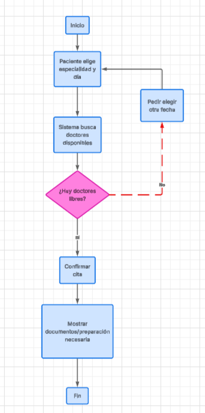</td>

<div align = center>

_Figura 22. Anexo del diagrama de actividades de Appointment. Elaboración propia._

</div>

##### Follow-up Activity

<td align="center">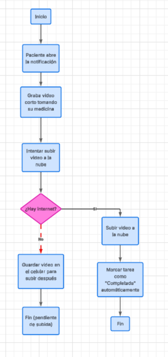</td>

<div align = center>

_Figura 23. Anexo del diagrama de actividades de Follow-up. Elaboración propia._

</div>

##### Identity & Profiles Activity

<td align="center">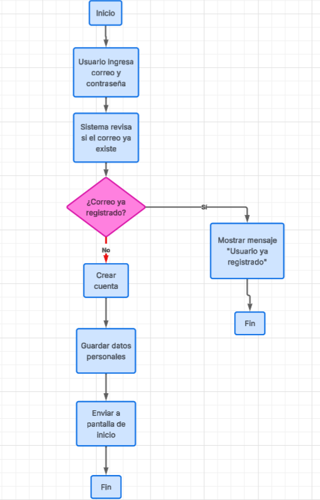</td>

<div align = center>

_Figura 24. Anexo del diagrama de actividades de Identity & Profiles. Elaboración propia._

</div>

##### Treatment Activity

<td align="center">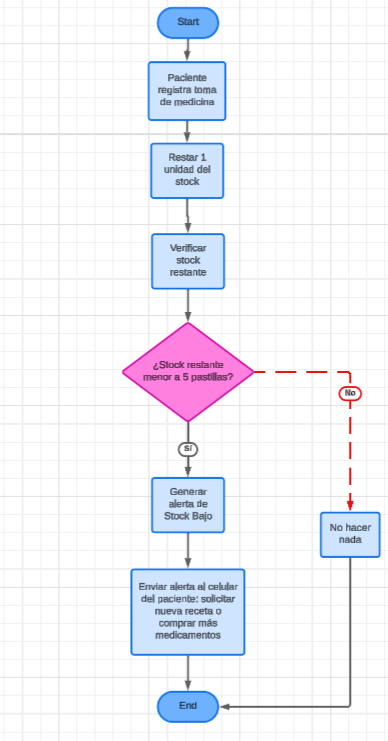</td>

<div align = center>

_Figura 25. Anexo del diagrama de actividades de Treatment. Elaboración propia._

</div>

##### Reminder Activity

<td align="center">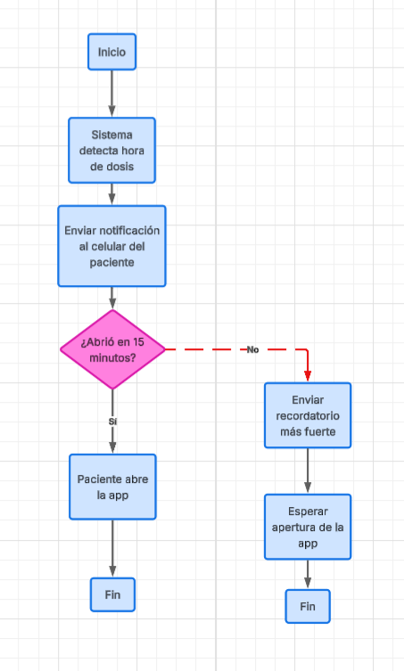</td>

<div align = center>

_Figura 26. Anexo del diagrama de actividades de Reminder. Elaboración propia._

</div>

#### Class Diagram

<td align="center">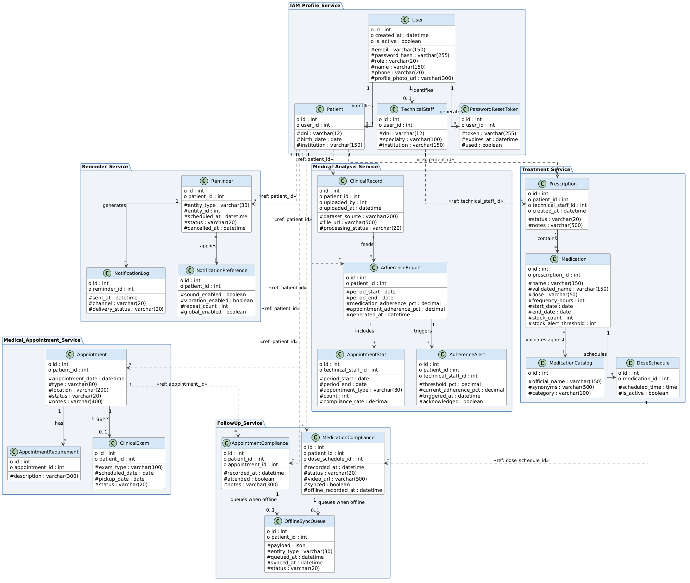</td>

<div align = center>

_Figura 27. Anexo del diagrama de clases del sistema MediTrack. Elaboración propia._

</div>

### 4.1.5. Relational/Non Relational Database Diagram

<td align="center">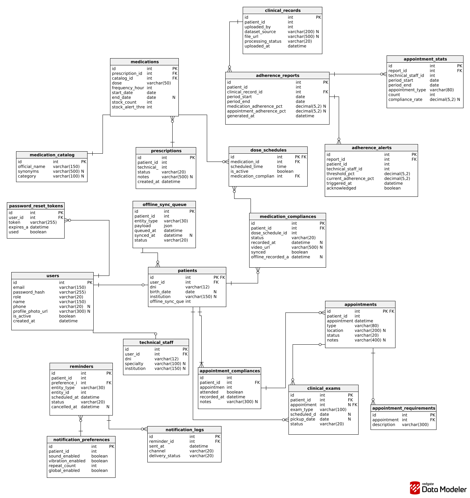</td>

<div align = center>

_Figura 28. Anexo del diagrama de la base de datos relacional de MediTrack. Elaboración propia._

</div>

### 4.1.6. Design Patterns

#### Repository

El presente patrón se aplica en todos los microservicios de MediTrack para abstraer
el acceso a datos. Cada servicio cuenta con repositorios especializados como
`MedicationRepository`, `AppointmentRepository` o `ComplianceRepository`, que
encapsulan las consultas a MySQL detrás de una interfaz limpia:

- Desacopla la lógica de negocio del mecanismo de persistencia, permitiendo que
  el Treatment Service busque medicamentos con `medicationRepository.getByPatientId(id)`
  sin conocer el SQL subyacente.
- Facilita las pruebas unitarias al permitir reemplazar el repositorio real por
  un mock sin modificar la lógica del servicio.
- Centraliza las consultas a base de datos, evitando duplicación y asegurando
  consistencia en el acceso a los datos clínicos.

#### Singleton

Se utiliza en cada microservicio para gestionar la conexión al pool de base de
datos MySQL, garantizando que exista una única instancia durante todo el ciclo
de vida del servicio:

- Garantiza un único punto de acceso al pool de conexiones, evitando el
  agotamiento de recursos ante múltiples instancias simultáneas.
- Asegura que `DatabaseConnectionPool.getInstance()` devuelva siempre la misma
  instancia ya inicializada, sin importar desde qué repositorio se invoque.
- Simplifica la configuración y el monitoreo del uso de conexiones en cada
  microservicio.

#### Factory Method

El presente patrón se aplica en el Reminder Service para la creación de
recordatorios. Dependiendo del tipo de entidad (`medication`, `appointment`,
`exam`), se instancia una fábrica especializada: `MedicationReminderFactory`,
`AppointmentReminderFactory` o `ExamReminderFactory`, cada una con su propio
mensaje, tiempo de anticipación y comportamiento:

- Elimina bloques condicionales complejos al centralizar la lógica de
  construcción de cada tipo de recordatorio en su propia fábrica.
- Facilita la incorporación de nuevos tipos de recordatorio en el futuro sin
  modificar el código existente, respetando el principio Open/Closed.
- Asegura consistencia en la creación de recordatorios, garantizando que cada
  tipo se construya con los parámetros correctos.

#### Strategy

El presente patrón se aplica en el Medical Analysis Service para el cálculo del
porcentaje de adherencia. Se define una interfaz `AdherenceCalculator` con
implementaciones intercambiables: `MedicationAdherenceStrategy` y
`AppointmentAdherenceStrategy`, utilizadas según el contexto del reporte:

- Permite calcular la adherencia de medicamentos y citas con algoritmos
  independientes sin que el servicio conozca cuál estrategia está ejecutando.
- Facilita la incorporación de nuevas métricas de adherencia (por ejemplo, por
  examen clínico) sin modificar el código del servicio principal.
- Mejora la mantenibilidad al separar cada lógica de cálculo en una clase
  dedicada y fácilmente testeable.

#### Decorator

El presente patrón se emplea en el Treatment Service durante la carga de recetas
médicas. La receta pasa por capas de validación encadenadas:
verificación de existencia del paciente, validación del medicamento contra el
catálogo oficial y verificación de horarios completos:

- Permite agregar o quitar validaciones de forma independiente sin modificar las
  capas existentes, respetando el principio Open/Closed.
- Mejora la legibilidad del flujo de validación al separar cada responsabilidad
  en su propio decorador.
- Reduce el riesgo de errores en recetas cargadas al sistema, garantizando que
  toda prescripción pase por las verificaciones necesarias antes de persistirse.

#### Observer

En MediTrack se aplica para la comunicación asíncrona entre microservicios. Cuando
el Follow-up Service registra el cumplimiento de un medicamento, publica el evento
`CumplimientoRegistrado`; el Reminder Service lo escucha y cancela el recordatorio
pendiente. De forma similar, el evento `StockBajo` es publicado por el Treatment
Service cuando el conteo de pastillas alcanza el umbral definido:

- Facilita la comunicación desacoplada entre microservicios, ya que el emisor no
  necesita conocer a los receptores del evento.
- Permite añadir nuevos suscriptores en el futuro (por ejemplo, un servicio de
  alertas al médico) sin modificar el código del servicio emisor.
- Garantiza que la información crítica, como el stock bajo o el cumplimiento
  registrado, llegue a los servicios correctos en el momento oportuno.

### 4.1.7. Tactics

- **Optimización de la Base de Datos:**
  - Utilizar índices en las consultas relacionadas con pacientes, medicamentos, recetas e historiales clínicos para mejorar la velocidad de acceso a la información.

  - Implementar una estructura de datos eficiente que permita manejar relaciones entre pacientes, tratamientos y personal técnico sin redundancias.

  - Realizar análisis periódicos para identificar consultas ineficientes, especialmente en dashboards de adherencia y búsqueda de pacientes.

- **Caché de Datos y Consultas:**
  - Implementar mecanismos de caché para almacenar información frecuente como lista de medicamentos, horarios y datos del paciente, reduciendo la carga del sistema.

  - Aplicar caché a nivel de aplicación para mejorar la experiencia del usuario en consultas repetitivas, como visualización de tratamientos o historial clínico.

- **Optimización de Código y Arquitectura:**
  - Realizar pruebas de rendimiento para identificar cuellos de botella en procesos críticos como generación de recordatorios y carga de recetas.

  - Aplicar patrones de diseño que favorezcan la escalabilidad y mantenibilidad del sistema.

  - Utilizar una arquitectura basada en microservicios para separar funcionalidades como gestión de usuarios, tratamientos, notificaciones y análisis de datos.

- **Optimización de Recursos en el Frontend:**
  - Minimizar el uso de recursos en la aplicación móvil y web mediante técnicas de compresión y optimización de archivos.

  - Implementar carga eficiente de datos para asegurar una experiencia fluida, especialmente en dispositivos móviles y en usuarios adultos mayores.

- **Monitorización y Gestión de Errores:**
  - Implementar herramientas de monitoreo para supervisar el rendimiento del sistema en tiempo real, especialmente en el envío de notificaciones y procesamiento de datos clínicos.

  - Desarrollar un sistema robusto de manejo de errores que permita registrar fallos y garantizar la continuidad del servicio sin afectar al usuario.

<hr class="page-break">

## 4.2. Architectural Drivers

### 4.2.1. Design Purpose

Para el desarrollo de la aplicación MediTrack, orientada al seguimiento de tratamientos médicos y la integración entre pacientes y centros de salud, se propone la implementación de una arquitectura basada en microservicios.

Esta arquitectura permite organizar el sistema en componentes independientes, facilitando el desarrollo, mantenimiento y escalabilidad de funcionalidades clave como gestión de medicamentos, recordatorios, citas médicas y carga de información clínica. Esto resulta especialmente importante considerando que el sistema debe atender tanto a pacientes como al personal técnico de clínicas y hospitales.

La escalabilidad es un factor crítico, ya que el sistema debe soportar incrementos en el número de usuarios y en la cantidad de datos clínicos procesados. Por ejemplo, a medida que más instituciones de salud se integren a la plataforma, el sistema deberá manejar grandes volúmenes de recetas, historiales y notificaciones sin afectar el rendimiento.

Además, la arquitectura de microservicios permite desplegar y actualizar componentes de manera independiente. Esto es clave en MediTrack, donde módulos como notificaciones, gestión de pacientes o dashboards de adherencia pueden evolucionar de forma continua sin interrumpir el funcionamiento general del sistema.

Este enfoque también facilita la integración con sistemas externos de salud y permite incorporar nuevas funcionalidades en el futuro, como análisis predictivo de adherencia o integración con dispositivos médicos, alineándose con la evolución del sector de salud digital.

### 4.2.2. Primary Functionality (Primary User Stories)

Las Primary User Stories representan las funcionalidades núcleo del sistema que ejercen la mayor influencia en la definición de la arquitectura de microservicios. Estas historias impulsan directamente la identificación de bounded contexts (DDD), los flujos de datos críticos, los mecanismos de comunicación entre servicios (sincrónicos y asíncronos), el diseño de persistencia y las estrategias de notificación y procesamiento de eventos.
Se han seleccionado las User Stories de mayor prioridad del Product Backlog que impactan significativamente la estructura arquitectónica del producto MediTrack.

| ID   | Título                                    | Descripción                                                                                                                                                                                                                                                      |
| ---- | ----------------------------------------- | ---------------------------------------------------------------------------------------------------------------------------------------------------------------------------------------------------------------------------------------------------------------- |
| US13 | Subir receta médica con horarios          | Como personal técnico de clínica, quiero subir una receta médica digital (PDF o formulario estructurado) con la lista de medicamentos, dosis, horarios y duración del tratamiento para que el sistema genere automáticamente los recordatorios para el paciente. |
| US04 | Ver lista de medicamentos                 | Como paciente, quiero ver todos mis medicamentos con sus horarios, para saber qué debo tomar y a qué hora.                                                                                                                                                       |
| US05 | Recibir recordatorio de medicamento       | Como paciente, quiero recibir una notificación en el horario de mi medicamento, para no olvidar tomarlo.                                                                                                                                                         |
| US06 | Registrar cumplimiento de medicamento     | Como paciente, quiero marcar si tomé o no mi medicamento, para llevar un registro de mi adherencia al tratamiento.                                                                                                                                               |
| US14 | Subir historial clínico                   | Como personal técnico, quiero cargar el historial clínico de un paciente para evitar ingreso manual de datos.                                                                                                                                                    |
| US16 | Ver dashboard de tendencias de adherencia | Como personal técnico, quiero ver un dashboard con la tendencia de adherencia de mis pacientes, para identificar quiénes necesitan seguimiento.                                                                                                                  |
| US07 | Alertar stock bajo de medicamento         | Como paciente, quiero recibir una alerta cuando me quedan pocas pastillas, para ir a la farmacia antes de quedarme sin tratamiento.                                                                                                                              |
| US25 | Ver historial de adherencia y progreso    | Como paciente, quiero ver mi historial completo de adherencia y progreso del tratamiento, para motivarme y seguir mi evolución.                                                                                                                                  |

### 4.2.3 Quality Attribute Scenarios

Los escenarios de atributos de calidad permiten analizar cómo debe reaccionar la aplicación ante distintos estímulos y condiciones críticas.

| ID    | Atributo de Calidad | Fuente                                | Estímulo                                                                                                  | Artefacto                                               | Entorno                             | Respuesta                                                                                                                          | Medida de Respuesta                                                                               |
| ----- | ------------------- | ------------------------------------- | --------------------------------------------------------------------------------------------------------- | ------------------------------------------------------- | ----------------------------------- | ---------------------------------------------------------------------------------------------------------------------------------- | ------------------------------------------------------------------------------------------------- |
| QAS-0 | Rendimiento         | Paciente (app móvil)                  | Solicitud de visualización de lista de medicamentos o envío de recordatorio push inmediato                | API Gateway + Notification Service + Mobile Application | Producción, carga normal            | El sistema responde rápidamente y entrega el recordatorio o muestra la lista de medicamentos (US04, US05, US13, US16)              | Latencia ≤ 2 segundos (percentil 95)                                                              |
| QAS-1 | Durabilidad         | Paciente                              | Pérdida temporal de conexión a internet al registrar cumplimiento de medicamento o al consultar historial | Mobile Application (Frontend + Local Storage)           | Entorno sin conexión (modo offline) | El cumplimiento o historial se guarda localmente y se sincroniza automáticamente cuando se recupera la conexión (US06, US07, US25) | 100 % de los registros locales se sincronizan correctamente en menos de 5 minutos tras reconexión |
| QAS-2 | Disponibilidad      | Sistema de notificaciones / Scheduler | Fallo en el servicio de envío de recordatorios o registro de cumplimiento                                 | Notification Service + Compliance Service               | Producción, carga normal            | El sistema detecta el fallo, reintenta automáticamente y activa fallback (SMS o notificación local) (US05, US06, US07, US13)       | Tiempo de recuperación ≤ 30 segundos; 99.9 % de recordatorios críticos entregados                 |

### 4.2.4. Constraints

En esta sección se documentan las restricciones tecnológicas, legales y operativas que acotan el espacio de decisiones arquitectónicas de MediTrack.

| ID     | Categoria                 | Restricción                                                                                                                                                                                                                                                                       | Impacto en la arquitectura                                                                                                                                                                                                                                                                                                                                                                    |
| ------ | ------------------------- | --------------------------------------------------------------------------------------------------------------------------------------------------------------------------------------------------------------------------------------------------------------------------------- | --------------------------------------------------------------------------------------------------------------------------------------------------------------------------------------------------------------------------------------------------------------------------------------------------------------------------------------------------------------------------------------------- |
| CON-01 | Base de datos             | Todos los microservicios utilizarán MySQL como único motor de persistencia relacional bajo el patrón Database per Service. Los modelos de lectura derivados del patrón CQRS se construirán sobre el mismo motor mediante vistas materializadas o réplicas de lectura.             | Cada microservicio tendrá su propio esquema MySQL aislado. No se evaluarán bases de datos NoSQL ni otros motores relacionales en esta versión. Los read models del enfoque CQRS (sección 4.1.2) se materializarán sobre MySQL, evitando la introducción de motores adicionales.                                                                                                               |
| CON-02 | Infraestructura cloud     | El despliegue se realizará sobre Azure for Students (plan gratuito).                                                                                                                                                                                                              | Limita el número de instancias simultáneas, la RAM por servicio y el ancho de banda. Las decisiones de escalabilidad horizontal deben contemplar estos topes desde el diseño.                                                                                                                                                                                                                 |
| CON-03 | Comunicación              | Los clientes se comunicarán con el backend exclusivamente mediante API REST bajo HTTPS.                                                                                                                                                                                           | Se descarta GraphQL y gRPC como protocolos de cliente. Todos los contratos de integración serán endpoints REST documentados con OpenAPI.                                                                                                                                                                                                                                                      |
| CON-04 | Seguridad                 | La gestión de sesiones y roles se implementará con JSON Web Tokens (JWT). El API Gateway actuará como punto principal de validación y autorización por rol, pero cada microservicio deberá validar la firma del token de forma independiente como capa de defensa en profundidad. | El Gateway centraliza la lógica de autenticación, pero los microservicios no confían ciegamente en él. La validación local de la firma JWT es obligatoria, alineándose con el principio de menor privilegio (Principle 4.1.1 #2).                                                                                                                                                             |
| CON-05 | Notificaciones            | El envío de notificaciones push remotas se realizará exclusivamente con Firebase Cloud Messaging (FCM).                                                                                                                                                                           | El Reminder Service dependerá de FCM para la entrega final al dispositivo. Debe contemplarse un mecanismo de reintento ante fallos de FCM y un canal de fallback (ver AC-09).                                                                                                                                                                                                                 |
| CON-06 | Almacenamiento offline    | El cliente móvil utilizará SQLite como motor de persistencia local para soportar el funcionamiento offline-first.                                                                                                                                                                 | La aplicación Flutter mantendrá un esquema local sincronizable mediante un ORM compatible con SQLite. La sincronización con el backend se realizará de forma asíncrona al recuperar conexión, cumpliendo con QAS-1 (100 % de registros sincronizados en ≤ 5 minutos).                                                                                                                         |
| CON-07 | Stack tecnológico         | Backend en .NET 8, frontend web en Flutter Web y cliente móvil en Flutter (Android).                                                                                                                                                                                              | Las decisiones de frameworks, librerías y patrones de integración quedan acotadas al ecosistema .NET y Flutter. El uso unificado de Flutter en mobile y web permite compartir librerías de dominio entre ambos clientes. No se incorporarán otros lenguajes sin consenso del equipo.                                                                                                          |
| CON-08 | Plataforma móvil objetivo | El cliente móvil se distribuirá exclusivamente para Android en la fase inicial del producto.                                                                                                                                                                                      | La estrategia de notificaciones push se diseña sobre FCM (CON-05) para Android. Las pruebas de compatibilidad se ejecutarán únicamente sobre versiones recientes de Android, alineadas con el dispositivo predominante en el segmento Paciente (Lima Metropolitana, NSE medio, incluyendo adultos mayores). iOS queda fuera del alcance de la versión 1.                                      |
| CON-09 | Cumplimiento legal        | El sistema deberá cumplir con la Ley N° 29733 — Ley de Protección de Datos Personales del Perú y su reglamento, particularmente en lo referido al tratamiento de datos personales sensibles relacionados con la salud (Art. 2.5).                                                 | La arquitectura debe contemplar consentimiento informado del usuario, cifrado de datos en tránsito (HTTPS/TLS) y en reposo, control de accesos basado en roles, registros de auditoría, y procesos de retención y eliminación de datos. El alojamiento y procesamiento deben mantenerse dentro del marco legal peruano. Aterriza el Principle 4.1.1 #2 ("Seguridad y Privacidad por Diseño"). |

### 4.2.5. Architectural Concerns

En esta sección se identifican las preocupaciones arquitectónicas de mayor impacto, derivadas tanto de los requisitos funcionales como de los riesgos y necesidades de los stakeholders.

| ID    | Aspecto                                               | Preocupacion/Restricción                                                                                                                                                                                                                                                                                                         | Impacto en la Arquitectura                                                                                                                                                                                                                                                                                                                                                                   |
| ----- | ----------------------------------------------------- | -------------------------------------------------------------------------------------------------------------------------------------------------------------------------------------------------------------------------------------------------------------------------------------------------------------------------------- | -------------------------------------------------------------------------------------------------------------------------------------------------------------------------------------------------------------------------------------------------------------------------------------------------------------------------------------------------------------------------------------------- |
| AC-01 | Seguridad y control de acceso                         | El sistema atiende dos segmentos con permisos radicalmente distintos. Un fallo en la separación Paciente/Personal Técnico implicaría una violación de privacidad y un incumplimiento de CON-09 (Ley N° 29733).                                                                                                                   | La arquitectura debe aplicar autorización por rol en el API Gateway (validación JWT con claim de rol) y validación local de la firma del token en cada microservicio (defensa en profundidad, alineado con CON-04). Cada servicio expone únicamente la información correspondiente al rol autenticado.                                                                                       |
| AC-02 | Disponibilidad de notificaciones críticas             | El Reminder Service es el componente de mayor impacto clínico. Un fallo en la entrega de un recordatorio puede derivar en una dosis omitida con consecuencias directas para la salud del paciente.                                                                                                                               | El Reminder Service debe implementar reintentos automáticos con backoff exponencial, colas de mensajes con garantía de entrega y comunicación asíncrona para desacoplarse de los servicios que originan los eventos.                                                                                                                                                                         |
| AC-03 | Coherencia de datos en modo offline                   | Los pacientes deben poder registrar cumplimientos sin conexión a internet (situación frecuente en el contexto peruano). Cuando un mismo paciente sincroniza registros desde el dispositivo tras periodos prolongados sin conexión, pueden producirse conflictos entre el estado local y el estado remoto.                        | La arquitectura debe definir una estrategia explícita de resolución de conflictos en la sincronización entre el almacenamiento offline (CON-06) y los microservicios. La estrategia concreta (timestamp, vector clocks u otra) se decidirá en las iteraciones ADD (sección 4.3).                                                                                                             |
| AC-04 | Escalabilidad del motor de notificaciones             | El Reminder Service puede disparar miles de notificaciones simultáneas si múltiples pacientes comparten el mismo horario de medicación.                                                                                                                                                                                          | Debe diseñarse para escalar horizontalmente de forma independiente al resto de microservicios, dentro de los topes impuestos por CON-02, sin que su carga afecte la disponibilidad del Treatment Service o el Follow-up Service.                                                                                                                                                             |
| AC-05 | Mantenibilidad e independencia entre servicios        | El equipo de desarrollo es pequeño. Un cambio en un servicio no debe obligar a modificar ni redesplegar otros servicios.                                                                                                                                                                                                         | Cada microservicio debe poder modificarse, testearse y desplegarse de forma autónoma. La comunicación entre servicios se realizará exclusivamente mediante interfaces bien definidas (REST o eventos), sin dependencias directas entre repositorios o bases de datos.                                                                                                                        |
| AC-06 | Accesibilidad y simplicidad para el segmento Paciente | Una parte significativa del segmento Paciente tiene baja alfabetización digital, incluyendo adultos mayores identificados en las entrevistas. La interfaz móvil debe minimizar la carga cognitiva sin acoplar el dominio del backend a la presentación.                                                                          | La arquitectura debe incorporar un componente Backend-For-Frontend (BFF) específico para la app móvil, encargado de adaptar y simplificar las respuestas del dominio (ordenamiento, agregaciones, estados en lenguaje natural) a las necesidades de presentación móvil. Los microservicios de dominio se mantienen agnósticos de la UI, preservando el Principle 4.1.1 #3 (Desacoplamiento). |
| AC-07 | Definición de Bounded Contexts                        | La cercanía funcional entre Treatment, Reminder y Follow-up genera riesgo de límites mal definidos. Un modelado incorrecto derivaría en un monolito distribuido con servicios fuertemente acoplados, contradiciendo el enfoque DDD adoptado en 4.1.2.                                                                            | La arquitectura debe partir de un modelado DDD explícito con Context Map documentado, identificando claramente las relaciones (Customer-Supplier, Conformist, Anti-Corruption Layer) entre los Bounded Contexts. Se evitará compartir entidades de dominio entre servicios mediante librerías comunes.                                                                                       |
| AC-08 | Consistencia de datos entre servicios                 | Operaciones críticas como el registro de cumplimiento (US06) o la generación automática de recordatorios al subir una receta (US13) atraviesan varios servicios (Treatment, Follow-up, Reminder) con bases de datos independientes (CON-01). Una transacción ACID distribuida no es viable.                                      | La arquitectura debe adoptar un modelo de eventual consistency mediante mensajería asíncrona, aplicando el patrón Saga para flujos que cruzan servicios y el patrón Outbox para garantizar la publicación confiable de eventos desde cada microservicio sin perder atomicidad con su escritura local.                                                                                        |
| AC-09 | Estrategia de fallback de notificaciones              | QAS-2 exige una entrega del 99.9 % de recordatorios críticos. Un fallo prolongado de FCM (CON-05) o la ausencia de conectividad del dispositivo pueden impedir la entrega del recordatorio en el horario clínico.                                                                                                                | La arquitectura debe contemplar canales de fallback: notificación local programada en el dispositivo (gestionada por la app Flutter sobre el almacenamiento offline de CON-06) como respaldo principal, y un canal SMS gestionado por un proveedor externo, activado cuando FCM no confirma la entrega dentro de una ventana definida.                                                       |
| AC-10 | Asimetría de carga entre segmentos                    | Pacientes (cliente móvil Android, conectividad fluctuante, alta frecuencia de escrituras pequeñas como cumplimiento de medicación) y Personal Técnico (cliente web, conectividad estable, lecturas pesadas como historiales US14 y dashboards de adherencia US16) presentan patrones de tráfico opuestos sobre el mismo backend. | La arquitectura debe aplicar el patrón CQRS (4.1.2) separando los modelos de escritura transaccional de los modelos de lectura analítica del Personal Técnico, de modo que las consultas pesadas no degraden la latencia de las operaciones del Paciente (QAS-0: ≤ 2 s p95).                                                                                                                 |
| AC-11 | Observabilidad en arquitectura distribuida            | Con seis microservicios de dominio más el API Gateway, y flujos que cruzan varios servicios (US06, US13), un fallo aislado es difícil de diagnosticar sin trazabilidad transversal. QAS-2 exige detección de fallos en ≤ 30 segundos y un 99.9 % de entregas críticas.                                                                                          | La arquitectura debe incorporar tracing distribuido con correlation IDs propagados desde el API Gateway a través de todos los servicios, logging centralizado y métricas por servicio expuestas a un sistema de monitoreo. La observabilidad se trata como capa transversal obligatoria, no como añadido posterior.                                                                          |

<hr class="page-break">

## 4.3. ADD Iterations

El proceso ADD (Attribute-Driven Design) permite tomar decisiones arquitectónicas guiadas por los atributos de calidad y drivers del sistema. A continuación se presentan dos iteraciones: la primera orientada a establecer la estructura base de microservicios y la segunda a garantizar la escalabilidad del motor de notificaciones y la continuidad del tratamiento del paciente.

### 4.3.1. Iteration 1: Flujo Core del Tratamiento

#### 4.3.1.1. Architectural Design Backlog 1

En esta tabla se registran los requisitos priorizados que guían las decisiones de diseño de esta iteración.

<table>
  <thead>
    <tr>
      <th>ID</th>
      <th>Requisito / Historia de Usuario</th>
      <th>Prioridad</th>
      <th>Estado</th>
    </tr>
  </thead>
  <tbody>
    <tr>
      <td>1</td>
      <td>Como personal técnico, quiero subir una receta indicando medicamento, dosis y horarios, para que el paciente la reciba en su aplicación. (US13)</td>
      <td>Alta</td>
      <td>Pendiente</td>
    </tr>
    <tr>
      <td>2</td>
      <td>Como paciente, quiero ver todos mis medicamentos con sus horarios, para saber qué debo tomar y a qué hora. (US04)</td>
      <td>Alta</td>
      <td>Pendiente</td>
    </tr>
    <tr>
      <td>3</td>
      <td>Como paciente, quiero recibir una notificación en el horario de mi medicamento, para no olvidar tomarlo. (US05)</td>
      <td>Alta</td>
      <td>Pendiente</td>
    </tr>
    <tr>
      <td>4</td>
      <td>Como paciente, quiero marcar si tomé o no mi medicamento, para llevar un registro de mi adherencia. (US06)</td>
      <td>Alta</td>
      <td>Pendiente</td>
    </tr>
  </tbody>
</table>

#### 4.3.1.2. Establish Iteration Goal by Selecting Drivers

**Objetivo:** Definir el flujo principal del sistema: desde la carga de una receta hasta la notificación al paciente y el registro de su cumplimiento.

| Driver                                        | Justificación                                                                                                                                                        |
| --------------------------------------------- | -------------------------------------------------------------------------------------------------------------------------------------------------------------------- |
| US13 — Subir receta médica                    | Define el punto de entrada del flujo de tratamiento y la necesidad de validación previa a la persistencia.                                                           |
| US05 — Recibir recordatorio                   | Establece la necesidad de generar eventos derivados de la receta para la creación de recordatorios.                                                                  |
| US06 — Registrar cumplimiento                 | Permite cerrar el ciclo del tratamiento mediante la persistencia del comportamiento del paciente.                                                                    |
| AC-08 — Consistencia de datos entre servicios | Justifica la validación estructurada de recetas antes de generar efectos secundarios (eventos `RecetaCargada`) que disparan flujos en otros servicios como Reminder. |

#### 4.3.1.3. Choose One or More Elements of the System to Refine

Partiendo del Diagrama de Contexto, en esta iteración se refinan los siguientes elementos:

| Elemento seleccionado | Justificación                                                                                                                                               |
| --------------------- | ----------------------------------------------------------------------------------------------------------------------------------------------------------- |
| **Treatment Service** | Es el receptor del flujo de mayor prioridad (US13). Se refina el pipeline de validación de recetas mediante el patrón Decorator antes de la persistencia.   |
| **Reminder Service**  | Es el componente de mayor criticidad clínica. Se refina a nivel de componentes internos para garantizar la entrega de recordatorios vía FCM con reintentos. |
| **Follow-up Service** | Es el responsable de registrar el cumplimiento del paciente y cerrar el ciclo del tratamiento.                                                              |

#### 4.3.1.4. Choose One or More Design Concepts That Satisfy the Selected Drivers

| Concepto de Diseño                                                   | Relación con Drivers                                                                                                                                                                                                          |
| -------------------------------------------------------------------- | ----------------------------------------------------------------------------------------------------------------------------------------------------------------------------------------------------------------------------- |
| **Pipeline de validación con patrón Decorator** en Treatment Service | AC-08, US13. Encadena validaciones (existencia del paciente, nombre del medicamento en catálogo, horarios completos) antes de persistir la receta, evitando que datos inválidos se propaguen a Reminder vía eventos.          |
| **Comunicación asíncrona por eventos**                               | AC-02, AC-04, AC-08, US06. El Follow-up Service publica `CumplimientoRegistrado`; el Reminder Service lo consume y cancela el recordatorio pendiente. Alternativa descartada: REST síncrono, por riesgo de fallos en cascada. |
| **Patrón Observer entre servicios**                                  | US06. El registro de cumplimiento genera eventos que pueden ser consumidos por otros servicios sin acoplamiento directo.                                                                                                      |

#### 4.3.1.5. Instantiate Architectural Elements, Allocate Responsibilities, and Define Interfaces

| Elemento              | Responsabilidad                                                                                                                                                                                               | Interfaces                                                                                                                                                                                           |
| --------------------- | ------------------------------------------------------------------------------------------------------------------------------------------------------------------------------------------------------------- | ---------------------------------------------------------------------------------------------------------------------------------------------------------------------------------------------------- |
| **Treatment Service** | Recibe recetas del Personal Técnico, ejecuta pipeline de validación (Decorator), persiste medicamentos con horarios y publica los eventos `RecetaCargada` y `StockBajo`.                                      | `POST /treatments/prescriptions`, `GET /treatments/patients/{patientId}/medications`, `PUT /treatments/medications/{id}`, `DELETE /treatments/medications/{id}`, `POST /treatments/clinical-history` |
| **Reminder Service**  | Genera recordatorios vía Factory Method al recibir `RecetaCargada` y `CitaAgendada`. Ejecuta scheduler para envío vía FCM con backoff exponencial. Cancela recordatorios al recibir `CumplimientoRegistrado`. | `GET /reminders/patients/{patientId}`, `PUT /reminders/{id}/cancel`. Consume eventos: `RecetaCargada`, `CitaAgendada`, `CumplimientoRegistrado`                                                      |
| **Follow-up Service** | Registra cumplimiento/incumplimiento de medicamentos y citas. Publica el evento `CumplimientoRegistrado` tras persistir un cumplimiento.                                                                      | `POST /followup/compliance`, `GET /followup/patients/{patientId}/history`                                                                                                                            |

#### 4.3.1.6. Sketch Views (C4 & UML) and Record Design Decisions

**C4 - Context Diagram**

Se muestra al paciente y personal tecnico como actores principales y su interacción con el microservicio de tratamiento.

<td align="center"></td>

<div align = center>

_Figura 29. Anexo del diagrama de contexto de MediTrack. Elaboración propia._

</div>

**C4 - Container Diagram**
Se muestra los contenedores del sistema, destacando el microservicio de tratamiento y su base de datos dedicada, así como cómo se comunican con los otros servicios internos del sistema.

<td align="center"></td>

<div align = center>

_Figura 30. Anexo del diagrama de contenedores de MediTrack. Elaboración propia._

</div>

**C4 - Component Diagram**
Se detalla los componentes internos del microservicio, como Controller, Event Listener, Manager, Service y muestra cómo se comunican entre sí y con la base de datos.
<td align="center"></td>

<td align="center">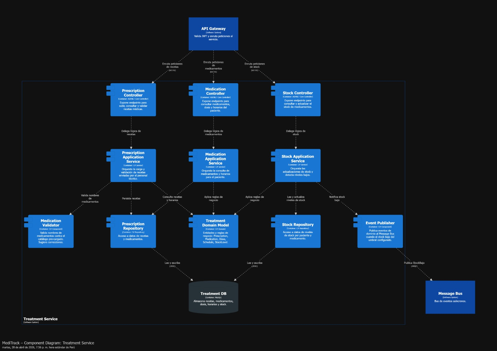</td>

<div align = center>

_Figura 31. Anexo del diagrama de componentes de Treatment Service. Elaboración propia._

</div>

#### 4.3.1.7. Analysis of Current Design and Review Iteration Goal (Kanban Board)

<td align="center">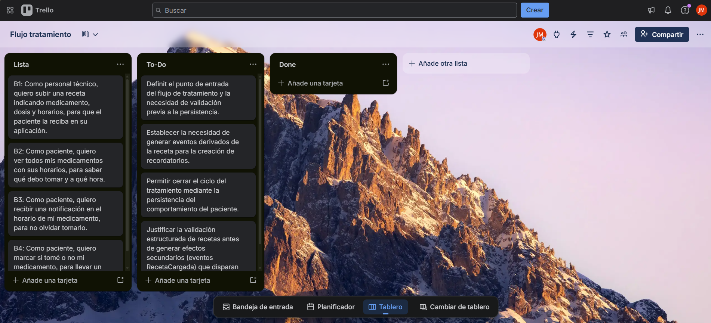</td>

<div align = center>

_Figura 32. Kanban Board Iteration 1. Elaboración propia._

</div>

Link del Trello: https://trello.com/invite/b/69f68ffd0f1cabd66eb3d654/ATTIfa866b418b39e6f9b6af171adf8cdfc370BCEFBD/flujo-tratamiento

<hr class="page-break">

### 4.3.2. Iteration 2: Continuidad del Tratamiento — Modo Offline

#### 4.3.2.1. Architectural Design Backlog 1

En esta tabla se registran los requisitos priorizados que guían las decisiones de diseño de esta segunda iteración.

| ID  | Requisito / Historia de Usuario                                                                                                              | Prioridad | Estado    |
| --- | -------------------------------------------------------------------------------------------------------------------------------------------- | --------- | --------- |
| 1   | Como paciente, quiero poder registrar cumplimiento sin internet para continuar mi tratamiento en cualquier contexto. (US23)                  | Alta      | Pendiente |
| 2   | Como paciente, quiero recibir una alerta cuando me quedan pocas pastillas, para ir a la farmacia antes de quedarme sin tratamiento. (US07)   | Alta      | Pendiente |
| 3   | Como paciente, quiero configurar las preferencias de notificaciones para ajustar sonido, vibración y repeticiones según mi necesidad. (US22) | Media     | Pendiente |

#### 4.3.2.2. Establish Iteration Goal by Selecting Drivers

**Objetivo:**
Permitir la continuidad del tratamiento del paciente en tres frentes: soporte a funcionamiento sin conexión (offline-first)y resiliencia del motor de notificaciones ante alta concurrencia.

| Driver                                     | Justificación                                                                                                                                                              |
| ------------------------------------------ | -------------------------------------------------------------------------------------------------------------------------------------------------------------------------- |
| US23 — Modo offline                        | Define la necesidad de persistencia local en el cliente.                                                                                                                   |
| US07 — Alerta de stock bajo                | El Treatment Service debe detectar cuando el conteo de pastillas cae al umbral y publicar el evento `StockBajo` para que el Reminder Service genere la alerta al paciente. |
| US22 — Preferencias de notificaciones      | Los pacientes, especialmente adultos mayores, deben poder ajustar el comportamiento de los recordatorios. Requiere un módulo de preferencias en el Follow-up Service.      |
| AC-03 — Coherencia offline                 | Justifica la estrategia de resolución de conflictos en sincronización.                                                                                                     |
| AC-04 — Escalabilidad del Reminder Service | El servicio debe poder escalar horizontalmente ante picos de notificaciones simultáneas.                                                                                   |
| QAS-1 — Durabilidad                        | Garantiza que los datos registrados offline no se pierdan.                                                                                                                 |

#### 4.3.2.3. Choose One or More Elements of the System to Refine

| Elemento seleccionado | Justificación                                                                                                                                  |
| --------------------- | ---------------------------------------------------------------------------------------------------------------------------------------------- |
| **App Móvil Flutter** | Se añade la capa de persistencia local SQLite y el mecanismo de sincronización batch con el Follow-up Service al reconectar.                   |
| **Follow-up Service** | Se añade el endpoint de sincronización batch offline (`POST /followup/compliance/sync`) y la lógica de resolución de conflictos por timestamp. |
| **Treatment Service** | Se refina la lógica de conteo de stock y publicación del evento `StockBajo` al alcanzar el umbral de pastillas restantes.                      |

#### 4.3.2.4. Choose One or More Design Concepts That Satisfy the Selected Drivers

| Concepto de Diseño                                                           | Relación con Drivers                                                                                                                                                                                                                                                                                                                     |
| ---------------------------------------------------------------------------- | ---------------------------------------------------------------------------------------------------------------------------------------------------------------------------------------------------------------------------------------------------------------------------------------------------------------------------------------- |
| **Persistencia local SQLite con sincronización optimista** en la app móvil   | AC-03, QAS-1, US23. La app persiste cumplimientos localmente. Al reconectar, envía los registros pendientes al Follow-up Service vía endpoint batch. El timestamp determina la precedencia en caso de conflicto. Alternativa descartada: solo funcionamiento online, no satisface QAS-1 ni el principio Offline-First definido en 4.1.1. |
| **Módulo de preferencias de notificación** integrado en el Follow-up Service | US22, AC-06. Almacena la configuración de sonido, vibración y repeticiones por paciente, permitiendo simplificar la experiencia de notificación para el segmento Paciente (especialmente adultos mayores). El Reminder Service consulta estas preferencias antes de generar cada notificación.                                           |
| **Detección de stock bajo y evento `StockBajo`** en el Treatment Service     | US07, AC-02. Cuando el conteo de pastillas restantes alcanza el umbral de 3 unidades, el Treatment Service publica `StockBajo`; el Reminder Service genera la notificación al paciente.                                                                                                                                                  |

#### 4.3.2.5. Instantiate Architectural Elements, Allocate Responsibilities, and Define Interfaces

| Elemento                                          | Responsabilidad                                                                                                                                                                                                                        | Interfaces                                                                                                                                                   |
| ------------------------------------------------- | -------------------------------------------------------------------------------------------------------------------------------------------------------------------------------------------------------------------------------------- | ------------------------------------------------------------------------------------------------------------------------------------------------------------ |
| **App Móvil Flutter (capa offline)**              | Persiste en SQLite la lista de medicamentos y los registros de cumplimiento. Al detectar reconexión, envía los registros pendientes al Follow-up Service vía endpoint batch y actualiza el estado local con la respuesta del servidor. | Consume: `POST /followup/compliance/sync`, lectura/escritura de DB local SQLite                                                                              |
| **Follow-up Service (sincronización batch)**      | Recibe registros offline en lote, aplica resolución de conflictos por timestamp y persiste los cumplimientos. Almacena y expone las preferencias de notificación del paciente.                                                         | `POST /followup/compliance/sync`, `GET /followup/preferences/{patientId}`, `PUT /followup/preferences/{patientId}`                                           |
| **Reminder Service (resiliencia y preferencias)** | Antes de enviar cada notificación, consulta las preferencias del paciente. Implementa reintentos con backoff exponencial ante fallo de FCM. Escala horizontalmente de forma independiente ante picos de concurrencia.                  | `GET /reminders/patients/{patientId}`, `PUT /reminders/{id}/cancel`. Consume eventos: `RecetaCargada`, `CitaAgendada`, `CumplimientoRegistrado`, `StockBajo` |
| **Treatment Service (detección de stock bajo)**   | Al registrar una toma de medicamento, decrementa el contador de stock. Cuando el stock llega a 3 unidades, publica el evento `StockBajo` para que el Reminder Service genere la alerta al paciente.                                    | `PUT /treatments/medications/{id}/stock`. Publica evento: `StockBajo`                                                                                        |

#### 4.3.2.6. Sketch Views (C4 & UML) and Record Design Decisions

**C4 - Context Diagram**

Se muestra al paciente y personal tecnico como actores principales y su interacción con el microservicio de tratamiento.

<td align="center"></td>

<div align = center>

_Figura 33. Anexo del diagrama de contexto de MediTrack. Elaboración propia._

</div>

**C4 - Container Diagram**

Se muestra los contenedores del sistema, destacando el microservicio del seguimiento del tratamiento y su base de datos dedicada, así como cómo lee los servicios internos del sistema.

<td align="center"></td>

<div align = center>

_Figura 34. Anexo del diagrama de contenedores de MediTrack. Elaboración propia._

</div>

**C4 - Component Diagram**

Se detalla los componentes internos del microservicio, como Controller, Event Listener, Manager, Service y muestra cómo se comunican entre sí y con la base de datos.

<td align="center"></td>

<div align = center>

_Figura 35. Anexo del diagrama de componentes de Follow-up service. Elaboración propia._

</div>

#### 4.3.2.7. Analysis of Current Design and Review Iteration Goal (Kanban Board)

<td align="center">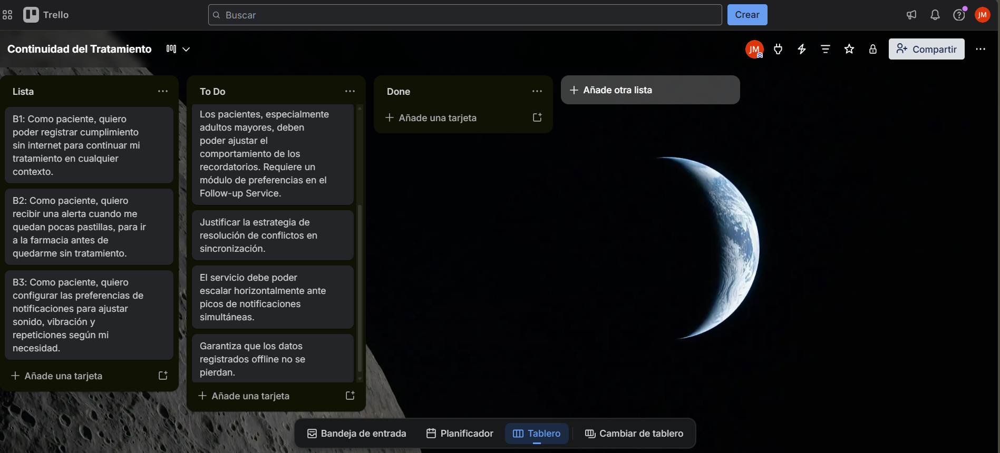</td>

<div align = center>

_Figura 36. Kanban Board Iteration 2._

</div>
Link del Trello: https://trello.com/invite/b/69f6752f9be88dc527f213a9/ATTIfba9ad9e2b8975b1696794b6ecf0382cED03D548/continuidad-del-tratamiento

<hr class="page-break">

# Capítulo V: Product Implementation, Validation & Deployment

## 5.1. Testing Suites & General Patterns

### 5.1.1. Backend Application Core Testing Suite

El backend de MediTrack implementa pruebas orientadas al comportamiento del sistema (BDD) mediante escenarios escritos en lenguaje Gherkin. Cada microservicio define sus escenarios de prueba en archivos `.feature`, los cuales describen las funcionalidades principales desde la perspectiva del negocio y sirven como evidencia de cobertura por sprint.

Los escenarios se organizan por bounded context, siguiendo la misma partición de microservicios definida en la arquitectura. A continuación se presentan los escenarios de prueba correspondientes al **FollowUp Service**, único microservicio completamente implementado al cierre del Sprint 1.

**FollowUp Service — Gestión de medicamentos del paciente**

```gherkin
Feature: Medication Query
  As a patient
  I want to retrieve my active medications and their schedules
  So that I can follow my treatment correctly

  Scenario: Get medications for a valid patient
    Given a patient with id 5 has registered medications in the system
    When a GET request is sent to "/api/v1/medications?patientId=5"
    Then the response status is 200 OK
    And the response body contains a list of medications with their dose schedules

  Scenario: Get medications for a patient with no medications
    Given no medications are registered for patient with id 99
    When a GET request is sent to "/api/v1/medications?patientId=99"
    Then the response status is 404 Not Found
    And the response body contains the message "No medications found for patient 99"

  Scenario: Get medications with an invalid patient id
    When a GET request is sent to "/api/v1/medications?patientId=0"
    Then the response status is 400 Bad Request
    And the response body contains a validation error message
```

**FollowUp Service — Próxima dosis pendiente**

```gherkin
Feature: Next Pending Dose
  As a patient
  I want to know my next pending medication dose for today
  So that I can take it on time

  Scenario: Get next pending dose when one exists today
    Given patient with id 5 has an active medication scheduled at "08:00"
    And no compliance has been recorded for that schedule today
    When a GET request is sent to "/api/v1/medications/next-dose?patientId=5"
    Then the response status is 200 OK
    And the response body contains the next pending dose with "MinutesUntilDose" calculated

  Scenario: Get next pending dose when all doses are already taken
    Given patient with id 5 has all scheduled doses marked as "taken" today
    When a GET request is sent to "/api/v1/medications/next-dose?patientId=5"
    Then the response status is 404 Not Found
    And the response body contains the message "No pending doses found for patient 5 today"
```

**FollowUp Service — Registro de cumplimiento de medicación**

```gherkin
Feature: Medication Compliance Recording
  As a patient
  I want to record whether I took or skipped a scheduled dose
  So that my treatment adherence is tracked

  Scenario: Record a taken dose successfully
    Given a dose schedule with id 3 exists and belongs to patient 5
    When a POST request is sent to "/api/v1/compliance?patientId=5"
    And the request body contains status "taken" and doseScheduleId 3
    Then the response status is 201 Created
    And the response body contains the compliance record with status "taken"
    And a Location header pointing to the new resource is returned

  Scenario: Record a skipped dose successfully
    Given a dose schedule with id 3 exists and belongs to patient 5
    When a POST request is sent to "/api/v1/compliance?patientId=5"
    And the request body contains status "skipped" and doseScheduleId 3
    Then the response status is 201 Created
    And the response body contains the compliance record with status "skipped"

  Scenario: Record compliance with invalid status
    When a POST request is sent to "/api/v1/compliance?patientId=5"
    And the request body contains status "pending" and doseScheduleId 3
    Then the response status is 400 Bad Request
    And the response body contains "Status must be either 'taken' or 'skipped'"

  Scenario: Record compliance for a non-existent dose schedule
    When a POST request is sent to "/api/v1/compliance?patientId=5"
    And the request body contains status "taken" and doseScheduleId 999
    Then the response status is 400 Bad Request
    And the response body contains "DoseSchedule with ID 999 does not exist"

  Scenario: Retrieve a compliance record by id
    Given a compliance record with id 1 exists in the system
    When a GET request is sent to "/api/v1/compliance/1"
    Then the response status is 200 OK
    And the response body contains the compliance record with its dose schedule details
```

Las pruebas se validan en dos modalidades. Para pruebas unitarias se verifica de forma aislada la lógica de los Command y Query Services, controlando los valores de los Value Objects y el flujo de validaciones de negocio. Para pruebas de integración se levanta el servicio completo con su base de datos MySQL local, verificando el comportamiento end-to-end de los endpoints a través de Swagger UI y colecciones de Postman.

### 5.1.2. Pattern Based Backend Application(s)

Los microservicios de MediTrack se desarrollan aplicando los principios de **Clean Architecture** y **Domain-Driven Design (DDD)**, con una separación clara de responsabilidades organizada en cuatro capas donde el control de dependencias fluye siempre hacia el interior: el Domain no conoce a ninguna otra capa, Application solo conoce a Domain, Infrastructure y la capa de Interfaces conocen a las capas interiores pero nunca al revés.

**Estructura de capas — FollowUp Service**

El FollowUp Service implementa esta estructura dentro de un único proyecto `MediTrack.FollowUpService.API`, organizado en las siguientes carpetas de capa:

| Carpeta | Capa | Responsabilidad |
| ------- | ---- | --------------- |
| `Domain/Model/` | **Domain** | Aggregates, Value Objects, Commands, Queries, interfaces de repositorio y servicios |
| `Application/Internal/` | **Application** | Command Services y Query Services que orquestan los casos de uso |
| `Infrastructure/Persistence/EFC/` | **Infrastructure** | `FollowUpDbContext`, repositorios concretos con EF Core y MySQL |
| `Interfaces/REST/` | **Interfaces** | Controllers, Resources (DTOs) y Assemblers (transformadores) |

**Aggregates y Value Objects del Domain**

El Domain del FollowUp Service define tres aggregates principales:

`Medication` es el agregado raíz que representa un medicamento prescrito a un paciente. Encapsula la dosis mediante el Value Object `DoseValue`, contiene la lista de `DoseSchedule` asociados y expone la propiedad computada `IsActive` para verificar si el tratamiento continúa vigente.

`DoseSchedule` representa cada horario de toma programado para un medicamento. Su atributo de hora se encapsula en el Value Object `ScheduledHour`, que valida que el valor esté entre `00:00` y `23:59` y provee conversión implícita a `TimeSpan` para compatibilidad con EF Core.

`MedicationCompliance` registra el cumplimiento de una dosis específica. El estado de cumplimiento se encapsula en el Value Object `ComplianceStatus`, que acepta únicamente los valores `"taken"` o `"skipped"`, implementa un factory method `From()` con validación estricta y proporciona conversión implícita a `string` para la persistencia en base de datos:

```csharp
public class ComplianceStatus
{
    public static readonly ComplianceStatus Taken = new("taken");
    public static readonly ComplianceStatus Skipped = new("skipped");

    public static ComplianceStatus From(string value)
    {
        var lowerValue = value.ToLowerInvariant();
        if (!_validStatuses.TryGetValue(lowerValue, out var status))
            throw new ArgumentException(
                $"Invalid ComplianceStatus '{value}'. Valid values are: 'taken', 'skipped'");
        return status;
    }

    public static implicit operator string(ComplianceStatus status) => status.Value;
    public static implicit operator ComplianceStatus(string value) => From(value);
}
```

**Patrón Command/Query en la capa Application**

La capa Application separa las operaciones de escritura (Commands) de las de lectura (Queries), delegando su ejecución a servicios especializados cuyas interfaces se declaran en el Domain:

- `IMedicationComplianceCommandService` → implementado por `MedicationComplianceCommandService`, que valida el estado de cumplimiento, verifica la existencia del `DoseSchedule` en base de datos y persiste el nuevo `MedicationCompliance`.
- `IMedicationQueryService` → implementado por `MedicationQueryService`, que retorna todos los medicamentos activos de un paciente.
- `INextPendingDoseQueryService` → implementado por `NextPendingDoseQueryService`, que aplica lógica de negocio compleja: filtra medicamentos activos, descarta horarios ya cumplidos en el día y calcula la próxima dosis pendiente según la zona horaria de Lima (SA Pacific Standard Time).

**Patrón Repository en Infrastructure**

Los repositorios concretos implementan las interfaces declaradas en Domain. Cada operación de persistencia llama a `SaveChangesAsync()` directamente sobre el `FollowUpDbContext`, que actúa como la unidad de persistencia del bounded context. Los repositorios utilizan LINQ con `Include()` para cargar las relaciones necesarias y aplican ordenamiento orientado a la experiencia del usuario:

```csharp
public async Task<ICollection<Medication>> FindByPatientIdAsync(int patientId)
{
    return await _context.Medications
        .Where(m => m.PatientId == patientId)
        .Include(m => m.Schedules)
        .OrderBy(m => m.Name)
        .ToListAsync();
}
```

**Patrón Assembler en la capa Interfaces/REST**

La capa Interfaces/REST utiliza el patrón **Assembler** para transformar entidades de dominio en Resources (DTOs de respuesta) y Resources en Commands (DTOs de entrada), manteniendo el modelo de dominio completamente aislado del contrato REST:

- `MedicationResourceFromEntityAssembler` → convierte `Medication` en `MedicationResource`
- `MedicationComplianceResourceFromEntityAssembler` → convierte `MedicationCompliance` en `MedicationComplianceResource`
- `NextPendingDoseResourceFromEntityAssembler` → convierte `MedicationCompliance` en `NextPendingDoseResource`, calculando `MinutesUntilDose` en tiempo real con ajuste de zona horaria de Lima
- `RecordComplianceCommandFromResourceAssembler` → convierte `RecordComplianceResource` en `RecordComplianceCommand`

**Flujo de una solicitud POST /api/v1/compliance**

1. `ComplianceController` recibe el `patientId` por query param y el `RecordComplianceResource` por body.
2. `RecordComplianceCommandFromResourceAssembler` transforma el resource en un `RecordComplianceCommand`.
3. `MedicationComplianceCommandService.HandleAsync()` valida el status, verifica la existencia del `DoseSchedule` en base de datos y crea el `MedicationCompliance`.
4. `MedicationComplianceRepository.AddAsync()` persiste la entidad y llama a `SaveChangesAsync()`.
5. `MedicationComplianceResourceFromEntityAssembler` transforma la entidad persistida en un `MedicationComplianceResource`.
6. El controller responde `201 Created` con el resource y el header `Location` apuntando al nuevo recurso.

### 5.1.3. Pattern Based Custom Software Library

Los componentes reutilizables del FollowUp Service se estructuran como clases y contratos compartidos dentro del mismo bounded context. Dado que al cierre del Sprint 1 el único microservicio completamente implementado es el FollowUp Service, los patrones base descritos a continuación se replicarán en los siguientes servicios conforme avance el desarrollo.

**Value Objects como biblioteca de tipos del dominio**

Los Value Objects encapsulan la lógica de validación y conversión de los atributos de negocio, actuando como una librería de tipos seguros para el dominio. Cada Value Object implementa conversiones implícitas que permiten a EF Core leer y escribir sus valores sin configuración adicional:

`DoseValue` encapsula el string de la dosis con validación de longitud máxima de 100 caracteres. `ScheduledHour` encapsula un `TimeSpan` validado en el rango `00:00–23:59` con un factory method `From(hours, minutes, seconds)` para construcción explícita y segura:

```csharp
public static ScheduledHour From(int hours, int minutes = 0, int seconds = 0)
{
    if (hours < 0 || hours >= 24)
        throw new ArgumentException("Hours must be between 0 and 23");
    return new ScheduledHour(new TimeSpan(0, hours, minutes, seconds));
}

// Conversión implícita para compatibilidad con EF Core
public static implicit operator TimeSpan(ScheduledHour hour) => hour.Value;
public static implicit operator ScheduledHour(TimeSpan value) => new(value);
```

**Interfaces de dominio como contratos de la librería**

Las interfaces declaradas en el Domain definen el contrato que las capas externas deben respetar, estableciendo el acuerdo entre capas sin revelar detalles de implementación:

```csharp
// Contrato de repositorio de medicamentos
public interface IMedicationRepository
{
    Task<ICollection<Medication>> FindByPatientIdAsync(int patientId);
    Task<Medication?> FindByIdAsync(int medicationId);
    Task AddAsync(Medication medication);
    Task UpdateAsync(Medication medication);
    Task DeleteAsync(int medicationId);
}

// Contrato de repositorio de cumplimientos
public interface IMedicationComplianceRepository
{
    Task<MedicationCompliance?> FindByIdAsync(int id);
    Task<ICollection<MedicationCompliance>> FindByPatientIdAsync(int patientId);
    Task<MedicationCompliance?> FindByDoseScheduleIdAsync(int doseScheduleId);
    Task AddAsync(MedicationCompliance compliance);
    Task UpdateAsync(MedicationCompliance compliance);
    Task DeleteAsync(int id);
}
```

**Records como Commands y Queries inmutables**

Los Commands y Queries se implementan como `record` de C#, garantizando inmutabilidad y semántica de valor para los objetos de transferencia de intención de negocio:

```csharp
// Command para registrar cumplimiento
public record RecordComplianceCommand(
    int PatientId,
    int DoseScheduleId,
    string Status,
    string? VideoUrl,
    DateTime? OfflineRecordedAt);

// Queries para consultar el estado del paciente
public record GetMedicationsByPatientIdQuery(int PatientId);
public record GetNextPendingDoseQuery(int PatientId);
```

**Configuración del DbContext con conversiones de Value Objects**

El `FollowUpDbContext` configura mediante Fluent API las conversiones entre los Value Objects del dominio y los tipos primitivos de MySQL, habilitando la persistencia transparente sin exponer los detalles de serialización fuera de la capa Infrastructure:

```csharp
// Mapping de Medication con conversión de DoseValue
modelBuilder.Entity<Medication>(entity =>
{
    entity.ToTable("medications");
    entity.Property(m => m.Dose)
        .HasConversion(d => d.Value, v => new DoseValue(v));
});

// Mapping de DoseSchedule con conversión de ScheduledHour
modelBuilder.Entity<DoseSchedule>(entity =>
{
    entity.ToTable("dose_schedules");
    entity.Property(ds => ds.ScheduledTime)
        .HasConversion(sh => sh.Value, v => new ScheduledHour(v));
});
```

### 5.1.4. Framework Pattern Driven Refactoring Report

El Sprint 1 del proyecto MediTrack concluye con el **FollowUp Service** completamente implementado bajo los principios de Clean Architecture y DDD. El **Treatment Service** cuenta únicamente con la estructura inicial del proyecto .NET 8 y será desarrollado en el Sprint 2. A continuación se documenta cómo el uso deliberado de los frameworks y patrones seleccionados produce un backend alineado con los atributos de calidad definidos en el ADD del Capítulo IV.

**Organización del proyecto FollowUp Service**

El microservicio se estructura en un único proyecto `MediTrack.FollowUpService.API` con carpetas que expresan la separación de capas, haciendo explícito el modelo arquitectónico sin requerir proyectos separados en esta etapa:

```
MediTrack.FollowUpService.API/
├── Domain/
│   └── Model/
│       ├── Aggregates/     → Medication, DoseSchedule, MedicationCompliance
│       ├── ValueObjects/   → ComplianceStatus, DoseValue, ScheduledHour
│       ├── Commands/       → RecordComplianceCommand
│       ├── Queries/        → GetMedicationsByPatientIdQuery, GetNextPendingDoseQuery
│       └── I*Repository.cs, I*CommandService.cs, I*QueryService.cs
├── Application/
│   └── Internal/
│       ├── CommandServices/ → MedicationComplianceCommandService
│       └── QueryServices/   → MedicationQueryService, NextPendingDoseQueryService
├── Infrastructure/
│   └── Persistence/EFC/
│       ├── Configuration/   → FollowUpDbContext
│       └── Repositories/    → MedicationRepository, MedicationComplianceRepository
├── Interfaces/
│   └── REST/
│       ├── Controllers/     → MedicationsController, ComplianceController
│       ├── Resources/       → DTOs de entrada y salida
│       └── Transform/       → Assemblers (4 clases)
├── Migrations/              → InitialMigration (tablas medications, dose_schedules, medication_compliances)
└── Program.cs
```

**Decisiones de diseño y su justificación**

Durante el desarrollo del Sprint 1 se tomaron las siguientes decisiones de diseño deliberadas, documentadas como parte del proceso de refactoring orientado a patrones:

| Decisión | Justificación |
| --------- | ------------- |
| `SaveChangesAsync()` en cada repositorio en lugar de un Unit of Work centralizado | El FollowUp Service opera con operaciones de escritura simples y atómicas por bounded context; la granularidad por repositorio es suficiente para este sprint y simplifica la implementación inicial |
| Value Objects con `implicit operator` en lugar de conversores EF Core explícitos | Reduce la configuración en `OnModelCreating` y permite que los Value Objects sean utilizados directamente por LINQ sin necesidad de wrapping adicional |
| Assemblers como clases independientes en lugar de métodos de extensión | Favorece la testabilidad individual de cada transformación y centraliza la lógica de mapeo en una sola clase con responsabilidad única |
| Zona horaria de Lima hardcodeada en `NextPendingDoseQueryService` | Decisión pragmática para el Sprint 1 dado el contexto geográfico del producto; se parametrizará en sprints posteriores al escalar a otros mercados |
| Auto-migración al inicio (`db.Database.Migrate()`) en `Program.cs` | Garantiza que el esquema de base de datos esté siempre sincronizado con el modelo del dominio en entornos de desarrollo y CI sin pasos manuales |

**Configuración del pipeline en Program.cs**

La configuración de `Program.cs` del FollowUp Service registra las dependencias siguiendo el orden de capas, manteniendo la legibilidad y permitiendo identificar qué componente pertenece a qué capa:

```csharp
// Infrastructure — proveedor MySQL
builder.Services.AddDbContext<FollowUpDbContext>(options =>
    options.UseMySQL(builder.Configuration.GetConnectionString("DefaultConnection")!));

// Domain/Infrastructure — repositorios
builder.Services.AddScoped<IMedicationRepository, MedicationRepository>();
builder.Services.AddScoped<IMedicationComplianceRepository, MedicationComplianceRepository>();

// Application — servicios de caso de uso
builder.Services.AddScoped<IMedicationQueryService, MedicationQueryService>();
builder.Services.AddScoped<INextPendingDoseQueryService, NextPendingDoseQueryService>();
builder.Services.AddScoped<IMedicationComplianceCommandService, MedicationComplianceCommandService>();

// Interfaces — assemblers de transformación
builder.Services.AddScoped<MedicationResourceFromEntityAssembler>();
builder.Services.AddScoped<NextPendingDoseResourceFromEntityAssembler>();
builder.Services.AddScoped<RecordComplianceCommandFromResourceAssembler>();
builder.Services.AddScoped<MedicationComplianceResourceFromEntityAssembler>();

// Presentation — documentación API
builder.Services.AddSwaggerGen();
builder.Services.AddOpenApi();
```

**Resultados del proceso de refactoring al cierre del Sprint 1**

El FollowUp Service implementado cumple con los atributos de calidad definidos en el ADD: la separación por capas garantiza que cada cambio en la base de datos o en el framework afecte únicamente a Infrastructure sin impactar el Domain ni Application; la validación de negocio concentrada en los Value Objects y Command Services facilita la prueba unitaria sin necesidad de levantar infraestructura; y el patrón Assembler mantiene el contrato REST desacoplado del modelo de dominio, permitiendo evolucionar ambos de forma independiente.

<hr class="page-break">

## 5.2. Software Configuration Management

### 5.2.1. Software Development Environment Configuration

De acuerdo con las decisiones arquitectónicas definidas para MediTrack, el equipo trabajará sobre un entorno homogéneo de desarrollo coherente con el stack tecnológico del proyecto. En ese sentido, se ha establecido el uso de `.NET 8` para el backend, `Flutter` para la aplicación móvil Android, `Flutter Web` para el frontend web, `MySQL` como motor de base de datos, `Azure for Students` como entorno de despliegue y `OpenAPI` para la documentación de servicios. Asimismo, se emplearán las herramientas exigidas por el curso para cubrir de forma colaborativa todas las actividades del ciclo de vida: gestión del proyecto, levantamiento y especificación de requisitos, diseño del producto, desarrollo, pruebas, despliegue y documentación.

Para asegurar que todos los integrantes trabajen sobre un entorno consistente, a continuación se detallan las herramientas por tipo de actividad, indicando su propósito dentro del proyecto y su ruta de referencia o descarga.

#### Project Management

| Producto de software | Modelo | Uso dentro del proyecto MediTrack                                                                                                                                                | Ruta de referencia / descarga |
| -------------------- | ------ | -------------------------------------------------------------------------------------------------------------------------------------------------------------------------------- | ----------------------------- |
| Trello               | SaaS   | Gestión del Product Backlog, Sprint Backlog y tableros Kanban de iteraciones y sprints. Se utiliza para organizar historias de usuario, tareas, responsables y estado de avance. | https://trello.com/           |
| Discord              | SaaS   | Medio principal de comunicación del equipo para coordinación diaria, reuniones, seguimiento de acuerdos y soporte durante el desarrollo colaborativo del proyecto.               | https://discord.com/          |

#### Requirements Management

| Producto de software    | Modelo | Uso dentro del proyecto MediTrack                                                                                                       | Ruta de referencia / descarga |
| ----------------------- | ------ | --------------------------------------------------------------------------------------------------------------------------------------- | ----------------------------- |
| UXPressia               | SaaS   | Elaboración de User Personas, Empathy Maps e Impact Map, manteniendo consistencia con los artefactos de análisis del capítulo II y III. | https://uxpressia.com/        |
| Lucidchart / Lucidspark | SaaS   | Construcción de As-Is Scenario Mapping, To-Be Scenario Mapping y otros artefactos colaborativos de análisis visual del dominio.         | https://www.lucidchart.com/   |

#### Product Design

| Producto de software | Modelo         | Uso dentro del proyecto MediTrack                                                                                                                  | Ruta de referencia / descarga |
| -------------------- | -------------- | -------------------------------------------------------------------------------------------------------------------------------------------------- | ----------------------------- |
| Figma                | SaaS           | Diseño colaborativo de interfaces, wireframes y propuestas visuales previas a la implementación de las pantallas del producto.                     | https://www.figma.com/        |
| Structurizr          | SaaS / Desktop | Modelado C4 de la arquitectura de software, especialmente para Context Diagram, Container Diagram y Component Diagram.                             | https://structurizr.com/      |
| Lucidchart           | SaaS           | Elaboración de diagramas UML, diagramas de actividades, diagramas de clases y diagrama de base de datos que complementan la arquitectura definida. | https://www.lucidchart.com/   |

#### Software Development

| Producto de software         | Modelo  | Uso dentro del proyecto MediTrack                                                                                                                                               | Ruta de referencia / descarga                          |
| ---------------------------- | ------- | ------------------------------------------------------------------------------------------------------------------------------------------------------------------------------- | ------------------------------------------------------ |
| Visual Studio Code           | Desktop | Editor principal para documentación técnica, frontend web y móvil en Flutter, y soporte general de edición colaborativa del repositorio.                                        | https://code.visualstudio.com/                         |
| Visual Studio 2022 Community | Desktop | Entorno de desarrollo principal para los microservicios implementados en .NET 8. Facilita construcción, depuración, ejecución local y administración de soluciones del backend. | https://visualstudio.microsoft.com/es/vs/community/    |
| Git                          | Desktop | Control local de versiones para ejecutar el workflow GitFlow definido por el equipo y sincronizar cambios con GitHub.                                                           | https://git-scm.com/downloads                          |
| .NET 8 SDK                   | Desktop | Kit de desarrollo requerido para compilar y ejecutar los microservicios definidos en la arquitectura bajo .NET 8.                                                               | https://dotnet.microsoft.com/en-us/download/dotnet/8.0 |
| Android Studio               | Desktop | IDE de apoyo para el cliente móvil Android, emulador y administración del Android SDK requerido por Flutter.                                                                    | https://developer.android.com/studio                   |
| Flutter SDK                  | Desktop | Framework base para la aplicación móvil Android del segmento Paciente y para la aplicación web del Personal Técnico mediante Flutter Web. Incluye soporte a SQLite y notificaciones locales en el cliente móvil. | https://docs.flutter.dev/get-started/install           |
| MySQL Workbench              | Desktop | Administración y validación del motor MySQL utilizado por los microservicios bajo el patrón Database per Service.                                                               | https://dev.mysql.com/downloads/workbench/             |

#### Software Testing

| Producto de software | Modelo       | Uso dentro del proyecto MediTrack                                                                                                            | Ruta de referencia / descarga        |
| -------------------- | ------------ | -------------------------------------------------------------------------------------------------------------------------------------------- | ------------------------------------ |
| Postman              | Desktop      | Validación manual y semiautomatizada de endpoints REST, registro de evidencias de ejecución y preparación de colecciones para Sprint Review. | https://www.postman.com/downloads/   |
| Swagger UI / OpenAPI | SaaS / Local | Verificación funcional de contratos REST, consulta interactiva de endpoints y soporte a la documentación técnica de servicios.               | https://swagger.io/tools/swagger-ui/ |

#### Software Deployment

| Producto de software | Modelo  | Uso dentro del proyecto MediTrack                                                                                                                 | Ruta de referencia / descarga                           |
| -------------------- | ------- | ------------------------------------------------------------------------------------------------------------------------------------------------- | ------------------------------------------------------- |
| Azure Portal         | SaaS    | Administración del entorno cloud de despliegue bajo Azure for Students, incluyendo recursos de cómputo, red y configuración general del proyecto. | https://portal.azure.com/                               |
| Azure CLI            | Desktop | Soporte a tareas de automatización, validación de recursos y despliegue desde entorno local o CI/CD.                                              | https://learn.microsoft.com/cli/azure/install-azure-cli |
| Firebase Console     | SaaS    | Configuración del servicio de Firebase Cloud Messaging (FCM) utilizado por el Reminder Service para el envío de notificaciones push.              | https://console.firebase.google.com/                    |
| Azure Communication Services | SaaS    | Servicio gestionado de Azure utilizado por Identity & Profile Service para el envío de correos de recuperación de cuenta mediante dominio Azure-managed. | https://azure.microsoft.com/services/communication-services/ |

#### Software Documentation

| Producto de software        | Modelo       | Uso dentro del proyecto MediTrack                                                                                                          | Ruta de referencia / descarga            |
| --------------------------- | ------------ | ------------------------------------------------------------------------------------------------------------------------------------------ | ---------------------------------------- |
| GitHub                      | SaaS         | Almacenamiento central del código fuente, seguimiento de cambios, revisión colaborativa y publicación de documentación técnica versionada. | https://github.com/                      |
| Swagger Editor / Swagger UI | SaaS / Local | Elaboración y publicación de la especificación OpenAPI de los microservicios del sistema.                                                  | https://swagger.io/tools/swagger-editor/ |

Como configuración mínima compartida, todos los integrantes del equipo deben contar con acceso a Trello, Discord, Lucidchart, Figma, Structurizr y GitHub mediante navegador web actualizado. Adicionalmente, para trabajo local sobre el código fuente, cada integrante deberá instalar Git y al menos un editor o IDE compatible con su responsabilidad principal dentro del proyecto.

En función del componente asignado, el entorno local se completa de la siguiente manera:

- Para backend: Visual Studio 2022 Community, .NET 8 SDK y MySQL Workbench.
- Para frontend web y cliente móvil Android: Flutter SDK, Visual Studio Code y Android Studio.
- Para pruebas y documentación de APIs: Postman y acceso a Swagger UI / OpenAPI.
- Para despliegue y operación básica: acceso a Azure Portal y Firebase Console.

### 5.2.2. Source Code Management

Para el seguimiento de modificaciones y la colaboración entre integrantes, el equipo utilizará **GitHub** como plataforma central de almacenamiento y control de versiones. A través de esta plataforma se gestionarán los cambios sobre el código fuente, la documentación técnica y el historial de evolución del proyecto, permitiendo mantener trazabilidad sobre cada aporte realizado durante el desarrollo.

El equipo adopta un esquema de **polyrepo**: cada microservicio, la aplicación móvil del Paciente, la aplicación web del Personal Técnico y la documentación técnica del proyecto residen en repositorios independientes bajo la organización GitHub del equipo. Cada repositorio de Web Service incluye tanto el código fuente del microservicio como los archivos de pruebas asociados, incluyendo los archivos `.feature` definidos para pruebas bajo enfoque BDD. Esta separación refuerza la independencia operativa exigida por la arquitectura de microservicios y evita que un cambio en un componente obligue a tocar repositorios ajenos.

Los repositorios del proyecto se organizan de la siguiente manera:

| Componente                          | Repositorio                       |
| ----------------------------------- | --------------------------------- |
| API Gateway                         | `meditrack-gateway`               |
| Identity & Profile Service          | `meditrack-identity-service`      |
| Treatment Service                   | `meditrack-treatment-service`     |
| Medical Appointment Service         | `meditrack-appointment-service`   |
| Follow-up Service                   | `meditrack-followup-service`      |
| Medical Analysis Service            | `meditrack-analysis-service`      |
| Reminder Service                    | `meditrack-reminder-service`      |
| Aplicación móvil (Flutter Android)  | `meditrack-mobile`                |
| Aplicación web (Flutter Web)        | `meditrack-web`                   |
| Documentación técnica del proyecto  | `meditrack-report`                |

El repositorio principal donde se concentra la documentación técnica del proyecto, los diagramas y los scripts operativos compartidos es:

**Repositorio de documentación:** https://github.com/Equipo00-Fundamentos-Arqui-Soft-202610/report

Los integrantes del equipo y los nombres de usuario identificados en GitHub son los siguientes:

| Integrantes                         | Nombre en GitHub |
| ----------------------------------- | ---------------- |
| Gonzales Alvarado, Javier Sebastian | WoodsDos         |
| Quijada Magro, Jeremy Alexander     | jquijada-dev     |
| Rivera Ratachi, Renzo Sebastian     | 1sopod           |
| Rojas Reategui, Victor Manuel       | VRojas1603       |
| Sulca Sanchez, Piero Angel          | psulca           |

Con la finalidad de mantener un flujo de trabajo ordenado y alineado con buenas prácticas de ingeniería de software, el equipo aplicará el modelo **GitFlow** como estrategia de branching. Esta estrategia permite separar claramente el código estable, el código en integración, las nuevas funcionalidades y las correcciones urgentes.

Las ramas principales consideradas por el equipo son las siguientes:

- `main`: almacena las versiones estables y listas para entrega o publicación.
- `dev`: concentra la integración de cambios aprobados antes de su paso a `main`.

Además de las ramas principales, el equipo utilizará ramas de soporte para organizar el trabajo incremental:

- `feature/<short-description>`: se utilizará para el desarrollo de nuevas funcionalidades, mejoras del producto o avances específicos del informe técnico.
- `release/v<major>.<minor>.<patch>`: se empleará para preparar una versión candidata a entrega, permitiendo realizar ajustes finales y validaciones sin afectar la rama de desarrollo.
- `hotfix/v<major>.<minor>.<patch>-<short-description>`: se utilizará para corregir errores críticos detectados en una versión ya estable publicada en `main`.

En el caso de las ramas `feature`, el criterio de nombrado será breve, descriptivo y en inglés, evitando espacios y utilizando guiones para separar palabras. Algunos ejemplos coherentes con este proyecto son `feature/5-2-2-source-code-management`, `feature/sprint-1` o `feature/interviews`.

Para las ramas de `release`, el equipo seguirá **Semantic Versioning**, utilizando el formato `vMAJOR.MINOR.PATCH`. Bajo esta convención:

- `MAJOR` representa cambios de alto impacto o entregas de gran alcance.
- `MINOR` representa incorporación de funcionalidades compatibles con el trabajo previo.
- `PATCH` representa correcciones puntuales o ajustes menores.

De esta manera, una versión preliminar de entrega podría identificarse como `v1.0.0`, mientras que una corrección posterior de errores menores podría registrarse como `v1.0.1`.

Del mismo modo, los mensajes de commit seguirán el estándar **Conventional Commits**, con el propósito de facilitar la lectura del historial, la identificación rápida del tipo de cambio y la preparación de futuras versiones. El formato general adoptado será:

`type(scope): short description`

Los tipos de commit que se priorizarán en el proyecto son:

- `feat`: incorporación de nuevas funcionalidades.
- `fix`: corrección de errores.
- `docs`: cambios en documentación.
- `refactor`: mejoras internas sin alterar el comportamiento funcional esperado.
- `test`: incorporación o ajuste de pruebas.
- `chore`: tareas de mantenimiento o configuración.

Algunos ejemplos consistentes con este flujo de trabajo son los siguientes:

- `feat(reminder): add medication notification scheduling`
- `fix(treatment): correct prescription validation flow`
- `docs(report): add software development environment configuration`
- `test(followup): add compliance feature scenarios`

Con esta organización, el equipo asegura trazabilidad sobre cada cambio, consistencia en la nomenclatura de ramas y commits, y una base clara para integrar de forma progresiva los avances de desarrollo de los Web Services y sus pruebas asociadas.

### 5.2.3. Source Code Style Guide & Conventions

Con el propósito de mantener consistencia, legibilidad y mantenibilidad en todos los componentes de MediTrack, el equipo adoptará un conjunto común de convenciones para nombrar elementos, estructurar archivos y redactar código fuente. Estas convenciones se aplicarán tanto al backend desarrollado en `.NET 8`, como al frontend web y al cliente móvil desarrollados en `Flutter` (Dart) y a los artefactos de pruebas y documentación técnica asociados al proyecto.

Como criterio general, el equipo utilizará **nomenclatura en inglés** para todos los lenguajes, artefactos y elementos técnicos de la solución. Esto incluye nombres de clases, interfaces, métodos, variables, componentes, endpoints, tablas, columnas, archivos, ramas y escenarios de prueba. De esta manera se busca uniformidad en el código fuente, mayor claridad técnica y alineamiento con las convenciones estándar de la industria.

Las referencias y convenciones adoptadas por el equipo se resumen a continuación:

| Lenguaje / Artefacto          | Referencia adoptada                                                            | Convenciones aplicadas en el proyecto                                                                                                                                                                                                                                                                                                                                                                                                                                                                                                                                               |
| ----------------------------- | ------------------------------------------------------------------------------ | ----------------------------------------------------------------------------------------------------------------------------------------------------------------------------------------------------------------------------------------------------------------------------------------------------------------------------------------------------------------------------------------------------------------------------------------------------------------------------------------------------------------------------------------------------------------------------------- |
| C# / .NET 8                   | Microsoft C# Coding Conventions y .NET Naming Guidelines                       | Se utilizará `PascalCase` para clases, interfaces, enums, records, DTOs y métodos públicos. Las interfaces iniciarán con prefijo `I`. Los parámetros, variables locales y atributos usarán `camelCase`, mientras que los campos privados usarán `_camelCase`. Los métodos asíncronos finalizarán con sufijo `Async`. Los nombres de controladores, servicios, repositorios y casos de uso se expresarán en inglés y de forma descriptiva.                                                                                                                                           |
| Dart / Flutter                | Effective Dart: Style                                                          | Se aplicará `PascalCase` para clases, widgets, enums y tipos, y `lowerCamelCase` para métodos, variables y propiedades. Los archivos se nombrarán en `snake_case`, siguiendo la práctica recomendada del ecosistema Dart. Los widgets y pantallas tendrán nombres expresivos en inglés, alineados con la funcionalidad que representan.                                                                                                                                                                                                                                             |
| Archivos `.feature` / Gherkin | Gherkin Conventions for Readable Specifications                                | Los escenarios de prueba se redactarán en inglés técnico legible, utilizando la estructura `Feature`, `Scenario`, `Given`, `When`, `Then` y, cuando corresponda, `And`. Cada escenario describirá un único comportamiento observable, evitando mezclar varios flujos en un mismo caso. Los títulos deberán ser breves, orientados al negocio y comprensibles para el equipo.                                                                                                                                                                                                        |
| SQL / MySQL                   | Convenciones internas del proyecto alineadas con buenas prácticas relacionales | Las tablas, columnas, índices y restricciones se nombrarán en inglés, empleando `snake_case` para los objetos de base de datos. Como criterio de modelado, el equipo adoptará nombres de tablas en **singular**, por ejemplo `patient`, `medication` o `medical_appointment`, ya que esta convención se alinea mejor con el modelado por entidad y con prácticas ampliamente utilizadas en entornos empresariales. Las claves primarias y foráneas utilizarán nombres descriptivos y consistentes, permitiendo una lectura clara del modelo relacional en todos los microservicios. |
| OpenAPI / documentación REST  | OpenAPI Specification                                                          | Los endpoints REST se documentarán con rutas claras y recursos expresados en inglés. Los paths mantendrán nombres consistentes y orientados a recursos, mientras que los esquemas y modelos documentados seguirán la misma convención de nombres aplicada en backend y frontend para facilitar trazabilidad entre implementación y documentación.                                                                                                                                                                                                                                   |

Además de las reglas anteriores, el equipo aplicará los siguientes lineamientos transversales durante la implementación:

- Evitar nombres genéricos como `data`, `temp`, `manager2` o `test123`, salvo en contextos estrictamente temporales o de prueba aislada.
- Favorecer nombres que expresen intención de negocio, por ejemplo `MedicationReminder`, `PatientProfile`, `RegisterComplianceCommand` o `GetAdherenceReport`.
- Mantener consistencia entre nombres de dominio, nombres de endpoints, nombres de entidades y nombres de escenarios de prueba.
- Separar responsabilidades por archivo y por clase, evitando archivos excesivamente grandes o con múltiples comportamientos no relacionados.
- Conservar formatos de código homogéneos dentro de cada lenguaje, de modo que la lectura y revisión en equipo resulte predecible.

Con la adopción de estas guías, el equipo establece una base común para programar, documentar y probar la solución de manera uniforme, reduciendo ambigüedades y facilitando el trabajo colaborativo entre los distintos componentes del sistema.

### 5.2.4. Software Deployment Configuration

En esta sección se documenta cómo el equipo despliega los Web Services y demás productos digitales de MediTrack en un entorno cloud accesible desde internet, partiendo del código fuente de cada repositorio hasta llegar a los servicios publicados sobre HTTPS. La configuración respeta el stack tecnológico definido por el equipo y los recursos disponibles bajo el plan **Azure for Students**.

#### Plataforma cloud y stack tecnológico

El despliegue se realiza sobre **Microsoft Azure**, aprovechando servicios gestionados que liberan al equipo de administrar sistemas operativos y servidores. Para los Web Services backend, desarrollados en **.NET 8**, se utiliza **Azure App Service**: la plataforma recibe el código compilado y lo expone sobre HTTPS sin requerir contenedores ni configuración de máquinas virtuales. Para el broker de mensajería **RabbitMQ** se utiliza **Azure Container Apps**, el servicio gestionado de Azure pensado para correr contenedores Docker sin administrar el clúster subyacente. La persistencia se concentra en **Azure Database for MySQL Flexible Server**, y los archivos multimedia (evidencias de cumplimiento) se almacenan en **Azure Blob Storage**.

Los clientes finales se desarrollan ambos con **Flutter**: una aplicación móvil compilada como APK Android para el segmento Paciente, y una aplicación web servida como build estático generado con **Flutter Web** para el Personal Técnico. Esta uniformidad de stack en el frontend simplifica el mantenimiento y permite compartir librerías de dominio entre ambos clientes.

#### Repositorios fuente

El equipo adopta un esquema de **polyrepo**: cada microservicio, cada cliente y cada componente del sistema vive en su propio repositorio de GitHub, con su propio historial, su propio pipeline de CI/CD y su propio ciclo de vida. Esto refuerza la independencia operativa de los microservicios, evita que un cambio en un componente obligue a modificar repositorios ajenos y permite que cada subequipo trabaje sin interferencias.

| Producto digital              | Repositorio                       |
| ----------------------------- | --------------------------------- |
| API Gateway                   | `meditrack-gateway`               |
| Identity & Profile Service    | `meditrack-identity-service`      |
| Treatment Service             | `meditrack-treatment-service`     |
| Medical Appointment Service   | `meditrack-appointment-service`   |
| Follow-up Service             | `meditrack-followup-service`      |
| Medical Analysis Service      | `meditrack-analysis-service`      |
| Reminder Service              | `meditrack-reminder-service`      |
| Aplicación móvil              | `meditrack-mobile`                |
| Aplicación web                | `meditrack-web`                   |

Adicionalmente, el repositorio `meditrack-report` concentra la documentación técnica del proyecto, los diagramas y los scripts operativos compartidos.

#### Productos digitales sujetos al despliegue

La siguiente tabla enumera los productos digitales del sistema y la configuración con la que cada uno se publica en el entorno cloud:

| Producto digital | Tecnología | Configuración de despliegue |
| ---------------- | ---------- | --------------------------- |
| API Gateway | .NET 8 + YARP | Azure App Service Linux sobre `plan-meditrack-gateway-prod` (SKU B1). Plan dedicado por su rol como punto único de entrada. |
| Identity & Profile Service | .NET 8 | Azure App Service Linux sobre `plan-meditrack-care-prod` (SKU B1). |
| Treatment Service | .NET 8 | Azure App Service Linux sobre `plan-meditrack-care-prod` (SKU B1). |
| Medical Appointment Service | .NET 8 | Azure App Service Linux sobre `plan-meditrack-care-prod` (SKU B1). |
| Follow-up Service | .NET 8 | Azure App Service Linux sobre `plan-meditrack-adherence-prod` (SKU B2). |
| Medical Analysis Service | .NET 8 | Azure App Service Linux sobre `plan-meditrack-adherence-prod` (SKU B2). |
| Reminder Service | .NET 8 | Azure App Service Linux sobre `plan-meditrack-reminder-prod` (SKU B1). Plan dedicado por su necesidad de escalado independiente. |
| Identity DB, Treatment DB, Appointment DB, Follow-up DB, Analysis DB, Reminder DB | MySQL 8 | Una instancia de Azure Database for MySQL Flexible Server (Burstable B1ms) por microservicio, alineada con el patrón Database per Service. |
| Message Bus | RabbitMQ 3 | Azure Container Apps con imagen oficial `rabbitmq:3-management`, configurada para escalar a cero cuando no recibe tráfico. |
| Almacenamiento de evidencias | Azure Blob Storage | Storage Account con contenedor privado, consumido por Follow-up Service e Identity & Profile Service. |
| Gestor de secretos | Azure Key Vault | Recurso compartido por todos los Web Services mediante Managed Identity. |
| Observabilidad | Application Insights | Instancia centralizada que recibe métricas y trazas distribuidas de los siete Web Services. |
| Aplicación móvil del Paciente | Flutter (Android) | APK firmado distribuido al dispositivo del paciente. |
| Aplicación web del Personal Técnico | Flutter Web | Build estático publicado vía Azure Static Web Apps. |
| Envío de correo transaccional | Azure Communication Services Email | Recurso de Azure dentro del Resource Group, configurado con dominio Azure-managed (sin necesidad de comprar dominio propio ni configurar DNS). Consumido por Identity & Profile Service para flujos de recuperación de cuenta. |
| Notificaciones push | Firebase Cloud Messaging | Servicio externo consumido por Reminder Service. |

#### Cómo se distribuyen los servicios en los App Service Plans

El equipo distribuye los siete Web Services en **cuatro App Service Plans**, agrupados por rol arquitectónico y patrón de tráfico. Cada plan agrupa servicios que comparten características similares, lo que permite compartir compute sin comprometer la independencia operativa:

- **`plan-meditrack-gateway-prod` (B1, solo el API Gateway).** El Gateway recibe el tráfico agregado de todo el sistema y ejecuta validación criptográfica de JWT en cada petición. Aislarlo en un plan propio protege a los servicios de dominio de las variaciones de carga del Gateway, y al revés.
- **`plan-meditrack-care-prod` (B1, Identity + Treatment + Appointment).** Estos tres servicios sostienen el ciclo de atención clínica del paciente y del personal médico. Comparten un patrón de tráfico interactivo y volúmenes equivalentes, por lo que cohabitan sin afectarse entre sí.
- **`plan-meditrack-adherence-prod` (B2, Follow-up + Analysis).** Estos servicios procesan información de adherencia y generan estadísticas analíticas. Su consumo de memoria puede ser mayor por las consultas agregadas, por eso utilizan un SKU superior con más RAM.
- **`plan-meditrack-reminder-prod` (B1, solo el Reminder Service).** Dado que el envío masivo de recordatorios puede dispararse en horarios específicos con alta concurrencia, este servicio requiere escalar horizontalmente de forma independiente al resto del sistema.

#### Pasos para el despliegue

El proceso parte de cada repositorio individual y culmina con cada Web Service publicado sobre HTTPS en Azure. Se compone de cuatro pasos esenciales:

1. **Aprovisionamiento del entorno cloud.** El equipo crea, mediante Azure CLI, el Resource Group `rg-meditrack-prod` y dentro de él los recursos necesarios: los cuatro App Service Plans, un App Service por microservicio, seis instancias de Azure Database for MySQL Flexible Server, un entorno de Azure Container Apps para RabbitMQ, una cuenta de Azure Blob Storage, un recurso de Azure Communication Services Email con su Email Communication Service asociado y un dominio Azure-managed, un Azure Key Vault y un recurso de Application Insights. Las cadenas de conexión, claves de firma de tokens, credenciales de Firebase y la connection string de Azure Communication Services Email se cargan en Azure Key Vault antes del primer despliegue; cada App Service las consume en tiempo de ejecución mediante Managed Identity, sin que existan secretos en el código fuente. Se aplica una convención de nombres uniforme (`app-meditrack-<service>-prod`, `mysql-meditrack-<service>-prod`, etc.).

2. **Configuración de los pipelines de CI/CD.** Cada repositorio incluye su propio workflow de GitHub Actions, alineado al flujo GitFlow descrito en la sección 5.2.2. Un push a la rama `develop` despliega el servicio sobre el entorno de staging; un push a una rama `release/*` o un tag sobre `main` despliega sobre el entorno de producción. La independencia de pipelines entre repositorios garantiza que un cambio en un microservicio nunca obligue a redesplegar a otro.

3. **Construcción, prueba y publicación por servicio.** Para cada microservicio el pipeline ejecuta las siguientes acciones: restauración de dependencias (`dotnet restore`), compilación en modo Release (`dotnet build --configuration Release`), ejecución de pruebas unitarias y escenarios BDD (`dotnet test`), generación del artefacto autocontenido (`dotnet publish`) y publicación sobre Azure App Service mediante la acción oficial `azure/webapps-deploy@v3` con autenticación OIDC. La publicación se realiza primero sobre un slot `staging`, donde se ejecuta un smoke test que valida el endpoint `/health` y la documentación Swagger; recién entonces se realiza el `swap` hacia el slot `production`, evitando interrupciones para los clientes. Inmediatamente después del swap, el pipeline aplica las migraciones de Entity Framework Core (`dotnet ef database update`) sobre la instancia MySQL correspondiente para mantener el esquema sincronizado con la versión publicada.

4. **Verificación post-despliegue.** Concluido el swap, el pipeline valida la disponibilidad del endpoint HTTPS del servicio, la accesibilidad de su documentación Swagger en `/swagger`, la conectividad con su instancia MySQL y, donde corresponda, la conectividad con RabbitMQ y con Firebase Cloud Messaging. Los resultados de estas verificaciones forman parte de la evidencia documentada en cada Sprint Review.

Ante una falla detectada en producción, el rollback se ejecuta mediante un `swap` inverso entre los slots `production` y `staging`, restituyendo la versión previa en cuestión de segundos sin necesidad de un nuevo despliegue.

#### Operación del entorno desplegado

Para mantener un consumo controlado de los créditos disponibles bajo Azure for Students, el equipo administra el entorno mediante un esquema de **stop/start**: los recursos se mantienen detenidos por defecto y se inician únicamente durante sesiones de testing del equipo, validaciones técnicas previas a un Sprint Review y la ejecución del propio Sprint Review.

La operación se automatiza con dos scripts de Azure CLI versionados en el repositorio de documentación: `scripts/azure-env-start.sh` inicia los cuatro App Service Plans y las seis instancias de MySQL; `scripts/azure-env-stop.sh` los detiene al finalizar cada sesión. La instancia de RabbitMQ sobre Azure Container Apps se configura para escalar a cero automáticamente cuando no recibe tráfico, sin requerir administración manual.

Los datos persistidos en las bases MySQL y en Azure Blob Storage permanecen intactos entre sesiones de stop/start, garantizando la continuidad del estado del sistema a lo largo de los sprints.

#### Deployment Diagram (C4 Model)

El siguiente diagrama representa el modelo de despliegue de MediTrack siguiendo la notación del C4 Model. Muestra los Web Services publicados como App Services dentro de sus respectivos planes, las seis instancias de MySQL bajo el patrón Database per Service, el broker RabbitMQ sobre Azure Container Apps, la cuenta de Azure Blob Storage, el recurso de Azure Communication Services Email, la integración con el servicio externo de Firebase Cloud Messaging y los dispositivos finales donde corren las aplicaciones Flutter del paciente y del personal técnico.

<div align="center">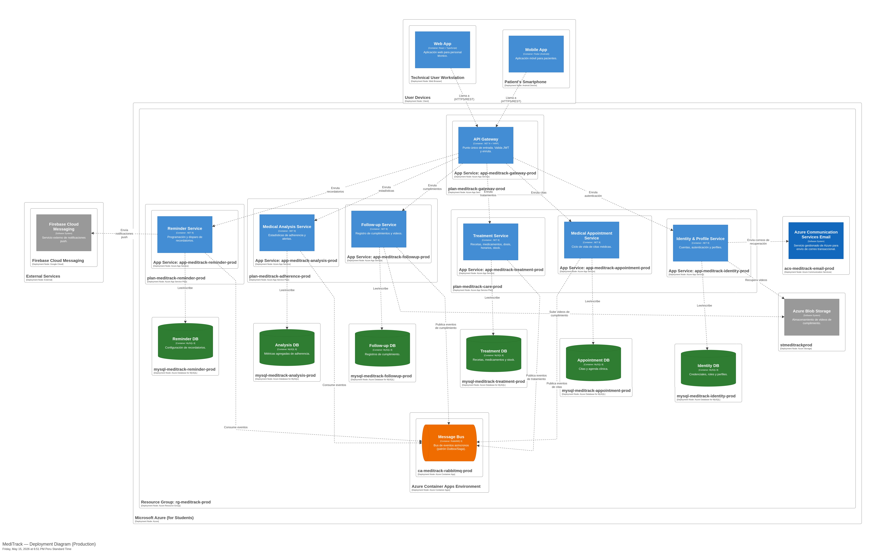</div>

<div align="center">

</div>

<hr class="page-break">

## 5.3. Microservices Implementation

### 5.3.1. Sprint 1

Durante el Sprint backlog, el equipo tuvo la tarea de completar la landing page y user stories principales . La herramienta para la organización y gestion a los mienbros fue Trello. Esta herramienta nos sirvio para dividirnos las tareas y trabajos a realizar por el equipo de trabajo.

#### 5.3.1.1. Sprint Backlog 1

<table border="1" cellspacing="0" cellpadding="5">
  <thead>
    <tr>
      <th colspan="8">Sprint 1</th>
    </tr>
    <tr>
      <th colspan="2">User Story</th>
      <th colspan="2">WorkItem / Task</th>
      <th>Description</th>
      <th>Estimation (Hours)</th>
      <th>Assigned To</th>
      <th>Status (To-do / In-Process / To-Review / Done)</th>
    </tr>
    <tr>
      <th>Id</th><th>Title</th>
      <th>Id</th><th>Title</th>
      <th></th><th></th><th></th><th></th>
    </tr>
  </thead>
  <tbody>
    <tr><td>US30</td><td>Ver propuesta de valor</td><td>TK01</td><td>Maquetar sección Hero</td><td>Diseñar e implementar la sección principal de la landing con descripción clara de qué es MediTrack y su propuesta de valor</td><td>3</td><td>Renzo Rivera</td><td>Done</td></tr>
    <tr><td>US31</td><td>Ver funcionalidades por segmento</td><td>TK02</td><td>Maquetar sección Funcionalidades</td><td>Implementar sección con tarjetas diferenciadas que muestren características específicas para pacientes y personal técnico</td><td>3</td><td>Renzo Rivera</td><td>Done</td></tr>
    <tr><td>US32</td><td>Ver testimonios o casos de uso</td><td>TK03</td><td>Maquetar sección Testimonios</td><td>Implementar sección con casos de uso representativos o testimonios de pacientes para generar confianza en la plataforma</td><td>2</td><td>Renzo Rivera</td><td>Done</td></tr>
    <tr><td>US34</td><td>Ver información de contacto</td><td>TK04</td><td>Maquetar sección Contacto</td><td>Implementar sección con correo, teléfono y/o formulario de contacto visible para visitantes con dudas</td><td>2</td><td>Renzo Rivera</td><td>Done</td></tr>
    <tr><td>US13</td><td>Subir receta médica con horarios</td><td>TK05</td><td>Crear endpoint de recetas</td><td>Implementar endpoint POST /api/v1/prescriptions con validación de paciente, medicamentos y horarios</td><td>4</td><td>Javier Gonzales</td><td>Done</td></tr>
    <tr><td></td><td></td><td>TK06</td><td>Implementar PrescriptionCommandService</td><td>Desarrollar servicio de comando con validación contra MedicationCatalog y reglas de negocio de la receta</td><td>3</td><td>Javier Gonzales</td><td>Done</td></tr>
    <tr><td></td><td></td><td>TK07</td><td>Crear assemblers y recursos REST</td><td>Implementar CreatePrescriptionCommandFromResourceAssembler y records de entrada/salida para el endpoint</td><td>2</td><td>Javier Gonzales</td><td>Done</td></tr>
    <tr><td>US14</td><td>Subir historial clínico</td><td>TK08</td><td>Crear endpoint de historial clínico</td><td>Implementar endpoint POST /api/v1/clinical-records con validación de existencia del paciente</td><td>3</td><td>Javier Gonzales</td><td>Done</td></tr>
    <tr><td></td><td></td><td>TK09</td><td>Implementar ClinicalRecordCommandService</td><td>Desarrollar servicio con validación via IPatientValidationClient (mock para el sprint) y creación del registro</td><td>2</td><td>Javier Gonzales</td><td>Done</td></tr>
    <tr><td>US15</td><td>Buscar paciente individual</td><td>TK10</td><td>Crear endpoint de búsqueda de pacientes</td><td>Implementar endpoint GET /api/v1/patients/search con búsqueda por nombre y DNI</td><td>2</td><td>Javier Gonzales</td><td>Done</td></tr>
    <tr><td></td><td></td><td>TK11</td><td>Implementar MockPatientSearchClient</td><td>Desarrollar cliente mock con lógica de búsqueda por DNI y nombre completo, con TODO documentado para reemplazo futuro</td><td>2</td><td>Javier Gonzales</td><td>Done</td></tr>
    <tr><td>US24</td><td>Editar o cancelar medicamento</td><td>TK12</td><td>Crear endpoint de edición de medicamento</td><td>Implementar endpoint PUT /api/v1/medications/{id} con validación de autorización de personal técnico</td><td>3</td><td>Javier Gonzales</td><td>Done</td></tr>
    <tr><td></td><td></td><td>TK13</td><td>Crear endpoint de cancelación de medicamento</td><td>Implementar endpoint PATCH /api/v1/medications/{id}/cancel con validación de autorización y cambio de estado IsActive</td><td>2</td><td>Javier Gonzales</td><td>Done</td></tr>
    <tr><td></td><td></td><td>TK14</td><td>Implementar MedicationCommandService</td><td>Desarrollar servicio con handlers para actualización y cancelación, incluyendo validaciones de negocio</td><td>3</td><td>Javier Gonzales</td><td>Done</td></tr>
    <tr><td>US04</td><td>Ver lista de medicamentos</td><td>TK15</td><td>Crear endpoint de medicamentos por paciente</td><td>Implementar endpoint GET /api/v1/medications?patientId= en Follow-up Service con schedules anidados</td><td>2</td><td>Renzo Rivera</td><td>Done</td></tr>
    <tr><td></td><td></td><td>TK16</td><td>Implementar MedicationQueryService</td><td>Desarrollar servicio de consulta con GetMedicationsByPatientIdQuery y validación de patientId</td><td>2</td><td>Renzo Rivera</td><td>Done</td></tr>
    <tr><td></td><td></td><td>TK17</td><td>Crear MedicationResourceFromEntityAssembler</td><td>Implementar assembler que mapea Medication a MedicationResource con lista de DoseScheduleResource anidados</td><td>1</td><td>Renzo Rivera</td><td>Done</td></tr>
    <tr><td>US06</td><td>Registrar cumplimiento de medicamento</td><td>TK18</td><td>Crear endpoint de cumplimiento</td><td>Implementar endpoint POST /api/v1/compliance con soporte para videoUrl y offlineRecordedAt</td><td>3</td><td>Renzo Rivera</td><td>Done</td></tr>
    <tr><td></td><td></td><td>TK19</td><td>Implementar MedicationComplianceCommandService</td><td>Desarrollar servicio con validación de DoseSchedule existente, reglas de ComplianceStatus y registro de cumplimiento</td><td>3</td><td>Renzo Rivera</td><td>Done</td></tr>
    <tr><td></td><td></td><td>TK20</td><td>Implementar Value Object ComplianceStatus</td><td>Crear Value Object con instancias estáticas Taken/Skipped y conversión implícita a string para compatibilidad con EF Core</td><td>2</td><td>Renzo Rivera</td><td>Done</td></tr>
    <tr><td>US26</td><td>Ver siguiente toma pendiente</td><td>TK21</td><td>Crear endpoint de siguiente toma</td><td>Implementar endpoint GET /api/v1/medications/next-dose?patientId= con respuesta de nombre, dosis y minutos restantes</td><td>2</td><td>Renzo Rivera</td><td>Done</td></tr>
    <tr><td></td><td></td><td>TK22</td><td>Implementar NextPendingDoseQueryService</td><td>Desarrollar servicio con lógica de zona horaria Lima (SA Pacific Standard Time), filtrado de schedules activos y exclusión de tomas ya completadas hoy</td><td>4</td><td>Renzo Rivera</td><td>Done</td></tr>
    <tr><td></td><td></td><td>TK23</td><td>Crear NextPendingDoseResourceFromEntityAssembler</td><td>Implementar assembler que calcula MinutesUntilDose considerando cruce de medianoche y formatea ScheduledTime en HH:mm</td><td>2</td><td>Renzo Rivera</td><td>Done</td></tr>
  </tbody>
</table>

#### 5.3.1.2. Development Evidence for Sprint Review

Durante este Sprint, se lograron avances significativos en la implementación de la landing page Medritrack, destacando la creación del frontend usando HTML, un diseño responsivo y estilizado con CSS, y la incorporación de funcionalidades dinámicas mediante JavaScript. Realizado en el periado de 11 de Abril al 11 de Mayo. Ademas de avance en 2 de los mircroservicios.

**Commits Report (Equipo00-Fundamentos-Arqui-Soft-202610):**

| Repository              | Branch | Commit ID | Commit Message | Commit Message Body | Committed on (Date) |
| ----------------------- | ------ | --------- | -------------- | ------------------- | ------------------- |
| WoodsDos/report         | dev    | 9aab934af4002f26aca4487d5e1eb8a386154336 | Merge pull request #44 from Equipo00-Fundamentos-Arqui-Soft-202610/feature/sprint-1 | Feature/sprint 1 | 2026-05-15 17:57:29 -0500 |
| jquijada-dev/report     | dev    | 597ecf0daee34ac205deaa4ec6c989bdf3090c4a | feat: fixed diagrams background color |  | 2026-05-15 17:42:07 -0500 |
| 1sopod/report           | dev    | 54f2ef10149ab4745a9f1340fb7e2b1c111da44d | fix: updated container diagram |  | 2026-05-15 16:26:25 -0500 |
| VRojas1603/report       | dev    | 037ea6d0808427dbb491a512f62b7076440774a4 | Merge pull request #43 from Equipo00-Fundamentos-Arqui-Soft-202610/feature/5-2-3-source-code-style-guide | docs: add source code style guide section | 2026-05-15 13:22:20 -0500 |
| psulca/report           | dev    | 90be5a549bcb2fe306fa8d09062df9c37500e996 | docs: add source code style guide section |  | 2026-05-15 13:12:06 -0500 |
| WoodsDos/report         | dev    | b3ae7158631b5b37c407827dd3c163a9b35a88e2 | Merge pull request #42 from Equipo00-Fundamentos-Arqui-Soft-202610/feature/5-2-2-source-code-management | docs: add source code management section | 2026-05-15 11:27:43 -0500 |
| jquijada-dev/report     | dev    | d80f0978290d84649713a2dfd1cff458e9f9ba38 | docs: add source code management section |  | 2026-05-15 09:18:07 -0500 |
| 1sopod/report           | dev    | 27415c2e9484baf213acab967c9c420838203daf | Merge pull request #41 from Equipo00-Fundamentos-Arqui-Soft-202610/feature/5-2-1-software-development-environment-configuration | docs: add software development environment configuration | 2026-05-15 08:49:39 -0500 |
| VRojas1603/report       | dev    | ad69a613113d479df37216dd99cc2c0d2994aba2 | docs: add software development environment configuration |  | 2026-05-15 08:47:19 -0500 |
| psulca/report           | dev    | e23a846d13c19d550f9d9643d2a41a3823652880 | Merge pull request #40 from Equipo00-Fundamentos-Arqui-Soft-202610/fix/adjusted-user-stories | feat: adjusted user stories | 2026-05-12 14:33:45 -0500 |
| WoodsDos/report         | dev    | ad0d3efe879d76e55a36c1e11e597e075394934e | feat: adjusted user stories | Fixed user story 26 and added landing page user stories | 2026-05-12 14:33:06 -0500 |

---

**Commits Meditrack_Landing_Page:**

| Repository                          | Branch | Commit ID | Commit Message | Commit Message Body | Committed on (Date) |
| ----------------------------------- | ------ | --------- | -------------- | ------------------- | ------------------- |
| jquijada-dev/Meditrack_Landing_Page | HEAD -> main, origin/main, origin/HEAD | 0553bb93ff965af0ed65c1dcc43689dbc8dae31e | Merge pull request #3 from Equipo00-Fundamentos-Arqui-Soft-202610/dev | Dev | 2026-05-15 13:30:48 -0500 |
| 1sopod/Meditrack_Landing_Page       | origin/dev | 6897e4c69ab988cc6b884fc8ba24f4288b902631 | Merge pull request #2 from Equipo00-Fundamentos-Arqui-Soft-202610/feature/landing-page-content | feature: enhance UI styles, add VSCode settings & scripts | 2026-05-11 02:06:25 -0500 |
| VRojas1603/Meditrack_Landing_Page   | origin/feature/landing-page-content | fef6d7d2fab87841b981bd263529049ce27d4dfd | feature: enhance UI styles, add VSCode settings & scripts | Large UI overhaul: refactors and extends styles.css with new layout constraints, gradients, shadows, responsive tweaks, accessibility/focus states, animations (slide, float, shimmer, glow), improved header/nav, cards, hero, features, testimonials and contact sections. Adds .vscode/settings.json with custom color theming for development environment. Enhances interactivity in js/script.js: adds IntersectionObserver scroll animations, smooth anchor scrolling, button hover effects, hero parallax, and a data-count counter animation. | 2026-05-11 02:05:15 -0500 |
| psulca/Meditrack_Landing_Page       |        | 6cdd6005fea8633fd827cb3daf43b8e2c3cc22a5 | Merge pull request #1 from Equipo00-Fundamentos-Arqui-Soft-202610/feature/landing-page-content | Feature/landing page content | 2026-05-08 23:48:18 -0500 |
| WoodsDos/Meditrack_Landing_Page     |        | 3dc199d77fcfb759dd2301152825e27bbd2f9240 | feat; add landing page sections | added landing page sections | 2026-05-08 23:47:40 -0500 |
| jquijada-dev/Meditrack_Landing_Page |        | 7bd98553cec0f75b47a206648f0bcf75c8ae6db6 | feat: reorganize page contents | reorganized landing page and added placeholders for images | 2026-05-08 18:11:42 -0500 |
| 1sopod/Meditrack_Landing_Page       |        | f74a9384708999b02a9adb249cd9529006a037d2 | feat: inital commit |  | 2026-05-08 12:17:22 -0500 |

#### 5.3.1.3. Testing Suite Evidence for Sprint Review

| Test ID | Microservicio | Descripción | Resultado Esperado | Resultado Obtenido | Estado |
|---------|---------------|-------------|--------------------|--------------------|--------|
| TS-001  | Followup    | Validación de endpoint de registro de cumplimiento | Respuesta HTTP 200 con datos correctos | Respuesta HTTP 200 con datos correctos |  Passed |
| TS-002  | Treatment   | Validación de endpoint de consulta de medicamentos | Lista de medicamentos retornada correctamente | Lista retornada correctamente |  Passed |

En este Sprint se ejecutaron **dos pruebas unitarias básicas**, una por cada microservicio (Compliance y Medications). Ambas pruebas fueron exitosas, confirmando la correcta respuesta de los endpoints

#### 5.3.1.4. Execution Evidence for Sprint Review

Durante este Sprint se lograron avances significativos en el desarrollo y documentación de los Web Services. Aunque no se realizó un despliegue formal en un entorno productivo, se construyeron dos componentes clave:

- Microservicios desarrollados: Compliance y Medications.
- Landing Page para visualización inicial.
- Prototipo funcional accesible mediante un enlace compartido, que permitió validar la lógica de los servicios y su interacción.

**Evidencias:**
- Screenshots de Postman mostrando las operaciones principales:

  <td align="center">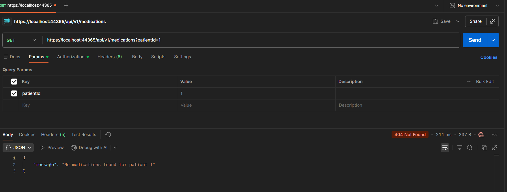</td>

  _Anexo de Prueba Postman. Elaboración propia._

- Capturas del Swagger UI con los endpoints documentados.

  <td align="center">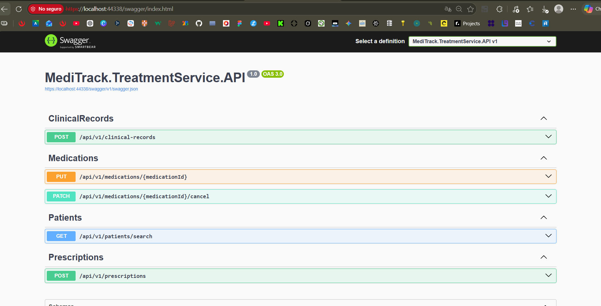</td>

  _Anexo del Treatment Service. Elaboración propia._
  

  <td align="center"></td>

  _Anexo del FollowUp Service. Elaboración propia._

- Enlace al prototipo: https://stitch.withgoogle.com/preview/2917742923999304642?node-id=3f7c03713a40437494706973672a2c87

  <td align="center">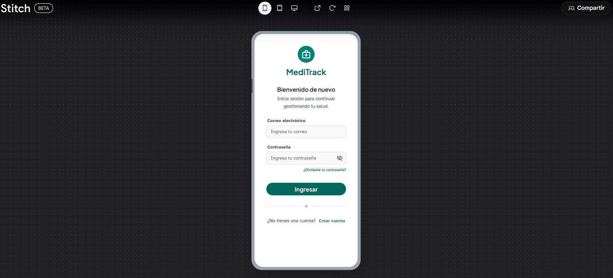</td>

  _Anexo del prototipo. Elaboración propia._

#### 5.3.1.5. Microservices Documentation Evidence for Sprint Review

Durante este Sprint se consolidó la realizacion de 2 Microservices mediante OpenAPI (Swagger UI), asegurando que cada microservicio esté descrito con sus acciones, parámetros y respuestas. Esto facilita la validación de servicios RESTful, la integración con aplicaciones móviles/web y la trazabilidad de cambios en el repositorio.

#### Treatment Service
**Link del Repositorio:** https://github.com/Equipo00-Fundamentos-Arqui-Soft-202610/Treatment-service

**Imagen de prueba:**
<td align="center"></td>


| Microservicio | Verbo | Endpoint | Parámetros | Response (ejemplo) |
| --- | --- | --- | --- | --- |
| TreatmentService | POST | ``/api/v1/clinical-records`` | Body: ``{ ``"patientId":0,"uploadedBy":0,"datasetSource":"string","fileUrl":"string" ``}`` | ``{ ``"id":1,"patientId":0,"uploadedBy":0,"datasetSource":"string","fileUrl":"string","status":"ok" ``}`` |
| TreatmentService | PUT | ``/api/v1/medications/{medicationId}`` | Path: ``medicationId``, Body: ``{ ``"dose":"string","frequencyHour":0,"startDate":"2026-05-16T00:52:17.777Z","endDate":"2026-05-16T00:52:17.777Z","stockCount":0,"stockAlertThre":0,"authorizedByTechnicalStaff":true ``}`` | ``{ ``"id":5,"dose":"string","frequencyHour":0,"status":"updated" ``}`` |
| TreatmentService | PATCH | ``/api/v1/medications/{medicationId}/cancel`` | Path: ``medicationId``, Body: ``{ ``"authorizedByTechnicalStaff":true ``}`` | ``{ ``"id":5,"status":"cancelled" ``}`` |
| TreatmentService | GET | ``/api/v1/patients/search`` | Query: ``?query=Juan`` | ``[{"id":1,"name":"Juan Perez","age":30}]`` |
| TreatmentService | POST | ``/api/v1/prescriptions`` | Body: ``{ ``"patientId":0,"technicalId":0,"notes":"string","medications":[{"catalogId":0,"dose":"string","frequencyHour":0,"startDate":"2026-05-16T00:52:17.784Z","endDate":"2026-05-16T00:52:17.784Z","stockCount":0,"stockAlertThre":0,"doseSchedules":[{"scheduledTime":"string"}]}] ``}`` | ``{ ``"id":20,"patientId":0,"status":"created" ``}`` |

#### Treatment Service
**Link del Repositorio:** https://github.com/Equipo00-Fundamentos-Arqui-Soft-202610/FollowUp-Service

**Imagen de prueba:**
<td align="center"></td>


| Microservicio | Verbo | Endpoint | Parámetros | Response (ejemplo) |
| --- | --- | --- | --- | --- |
| FollowUpService | POST | ``/api/v1/compliance`` | Query: ``patientId``, Body: ``{ ``"patientId":0,"doseScheduleId":0,"status":"string","videoUrl":"string","offlineRecordedAt":"2026-05-16T00:48:58.697Z" ``}`` | ``{ ``"id":0,"patientId":0,"doseScheduleId":0,"status":"string","recordedAt":"2026-05-16T00:48:58.698Z","videoUrl":"string","synced":true,"offlineRecordedAt":"2026-05-16T00:48:58.698Z" ``}`` |
| FollowUpService | GET | ``/api/v1/compliance/{id}`` | Path: ``id`` | ``{ ``"id":0,"patientId":0,"doseScheduleId":0,"status":"string","recordedAt":"2026-05-16T00:48:58.700Z","videoUrl":"string","synced":true,"offlineRecordedAt":"2026-05-16T00:48:58.700Z" ``}`` |
| FollowUpService | GET | ``/api/v1/medications`` | Query: ``patientId`` | ``[{"id":0,"patientId":0,"name":"string","dose":"string","frequencyHours":0,"startDate":"2026-05-16T00:48:58.702Z","endDate":"2026-05-16T00:48:58.702Z","stockCount":0,"isActive":true,"schedules":[{"id":0,"scheduledTime":"string","isActive":true}]}]`` |
| FollowUpService | GET | ``/api/v1/medications/next-dose`` | Query: ``patientId`` | ``{ ``"medicationName":"string","dose":"string","scheduledTime":"string","minutesUntilDose":0 ``}`` |

#### 5.3.1.6. Software Deployment Evidence for Sprint Review

Durante este Sprint no se realizó un deployment formal de los Web Services en un entorno productivo ni staging. Sin embargo, se avanzó en la construcción de un prototipo funcional, el cual permite visualizar y validar la lógica de los servicios desarrollados. Este prototipo se encuentra disponible mediante un enlace público, lo que facilita la revisión por parte del equipo y stakeholders.

**Actividades realizadas**
- Configuración inicial de repositorios en GitHub para centralizar el código de los Web Services.
- Definición de endpoints y documentación con Swagger UI, asegurando trazabilidad y pruebas locales.
- Prototipo accesible 
- Validación interna: se realizaron pruebas locales con datos de muestra para confirmar la correcta respuesta de los endpoints.

**Evidencias:**
- Endpoints:
  <td align="center"></td>
- Prototipo accesible:
  <td align="center"></td>
  Link: https://stitch.withgoogle.com/preview/2917742923999304642?node-id=3f7c03713a40437494706973672a2c87

#### 5.3.1.7. Team Collaboration Insights during Sprint

| Integrantes   | Tarea asignada |
|----------------|----------------|
| Jeremy | Desarrollo del microservicio **Follow Up** en C# y .NET: visualización de lista de medicamentos y horarios de toma, además del registro de cumplimiento de medicamentos según la hora programada (US04, US06, US26). |
| Renzo | Desarrollo del microservicio **Follow Up** en C# y .NET: implementación de funcionalidades para seguimiento de medicación y control de tomas registradas por el paciente (US04, US06, US26). |
| Victor | Desarrollo del microservicio **Treatment** en C# y .NET: implementación de carga y gestión de recetas médicas digitales, además de soporte para historial clínico (US13, US14, US15, US24). |
| Piero | Desarrollo del microservicio **Treatment** en C# y .NET: desarrollo de lógica para almacenamiento y consulta de tratamientos e historial clínico de pacientes (US13, US14, US15, US24). |
| Javier Gonzales | Desarrollo del microservicio **Treatment** en C# y .NET: apoyo en diseño e implementación de APIs REST para recetas médicas e historial clínico, integrando la arquitectura del sistema (US13, US14, US15, US24). |

 <td align="center">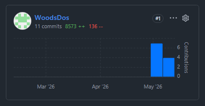</td>

 <td align="center">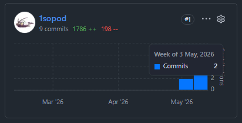</td>

 <td align="center">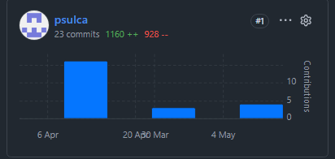</td>

 <td align="center">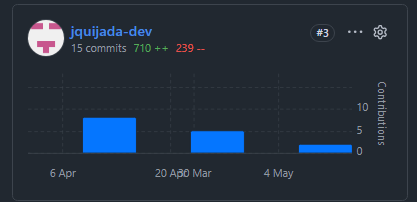</td>

 <td align="center">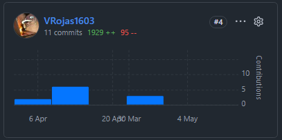</td>

#### 5.3.1.8. Kanban Board

<hr class="page-break">

 <td align="center">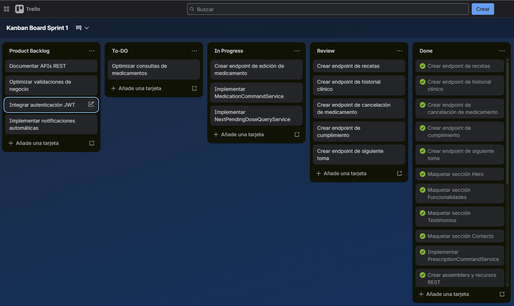</td>

### 5.3.2. Sprint 2

Durante el Sprint backlog, el equipo tuvo la tarea de completar los microservicios y tener un buen avance del Front-End . La herramienta para la organización y gestion a los mienbros fue Trello. Esta herramienta nos sirvio para dividirnos las tareas y trabajos a realizar por el equipo de trabajo.


#### 5.3.2.1. Sprint Backlog 2


#### 5.3.2.2. Development Evidence for Sprint Review

Durante este Sprint, realizado en el período del 15 de mayo al 06 de junio, se lograron avances significativos en el desarrollo de la solución Meditrack. Se continuó con la implementación del frontend web y de la aplicación móvil, incorporando nuevas interfaces, mejoras visuales y funcionalidades orientadas a optimizar la experiencia del usuario. Asimismo, se avanzó en el desarrollo e integración de múltiples microservicios de la arquitectura backend, destacando la implementación de Meditrack-Reminder-Service, Medical-Analysis-Service, Medical-Appointment-Service, Treatment-Service y FollowUp-Service. Estos servicios permiten gestionar recordatorios médicos, análisis clínicos, citas médicas, tratamientos y seguimientos de pacientes respectivamente. Los avances alcanzados permitieron fortalecer la comunicación entre frontend, aplicación móvil y backend basado en microservicios, consolidando así la funcionalidad y escalabilidad de la plataforma Meditrack.

**Commits Report:**

<br>

**Treatment service:**

| Repository | Branch | Commit ID | Commit Message | Commit Message Body | Committed on (Date) |
|------------|--------|------------|-----------------|---------------------|---------------------|
| treatment-service | develop | 5432678 | Merge pull request #3 from Equipo00-Fundamentos-Arqui-Soft-202610/develop |  | 2026-06-06 |
| treatment-service | develop | c3aff0a | feat: add get medications |  | 2026-06-06 |
| treatment-service | develop | 3ada2a7 | Merge pull request #2 from Equipo00-Fundamentos-Arqui-Soft-202610/develop |  | 2026-06-06 |
| treatment-service | develop | 1a3b4b5 | fix: align treatment service with database schema |  | 2026-06-05 |
| treatment-service | develop | 14ac15e | fix: align treatment entities with database schema |  | 2026-06-05 |
| treatment-service | develop | e6ff223 | fix: remove clinical record from treatment service |  | 2026-06-04 |

<br>

**Medical-Analysis-Service:**

| Repository | Branch | Commit ID | Commit Message | Commit Message Body | Committed on (Date) |
|------------|--------|------------|-----------------|---------------------|---------------------|
| medical-analysis-service | develop | f1fb47b | Add example configuration and README.md with local setup instructions. |  | 2026-06-06 |
| medical-analysis-service | develop | a5f47e3 | feat: add context.md with stack, structure, requirements, and endpoints. |  | 2026-06-06 |
| medical-analysis-service | develop | 04ff2f2 | feat: update API host address and add new endpoints for clinical records, statistics, and dashboard. |  | 2026-06-06 |
| medical-analysis-service | develop | d8e015f | feat: remove unnecessary files. |  | 2026-06-06 |
| medical-analysis-service | develop | ec1aa75 | feat: update dependency injection and add new services and repositories. |  | 2026-06-06 |
| medical-analysis-service | develop | e21ba5e | feat: update db context to include new entities and their configurations. |  | 2026-06-06 |
| medical-analysis-service | develop | 9c45bc6 | feat: add assembler services for REST resources and commands. |  | 2026-06-06 |
| medical-analysis-service | develop | 50e1cf2 | feat: add REST controllers for alert, clinical data, dashboard, and statistics APIs. |  | 2026-06-06 |
| medical-analysis-service | develop | 22bc029 | feat: add REST resources for alert, clinical data, dashboard, and statistics APIs. |  | 2026-06-06 |
| medical-analysis-service | develop | 77e0427 | feat: add query services for adherence alert, clinical data, dashboard, and statistics queries. |  | 2026-06-06 |
| medical-analysis-service | develop | 8262090 | feat: add adherence metric and alert command services. |  | 2026-06-06 |
| medical-analysis-service | develop | b447fd8 | feat: add initial migration for adherence alert, metric, and clinical record entities. |  | 2026-06-06 |
| medical-analysis-service | develop | 91b3356 | feat: add adherence alert, metric, and repository implementations. |  | 2026-06-06 |
| medical-analysis-service | develop | 07334d9 | feat: implement event bus and subscription for integration events. |  | 2026-06-06 |
| medical-analysis-service | develop | c2cb67e | feat: implement CSV dataset processor and parse CSV lines. |  | 2026-06-06 |
| medical-analysis-service | develop | fbec29f | feat: add event handlers for appointment attendance and compliance registered. |  | 2026-06-06 |
| medical-analysis-service | develop | 81df8de | feat: add interfaces for adherence alert, metric, and command services. |  | 2026-06-05 |
| medical-analysis-service | develop | ba304ae | feat: add adherence calculator factory and strategy implementations. |  | 2026-06-05 |
| medical-analysis-service | develop | e6a32f9 | feat: add events for appointment attendance and compliance registered. |  | 2026-06-05 |
| medical-analysis-service | develop | d456165 | feat: add query models for active alerts, adherence trend, appointment stats, clinical history, and compliance stats. |  | 2026-06-05 |
| medical-analysis-service | develop | 8354812 | feat: add commands for alert management and clinical dataset import. |  | 2026-06-05 |
| medical-analysis-service | develop | 9fbc412 | feat: add value objects for adherence rate, alert severity, status, category and date range. |  | 2026-06-05 |
| medical-analysis-service | develop | 6369b5c | feat: add aggregate models |  | 2026-06-05 |
| medical-analysis-service | develop | 136363c | Add basic configuration |  | 2026-06-05 |
| medical-analysis-service | develop | d451061 | Initial commit |  | 2026-06-05 |

<br>

**Medical-Appointment-Service:**

| Repository | Branch | Commit ID | Commit Message | Commit Message Body | Committed on (Date) |
|------------|--------|------------|-----------------|---------------------|---------------------|
| medical-appointment-service | develop | b56d16c | Merge pull request #1 from Equipo00-Fundamentos-Arqui-Soft-202610/develop |  | 2026-06-03 |
| medical-appointment-service | develop | deb3f22 | fix/eliminando-codigo-basura |  | 2026-06-03 |
| medical-appointment-service | develop | 7074acc | fix: configuraciones-mysql |  | 2026-06-03 |
| medical-appointment-service | develop | a454ec5 | feat/agregar-migracion-inicial-appointment-service |  | 2026-06-03 |
| medical-appointment-service | develop | df2ec57 | feat/configurar-arranque-appointment-service |  | 2026-06-03 |
| medical-appointment-service | develop | a4d0f73 | feat/exponer-api-appointment-service |  | 2026-06-03 |
| medical-appointment-service | develop | ab60a41 | feat/implementar-aplicacion-persistencia-appointment-service |  | 2026-06-03 |
| medical-appointment-service | develop | bd21a5c | feat/modelar-dominio-appointment-service |  | 2026-06-03 |
| medical-appointment-service | develop | 0e6db7d | feat/configurar-dependencias-appointment-service |  | 2026-06-03 |
| medical-appointment-service | develop | 9f5933e | feat/crear-estructura-appointment-service |  | 2026-06-03 |
| medical-appointment-service | develop | 2daebc9 | Initial commit |  | 2026-06-03 |

<br>

**FollowUp-Service:**

| Repository | Branch | Commit ID | Commit Message | Commit Message Body | Committed on (Date) |
|------------|--------|------------|-----------------|---------------------|---------------------|
| follow-up-service | develop | edefa90 | Merge pull request #9 from Equipo00-Fundamentos-Arqui-Soft-202610/develop |  | 2026-06-06 |
| follow-up-service | fix/connect-frontend | c1add17 | Merge pull request #8 from Equipo00-Fundamentos-Arqui-Soft-202610/fix/connect-frontend |  | 2026-06-06 |
| follow-up-service | fix/connect-frontend | ec69541 | fix: connection |  | 2026-06-06 |
| follow-up-service | develop | 873d8f3 | fix: add dose schedule |  | 2026-06-06 |
| follow-up-service | feature/low-stock-alert | 7299863 | Merge pull request #7 from Equipo00-Fundamentos-Arqui-Soft-202610/feature/low-stock-alert |  | 2026-06-01 |
| follow-up-service | feature/low-stock-alert | 74db1d3 | feat: Add low-stock medications query and endpoint |  | 2026-06-01 |
| follow-up-service | feature/medication-adherence | a2ca7b6 | Merge pull request #6 from Equipo00-Fundamentos-Arqui-Soft-202610/feature/medication-adherence |  | 2026-06-01 |
| follow-up-service | feature/medication-adherence | cf68bef | feat: add GET endpoint for medical adherence |  | 2026-06-01 |

<br>

**Reminder-Service:**

| Repository | Branch | Commit ID | Commit Message | Commit Message Body | Committed on (Date) |
|------------|--------|------------|-----------------|---------------------|---------------------|
| reminder-service | main | d00ea16 | docs: trim README to a lightweight overview |  | 2026-06-06 |
| reminder-service | main | e17e56e | docs: add service README with architecture and run instructions |  | 2026-06-06 |
| reminder-service | main | 90520a7 | build: add Dockerfile and docker-compose with mysql and rabbitmq |  | 2026-06-06 |
| reminder-service | main | 43ef766 | test: add unit tests and BDD feature for reminder flows |  | 2026-06-06 |
| reminder-service | main | 451a94d | feat(api): add REST controllers, JWT auth, swagger and health checks |  | 2026-06-06 |
| reminder-service | main | 0313b4d | feat(infrastructure): add EF Core/MySQL, RabbitMQ, FCM and scheduler |  | 2026-06-06 |
| reminder-service | main | da9da8e | feat(application): add use cases, integration events and DTOs |  | 2026-06-06 |
| reminder-service | main | 4b42b16 | feat(domain): add reminder domain model and factory method |  | 2026-06-06 |
| reminder-service | main | 40e0768 | chore: scaffold solution structure and tooling config |  | 2026-06-06 |

<br>

**MediTrack-Mobile:**

| Repository | Branch | Commit ID | Commit Message | Commit Message Body | Committed on (Date) |
|------------|--------|------------|-----------------|---------------------|---------------------|
| meditrack-mobile | develop | a39593f | Merge pull request #3 from Equipo00-Fundamentos-Arqui-Soft-202610/develop |  | 2026-06-06 |
| meditrack-mobile | feature/home | f69a032 | Merge pull request #2 from Equipo00-Fundamentos-Arqui-Soft-202610/feature/home |  | 2026-06-06 |
| meditrack-mobile | feature/home | 9b56ec7 | fix: home screen |  | 2026-06-06 |
| meditrack-mobile | feature/medications | 2729d65 | Merge pull request #1 from Equipo00-Fundamentos-Arqui-Soft-202610/feature/medications |  | 2026-06-06 |
| meditrack-mobile | feature/medications | 6cd5635 | fix/ui |  | 2026-06-06 |
| meditrack-mobile | feature/medications | e579813 | feat/medication-screen |  | 2026-06-06 |
| meditrack-mobile | develop | a6c73cd | feat: Rename screens, update UI texts, add gradle flags |  | 2026-06-01 |
| meditrack-mobile | develop | 3980a8e | feat: initial flutter project structure |  | 2026-06-01 |

<br>


#### 5.3.2.3. Testing Suite Evidence for Sprint Review

| Test ID | Microservice | Description | Expected Result | Obtained Result | Status |
|---------|--------------|-------------|-----------------|-----------------|--------|
| TS-001 | followup-service | Validation of medication adherence endpoint | HTTP 200 response with adherence information correctly returned | HTTP 200 response with adherence information correctly returned | Passed |
| TS-002 | treatment-service | Validation of medications query endpoint | Medication list returned successfully from the API | Medication list returned successfully from the API | Passed |


<br>

Durante este Sprint se ejecutaron pruebas funcionales básicas sobre los microservicios followup-service y treatment-service, validando el correcto funcionamiento de los endpoints principales relacionados con adherencia médica y consulta de medicamentos. Ambas pruebas fueron exitosas, confirmando la correcta integración y respuesta de los servicios implementados.

<br>

#### 5.3.1.4. Execution Evidence for Sprint Review

Durante este Sprint se lograron avances significativos en el desarrollo, integración y validación de los componentes principales de la plataforma MediTrack. Aunque no se realizó un despliegue formal en un entorno productivo, se implementaron y consolidaron diversos componentes clave del sistema:

* Microservicios desarrollados e integrados: treatment-service, followup-service, medical-analysis-service, medical-appointment-service y reminder-service.
* Desarrollo y mejora continua del frontend web y de la aplicación móvil MediTrack.
* Integración de endpoints RESTful para tratamientos, adherencia médica, seguimiento de pacientes, análisis clínicos y recordatorios.
* Prototipo funcional accesible en entorno local y de desarrollo, permitiendo validar la interacción entre frontend, aplicación móvil y arquitectura basada en microservicios.

Estos avances permitieron consolidar una versión funcional del ecosistema MediTrack para la validación de flujos principales del sistema durante el Sprint Review.

<br>

Evidencias:

+ treatment service:

<td align="center">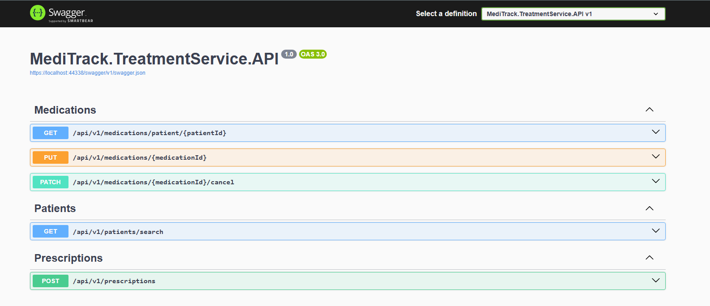</td>

<br>

+ follow up service:

<td align="center">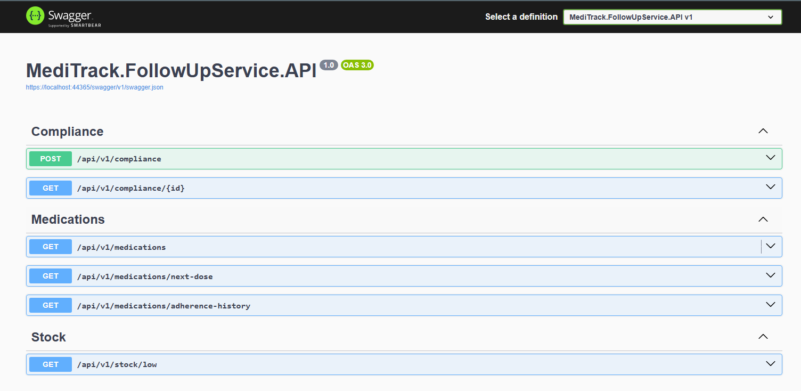</td>

<br>

+ meditrack mobile:

<td align="center">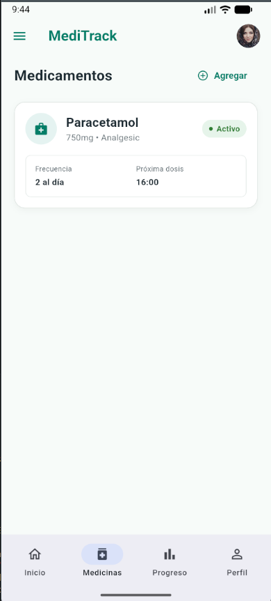</td>

<br>


#### 5.3.1.5. Microservices Documentation Evidence for Sprint Review

Durante este Sprint se consolidó la realizacion de 5 Microservices mediante OpenAPI (Swagger UI), asegurando que cada microservicio esté descrito con sus acciones, parámetros y respuestas. Esto facilita la validación de servicios RESTful, la integración con aplicaciones móviles/web y la trazabilidad de cambios en el repositorio.

#### Treatment Service
**Link del Repositorio:** https://github.com/Equipo00-Fundamentos-Arqui-Soft-202610/Treatment-service

**Imagen de prueba:**
<td align="center"></td>


| Microservicio | Verbo | Endpoint | Parámetros | Response (ejemplo) |
| --- | --- | --- | --- | --- |
| TreatmentService | POST | ``/api/v1/clinical-records`` | Body: ``{ ``"patientId":0,"uploadedBy":0,"datasetSource":"string","fileUrl":"string" ``}`` | ``{ ``"id":1,"patientId":0,"uploadedBy":0,"datasetSource":"string","fileUrl":"string","status":"ok" ``}`` |
| TreatmentService | PUT | ``/api/v1/medications/{medicationId}`` | Path: ``medicationId``, Body: ``{ ``"dose":"string","frequencyHour":0,"startDate":"2026-05-16T00:52:17.777Z","endDate":"2026-05-16T00:52:17.777Z","stockCount":0,"stockAlertThre":0,"authorizedByTechnicalStaff":true ``}`` | ``{ ``"id":5,"dose":"string","frequencyHour":0,"status":"updated" ``}`` |
| TreatmentService | PATCH | ``/api/v1/medications/{medicationId}/cancel`` | Path: ``medicationId``, Body: ``{ ``"authorizedByTechnicalStaff":true ``}`` | ``{ ``"id":5,"status":"cancelled" ``}`` |
| TreatmentService | GET | ``/api/v1/patients/search`` | Query: ``?query=Juan`` | ``[{"id":1,"name":"Juan Perez","age":30}]`` |
| TreatmentService | POST | ``/api/v1/prescriptions`` | Body: ``{ ``"patientId":0,"technicalId":0,"notes":"string","medications":[{"catalogId":0,"dose":"string","frequencyHour":0,"startDate":"2026-05-16T00:52:17.784Z","endDate":"2026-05-16T00:52:17.784Z","stockCount":0,"stockAlertThre":0,"doseSchedules":[{"scheduledTime":"string"}]}] ``}`` | ``{ ``"id":20,"patientId":0,"status":"created" ``}`` |

#### Follow up Service
**Link del Repositorio:** https://github.com/Equipo00-Fundamentos-Arqui-Soft-202610/FollowUp-Service

**Imagen de prueba:**
<td align="center"></td>


| Microservicio | Verbo | Endpoint | Parámetros | Response (ejemplo) |
| --- | --- | --- | --- | --- |
| FollowUpService | POST | ``/api/v1/compliance`` | Query: ``patientId``, Body: ``{ ``"patientId":0,"doseScheduleId":0,"status":"string","videoUrl":"string","offlineRecordedAt":"2026-05-16T00:48:58.697Z" ``}`` | ``{ ``"id":0,"patientId":0,"doseScheduleId":0,"status":"string","recordedAt":"2026-05-16T00:48:58.698Z","videoUrl":"string","synced":true,"offlineRecordedAt":"2026-05-16T00:48:58.698Z" ``}`` |
| FollowUpService | GET | ``/api/v1/compliance/{id}`` | Path: ``id`` | ``{ ``"id":0,"patientId":0,"doseScheduleId":0,"status":"string","recordedAt":"2026-05-16T00:48:58.700Z","videoUrl":"string","synced":true,"offlineRecordedAt":"2026-05-16T00:48:58.700Z" ``}`` |
| FollowUpService | GET | ``/api/v1/medications`` | Query: ``patientId`` | ``[{"id":0,"patientId":0,"name":"string","dose":"string","frequencyHours":0,"startDate":"2026-05-16T00:48:58.702Z","endDate":"2026-05-16T00:48:58.702Z","stockCount":0,"isActive":true,"schedules":[{"id":0,"scheduledTime":"string","isActive":true}]}]`` |
| FollowUpService | GET | ``/api/v1/medications/next-dose`` | Query: ``patientId`` | ``{ ``"medicationName":"string","dose":"string","scheduledTime":"string","minutesUntilDose":0 ``}`` |

#### Medical Appoinment Service

#### 5.3.1.6. Software Deployment Evidence for Sprint Review


#### 5.3.2.7. Team Collaboration Insights during Sprint

| Integrantes   | Tarea asignada |
|----------------|----------------|
| Jeremy |  |
| Renzo |  |
| Victor |  |
| Piero |  |
| Javier Gonzales |  |


#### 5.3.2.8. Kanban Board


# Referencias Bibliográficas

- CareClinic. (s.f.). Health Tracker: Symptoms, Meds, and Chronic Illness. Recuperado el 14 de abril de 2026, de https://careclinic.io/

- Medisafe. (s.f.). Digital Health Platform: Adherence, Persistence, and Solutions. Recuperado el 14 de abril de 2026, de https://www.medisafe.com

- MyTherapy. (s.f.). Aplicación de recordatorio de medicación y gestión de la salud. Recuperado el 14 de abril de 2026, de https://www.mytherapyapp.com/es

- Patel, S. (2025). Understanding treatment adherence in chronic diseases. Journal of Clinical Medicine. https://pmc.ncbi.nlm.nih.gov/articles/PMC12429436/

- Schnorrerova, P. (2025). Medication adherence and intervention strategies. Springer. https://link.springer.com/article/10.1007/s44411-025-00227-0

- Kardas, P. (2024). Medication non-adherence: Reflecting on two decades and future directions. Frontiers in Pharmacology. https://www.frontiersin.org/articles/10.3389/fphar.2024.1444012

- Kruse, C. S., Bolton, K., & Freriks, G. (2017). The effect of patient portals on quality outcomes. Journal of Medical Internet Research, 19(2), e44. https://doi.org/10.2196/jmir.6771

- Vargas Rodríguez, L. (2022). Adherencia terapéutica en pacientes con enfermedades crónicas en Lima. Universidad Peruana Cayetano Heredia.

- Luzeve Gutiérrez, M. (2019). Factores asociados al incumplimiento del tratamiento en pacientes con enfermedades crónicas. Universidad Peruana Cayetano Heredia.

- Consultor Salud. (2023). Adherencia al tratamiento en pacientes con hipertensión en Perú. https://consultorsalud.com

- Altamirano Carbajal, G. I., Bringas Villalba, E. F., & Ventura Hernández, E. M. (2021). Adherencia al tratamiento terapéutico en pacientes con hipertensión arterial en Lima Norte. Revista Científica Cuidado y Salud Pública, 1(2), 3–8. https://doi.org/10.53684/csp.v1i2.18

- Congreso de la República del Perú. (2011, 3 de julio). Ley N° 29733 — Ley de Protección de Datos Personales. Diario Oficial El Peruano. https://www.leyes.congreso.gob.pe/documentos/leyes/29733.pdf

- Ministerio de Justicia y Derechos Humanos del Perú. (2013, 22 de marzo). Decreto Supremo N° 003-2013-JUS — Reglamento de la Ley N° 29733, Ley de Protección de Datos Personales. Diario Oficial El Peruano. https://cdn.www.gob.pe/uploads/document/file/1913756/DS-3-2013-JUS.REGLAMENTO.LPDP_.pdf.pdf?v=1643315587

<hr class="page-break">

# Anexos

Link del prototipo: https://stitch.withgoogle.com/preview/2917742923999304642?node-id=3f7c03713a40437494706973672a2c87

## Links
